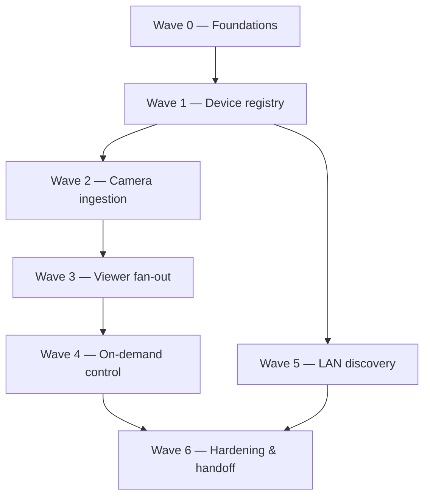
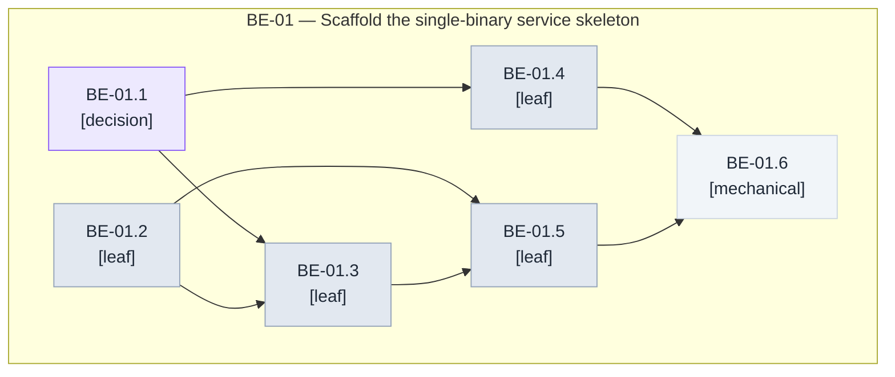
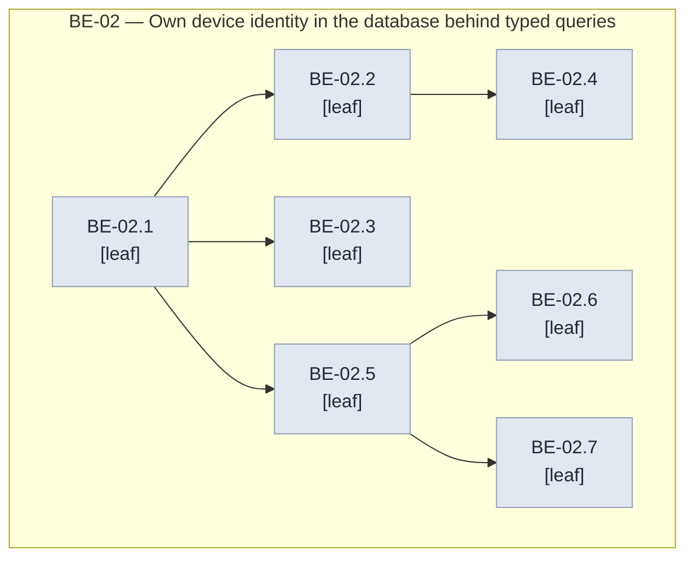
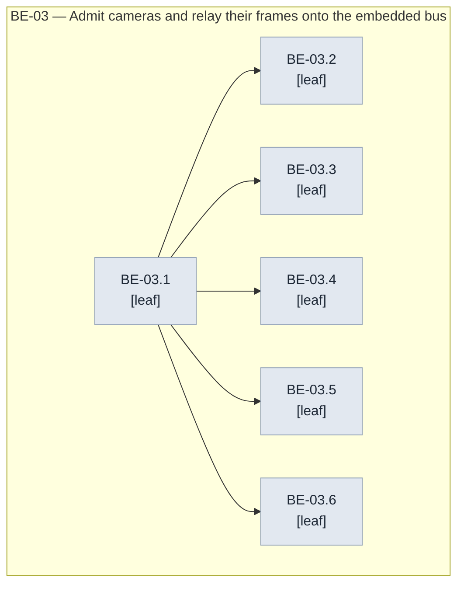
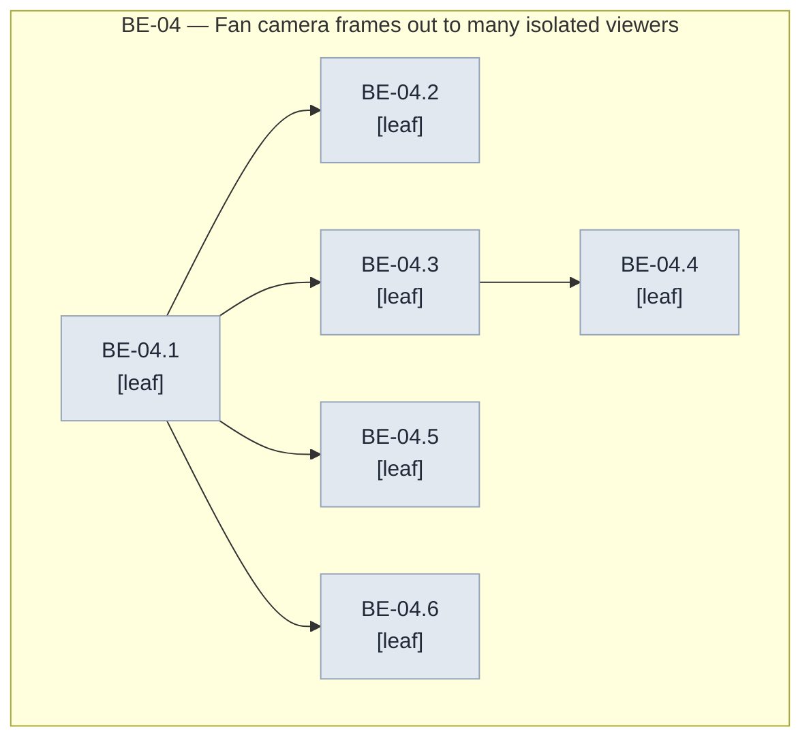
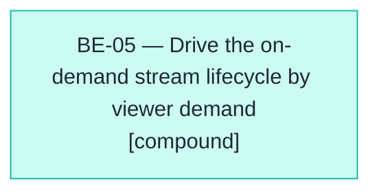
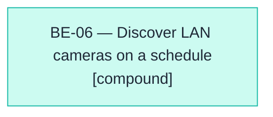

# ESP32-CAM Surveillance — central server backend — milestones and task graph

> **Status**: 0 of 7 milestones complete. **First SDD to start**: BE-01.
> **Entry gate**: released — the plan's single cross-document dependency (station-interface
> `/whoami` in the firmware plan) was frozen **and delivered** upstream; see § [Entry gate](#entry-gate).
> **References**: [`backend-prd.md`](backend-prd.md) (source PRD) ·
> [`firmware-prd.md`](firmware-prd.md) § Protocol contract ·
> [`firmware-milestones.md`](firmware-milestones.md) § Method (founding reference) ·
> no DAG-convention ADR exists yet — inline bindings, same as the founding document (see Method).
> **Date**: 2026-08-23.
> **Append-only rule**: once the first milestone merges, ids are never renumbered; new work
> appends the next free number; amendments are dated blockquotes with struck-through text.

> [!IMPORTANT]
> **Authoring constraint.** This document states behaviors as Gherkin scenarios and what evidence
> closes each node. It never states type names, field names, or signatures — each milestone's SDD
> cycle owns those. It is implementation-language-agnostic: tool bindings live only in
> [Method](#method--sdd-milestone-rules).

## Outcome first

When Wave 6's exit condition holds, a single Go binary runs on a Pi-class host: cameras each carry
exactly one ingest connection into it; their JPEG frames flow through an embedded message bus to any
number of browser viewers with bounded per-viewer memory and counted drops; viewership alone decides
when cameras stream or sleep; a discovery sweep keeps the Postgres registry truthful about what is
on the LAN; every budget in the PRD's non-functional tables is proven by a soak report; and the runbook
(systemd unit, deploy notes) lets an operator install it cold. Restart the box and every camera is
back online within a minute.

## Quick navigation

| Section | What it settles |
| --- | --- |
| [Sources and research](#sources-and-research) | Requirements inventory, SOTA digest, inconsistency register |
| [Scope boundary](#scope-boundary) | Owns / must not own / wording traps |
| [Method](#method--sdd-milestone-rules) | Node grammar citation, evidence gate, TDD cycle, language bindings |
| [Entry gate](#entry-gate) | Cross-document dependency status (released) |
| [Global dependency graph](#global-dependency-graph) | Wave-level DAG + delivery sequence |
| [Wave 0](#wave-0--foundations) … [Wave 6](#wave-6--hardening--handoff) | The milestones |
| [Traceability spine](#traceability-spine) | Requirement → node, two-way |

## Sources and research

### Requirements inventory (Phase 0)

Every distinct claim of [`backend-prd.md`](backend-prd.md), with its section anchor. These handles
seed the traceability spine.

| Id | Requirement (cited) |
| --- | --- |
| R-01 | Exactly one ingest WebSocket per camera MAC; viewer count adds zero device connections (PRD § Goals) |
| R-02 | Sustain 10 concurrent viewers on one camera at QVGA @ 5 fps with no hub-attributable stalls (PRD § Goals) |
| R-03 | p95 frame age capture→viewer write < 500 ms at 5 fps (PRD § Goals, § Latency budget) |
| R-04 | Stalled viewers get dropped frames (bounded channel, drop-oldest); healthy viewers see zero added latency; per-viewer drop counter exposed (PRD § Goals, FR-B-3 rule 3) |
| R-05 | Registry reflects reality: new LAN device listed ≤ ~2.5 min; `online` ≤ 2 s after camera connect (PRD § Goals) |
| R-06 | With zero viewers no camera streams: idle-camera-with-active-stream count = 0 within 5 min of last viewer leaving (PRD § Goals) |
| R-07 | All cameras reconnected and online ≤ 60 s after backend restart (PRD § Goals) |
| R-08 | ≤ 150 MB RSS and < 1,500 goroutines at full envelope, 30 cams + 300 viewers (PRD § Goals, § Resource budgets) |
| R-09 | Single binary embedding core NATS (`NoSigs`, constructor-validated options, monitor endpoint off by default behind config flag, server+client modules upgraded together) (PRD § Runtime target) |
| R-10 | PostgreSQL ≥ 15 via sqlc-generated typed queries only; golang-migrate versioned forward-only pairs (PRD § Runtime target, § Reliability targets) |
| R-11 | Device-facing listener on `/cams`, default port 8080 configurable — the ONLY device-facing listener (PRD FR-B-1) |
| R-12 | Hello admission: ≤ 5 s for first text frame; must parse as hello with mac matching `^[0-9a-f]{12}$`; else close `1008` + log (PRD FR-B-1 step 1) |
| R-13 | Newest-wins eviction per MAC: old connection gets `evicted_by_newer_session` error frame, then close; new session promoted (PRD FR-B-1 step 2) |
| R-14 | Hello upsert: known MAC → `online` + `last_seen_at` + refresh device-reported labels into `metadata.device_reported` while DB-owned name/description stay authoritative; unknown MAC → insert seeded from hello + `REGISTERED_VIA_HELLO` (PRD FR-B-1 step 3, FR-B-6) |
| R-15 | `camera_online` / `camera_offline` published on `cams.<mac>.events`; disconnect flips `offline` + `last_seen_at` (PRD FR-B-1 steps 4–5) |
| R-16 | Backend never sends binary to cameras; outbound is text command frames only (PRD FR-B-1) |
| R-17 | Frames published raw (no envelope, no base64) to `cams.<mac>.frames`; observations JSON to `cams.<mac>.events`; publish fire-and-forget, ingest never blocks (PRD FR-B-2) |
| R-18 | Viewer endpoint `GET /api/cameras/{mac}/stream`: `stream_meta` text frame first, then binary JPEG as they arrive (PRD FR-B-3 rule 1) |
| R-19 | One writer goroutine per viewer connection; concurrent writes forbidden (PRD FR-B-3 rule 2) |
| R-20 | Single wildcard `cams.*.frames` subscription held for process lifetime; route by subject token; no subscription churn per viewer (PRD FR-B-3 rule 4) |
| R-21 | Bus callback does nothing but non-blocking enqueue; synchronous viewer writes forbidden there (PRD FR-B-3 rule 5) |
| R-22 | Bus-layer slow-consumer protection: pending limits on the wildcard subscription + mandatory async error callback logging slow-consumer drops with subject and cumulative drop count (PRD FR-B-3 rule 6) |
| R-23 | Viewer keepalive: server ping 10 s, missing pong 30 s closes; unexpected client frame → close `1008` (PRD FR-B-3 rule 7) |
| R-24 | Session states `disconnected → connecting → connected_idle → streaming`; dial backoff mirrors firmware schedule (2 s doubling → 30 s cap, infinite retries) (PRD FR-B-4) |
| R-25 | Refcount energy control: first viewer wakes (`stream on`), last viewer + 30 s grace → `stream off`, idle 5 min zero-viewer → `sleep` command, await clean CLOSE, release dial until next demand (PRD FR-B-4) |
| R-26 | Manual override pins a session outside refcounting until explicit off; overrides visible in detail payload (PRD FR-B-4) |
| R-27 | Discovery cron default 60 s: self-gate skips when no routable address in CIDR; CIDR sweep ≤ 64 workers × 500 ms probe timeout, /24 < 15 s; strict shape validation; failing responders logged `UNIDENTIFIED_DEVICE`, never registered (PRD FR-B-5) |
| R-28 | Discovery upsert rules (insert `pending` w/ verbatim metadata + extracted ip/fw/chip; refresh known without touching status) + lazy stale sweep → `unreachable` after 10 min without activity; scan never demotes `online` (PRD FR-B-5, § Database model rulings) |
| R-29 | REST surface list/detail/pin/delete/rename + healthz/readyz (readiness = bus ready AND database answers); uniform error envelope; CORS single configured origin (PRD FR-B-7) |
| R-30 | Guards: DELETE 409 unless session `disconnected`; stream pin 409 unknown MAC with fps clamped [1,15]; rename limits name ≤ 32 / description ≤ 128; malformed body → 400 naming the offending field; unknown route → 404 envelope (PRD FR-B-7) |
| R-31 | Database model: colon-less lowercase 12-hex mac as `CHAR(12)` primary key with format CHECK; INET fast-path column; verbatim JSONB metadata with GIN `jsonb_path_ops`; status/index coverage; every mutation stamps `updated_at`; no raw SQL outside generated queries (PRD § Database model) |
| R-32 | Protocol contract mirror: inbound hello/binary/status/config-ok/error handling exactly as fixed; unparseable inbound text logged + dropped, never crashing or closing the session (PRD § Protocol contract) |
| R-33 | Every dropped frame increments exactly one counter (per-viewer or ingest-side) — silent loss forbidden anywhere in the pipeline (PRD § Reliability targets) |
| R-34 | Strict shape-validation of ALL device-supplied JSON before it touches the database; viewer input hostile-by-default (PRD § Security posture) |
| R-35 | Latency budget hops: capture→ingest parse ≤ 100 ms; ingest→hub enqueue ≤ 10 ms; hub dequeue→viewer flush ≤ 50 ms; end-to-end ≤ 500 ms p95 at 5 fps (PRD § Latency budget) |
| R-36 | Hardening evidence: frame-age instrumentation, 30-min soak at full envelope, restart-recovery proof, systemd unit with recommended fd limit, README deploy notes incl. DSN file permissions (PRD § NFR, Milestone B6) |
| R-37 | Registry availability during a bus outage: registry reads stay unaffected (database independent of the embedded bus); streams fail visibly and recover automatically (PRD § Reliability targets) |

### Research digest (Phase 1)

The PRD § References carries the August-2026 research digest with sources. Per its
§ Milestone-derivation notes this pass **verified citations rather than re-running the
investigation** (2026-08-23). Findings:

| Finding | Source | What it changed here |
| --- | --- | --- |
| Embedded-server APIs confirmed current: options validated inside the constructing call; in-process connection helper available | pkg.go.dev/github.com/nats-io/nats-server/v2/server | Confirms R-09 approach; ground rules retained unchanged |
| Legacy docs.nats.io deep links moved in the docs restructure; the benchmark page lives on and still shows millions of messages/s against our ~150 worst case | docs.nats.io (nats bench, new location) | Headroom claim holds; this digest cites package documentation instead of moved deep links |
| Slow-consumer defaults confirmed at source level: ~500k messages / 64 MB per subscription, dropped **silently** unless an async error handler is installed | pkg.go.dev/github.com/nats-io/nats.go (Slow Consumers) | R-22 stands as written |
| The server-side flush deadline that kills a stalled bus client connection defaults to **10 s** in current source — not the 2 s figure quoted in PRD FR-B-3 rule 5 | nats-server source constant (`DEFAULT_FLUSH_DEADLINE`) | Inconsistency register item #1; the invariant is unaffected, the constant is corrected here |
| gorilla/websocket v1.5.3 remains latest release (Jun 2024); project maintained; one-writer-per-connection discipline documented | github.com/gorilla/websocket/releases | Library binding confirmed; no newer release changes anything |
| MediaMTX ingest options remain RTSP/RTMP/SRT/HLS/MPEG-TS/WHIP/MoQ-family — raw JPEG over a custom WebSocket is still un-ingestable; go2rtc's mpjpeg support is pull/exec only (Media-over-QUIC added since research; irrelevant here) | mediamtx.org/docs/features/publish | Custom hub justified (R-18); escape-hatch verdict unchanged |
| Browser main-thread MJPEG decode confirmed via MotionJpegLatencyTest repo (createImageBitmap + explicit bitmap close is the fix); the "EVA production writeup" could NOT be re-located and is treated as unverified | github.com/iimachines/MotionJpegLatencyTest | Frontend-facing guidance recorded for the future frontend PRD; zero impact on backend nodes |

Research that changed nothing: gorilla choice, JPEG passthrough, live-only core bus, trusted-LAN
posture — all re-confirmed.

### Inconsistency register (Phase 2)

| # | Side A | Side B | Disposition |
| --- | --- | --- | --- |
| 1 | PRD FR-B-3 rule 5 quotes a "2 s write_deadline" for the bus server killing a stalled client connection | Current nats-server source defaults the flush deadline to 10 s | **Reconciled.** The load-bearing fact is the mechanism (a callback blocking past the configured flush deadline gets the WHOLE bus client connection killed — every camera feed drops at once), not the constant. Nodes phrase behavior ("within the configured flush deadline"), never the stale number. PRD amendment is optional follow-up, non-blocking. |
| 2 | PRD § References cites the legacy docs.nats.io embedding page + nats-server issue #4794 for the embedding gotchas | The page moved in the 2026 docs restructure; issue #4794 is an unrelated JetStream-cluster defect report, not evidence for those gotchas | **Reconciled.** Digest cites package documentation for API existence; the ground rules themselves were verified live during PRD authoring and are retained as plan constraints (R-09). Citation hygiene only. |
| 3 | PRD FR-B-5 step 5: stale sweep flips any device whose last activity exceeds the stale window and whose status ≠ `unreachable` | PRD § Database model ruling: "WS lifecycle owns online/offline; scan never demotes `online`" | **Reconciled.** A connected device refreshes its last-activity timestamp continuously, so it can never satisfy the stale predicate; to make disjointness structural rather than coincidental, the sweep additionally skips devices whose status is `online`. The ruling wins. Encoded as a pin scenario on BE-02.4 and an implementer trip point on BE-06. |
| 4 | Backpressure layering (wildcard-subscription pending limits vs per-viewer channels), discovery-latency wording (~2.5 min), audience-less publishing bounding | Same sections, earlier drafts | **Pre-reconciled** during PRD authoring (2026-08-23) per PRD § Milestone-derivation notes; recorded here as pre-reconciled, not re-litigated. |
| 5 | PRD open question 4 / milestone B5: ESP32 detection gated on a named station-interface `/whoami` promise in the firmware plan, "until it exists upstream" | The promise now exists AND shipped: firmware-milestones.md § FW-05.5, merged as PR #14 (commit `84cec3d`) on 2026-08-23 with silicon evidence | **Released.** Entry gate records the dependency as delivered; BE-06's gate cites it. No assumption required. |

## Scope boundary

- **Owns:** the entire central-server backend — device-facing ingest listener and hello admission;
  newest-wins session arbitration; raw-frame relay onto the embedded core message bus; the viewer
  fan-out hub with bounded per-viewer queues and counted drops; viewer keepalive hygiene;
  the viewer-refcount stream lifecycle including grace/idle timers, sleep handshake, and manual
  pins; the LAN discovery cron with strict response validation; the Postgres device registry and
  its disjoint status ownership; the whole REST surface plus liveness/readiness; latency and
  resource instrumentation; restart recovery; deployment packaging.
- **Must not own:** firmware behavior of any kind — owner: [`firmware-prd.md`](firmware-prd.md) +
  [`firmware-milestones.md`](firmware-milestones.md). Browser frame rendering (decode strategy,
  canvas plumbing) — owner: future frontend PRD (guidance recorded in PRD § References).
  Authentication/TLS/wss — owner: future security PRD. Recording/playback/JetStream — owner:
  future recording PRD. Motion detection, notifications, mobile push — owner: unspecified, out of
  scope by PRD non-goals. Multi-node HA and RTSP/HLS/WebRTC compatibility outputs — out of scope
  by PRD non-goals (MediaMTX named escape hatch).
- **Wording traps:**
  - "one WebSocket per camera" means one **ingest** connection owned by the session manager per
    MAC — viewers attach to the hub, never to the camera; audience size costs the device nothing.
  - "drop" always names a counter — every frame-loss path increments exactly one observable counter
    (R-33); if a drop cannot be observed, it is a bug, not an optimization.
  - "status" has two writers with disjoint vocabularies: the websocket lifecycle owns
    `online`/`offline`; discovery owns `pending`/`unreachable`. Neither ever writes the other's words.

## Method — SDD milestone rules

This document inherits the node grammar, leaf anatomy, split triggers, decomposition discipline,
and living-graph clause from [`firmware-milestones.md`](firmware-milestones.md) § Method, which is
this repository's founding method reference (inline-bindings era — no `docs/adr/` folder and no
ratified DAG-convention ADR exist yet; the founding document flags ratification as follow-up work
in its Inconsistency Register items #1–#2, and this document inherits that limitation knowingly).
Bindings for THIS document:

- **Id prefix used here:** `BE` (Backend), reserved by PRD § Milestone-derivation notes. `FW` is
  taken by the firmware document. Milestones are `BE-01` … `BE-07`; nodes are `BE-NN.p`,
  `BE-NN.p.q`, and at most `BE-NN.p.q.r` (three levels below the milestone).
- **Evidence gate:** one command closes a build-and-test leaf: `go test ./... -race`
  (Go toolchain with race detector enabled), declared once here per PRD § Milestone-derivation
  notes. Exceptions are scoped and named on the node that needs them: milestones BE-03 onward end
  with a real-device smoke whose scope is named in that milestone's Notes (mirroring the founding
  document's hardware-smoke binding), recorded in the PR description with captured log output.
- **TDD cycle per scenario:** RED (transcribed from the scenario) → implementation → GREEN →
  refactor (performance, clean code, idioms of the implementation language) → review.
- **SDD:** each milestone is one SDD change under its declared kebab-case slug; its leaves become
  the SDD tasks.
- **Language bindings (stated here only):** implementation language Go ≥ 1.23; embedded core
  message bus started exclusively through its validating constructor with application-owned signal
  handling; viewer/camera websockets under the one-writer-per-connection discipline of the chosen
  websocket library; database access exclusively through generated typed queries; schema changes as
  versioned forward-only migration pairs; local database via container.
- **Sizing note:** seven milestones derive 1:1 from PRD milestones B0–B6 — each already sized as a
  PR slice during PRD authoring. Waves 0–3 (the pipeline core) are fully refined to leaves now;
  waves 4–6 carry charters with `Refinement: deferred` and refine just-in-time when their wave
  opens, using what the pipeline waves taught (living-graph clause).

## Entry gate

The plan's single cross-document dependency — a **named, frozen promise** of a station-interface
`GET /whoami` in the firmware plan (PRD § Open question 4) — is **RELEASED**:
[`firmware-milestones.md`](firmware-milestones.md) § FW-05.5 delivers the always-on STA-bound
`/whoami` listener, merged upstream on 2026-08-23 (PR #14, merge commit `84cec3d`) with silicon
evidence (the `URI /whoami registered on STA interface` boot log). Nothing else waits upstream:
no backend code exists yet (PRD § Validation status), so beyond that released promise this is a
from-zero plan.

## Global dependency graph



Discovery (BE-06) depends only on the registry, not on streaming control — it may start as soon as
Wave 1 exits, in parallel with waves 2–4. Hardening gates on both remaining tracks.

### Delivery sequence

| Wave | Milestones | Gate | Exit condition (the wave's value) |
| --- | --- | --- | --- |
| 0 — Foundations | BE-01 | none (from-zero; the one external promise is already delivered upstream) | The scaffold binary boots its embedded message bus in-process, reports readiness only after bus + database checks pass, survives a migrate-up/down cycle, drains cleanly on shutdown; static builds proven for linux/arm64 and darwin/arm64 |
| 1 — Device registry | BE-02 | Wave 0 complete | Devices persist with wire-format keys and disjoint status ownership behind generated typed queries; REST exposes list/detail/rename/deregister with the uniform error envelope; contract tests green against real Postgres |
| 2 — Camera ingestion | BE-03 | Wave 1 complete | A fake camera dials the device listener: conforming hello admits it online ≤ 2 s, raw JPEG bytes reach the right bus subject byte-for-byte, a second dial evicts the first, disconnect flips offline — all proven by the fake-camera harness |
| 3 — Viewer fan-out | BE-04 | Wave 2 complete | Ten fake viewers share one live camera at 5 fps: healthy viewers hold p95 inter-frame arrival ≤ 220 ms while a stalled viewer accrues counted drops; routing holds one wildcard subscription; slow-consumer loss is loud; keepalive + hostile-input hygiene enforced |
| 4 — On-demand control | BE-05 | Wave 3 complete | First viewer wakes a sleeping camera in < 10 s; last viewer + 30 s grace stops the stream; 5 idle minutes sleeps the session; manual pins override refcounts; restart recovers everything ≤ 60 s |
| 5 — LAN discovery | BE-06 | Wave 1 complete (+ firmware station-`/whoami` promise — RELEASED, see Entry gate); may run parallel to waves 2–4 | Cron sweeps a /24 < 15 s at 64 workers; valid responders register with verbatim metadata, malformed responders logged and skipped; the stale sweep piggybacks on the tick; a real ESP32 answers and registers |
| 6 — Hardening & handoff | BE-07 | Waves 4 and 5 complete | Soak report proves RSS ≤ 150 MB, < 1,500 goroutines, p95 frame age ≤ 500 ms at full envelope; drop counters reconcile; systemd unit + README deploy notes shipped |

## Wave 0 — Foundations

Everything after this wave is cheap and safe: one binary that boots its own message bus, talks to
the database through reversible migrations, tells the truth about readiness, and shuts down like an
adult. No product behavior yet — deliberately.



### BE-01 — Scaffold the single-binary service skeleton

SDD change: `backend-server-scaffold` · Closes: R-09, R-10 (tooling half).

**Charter**

- **Goal:** one runnable binary whose module layout matches PRD § Architecture, boots an embedded
  core message bus in-process, serves liveness/readiness, applies reversible migrations, and
  shuts down gracefully.
- **Deliverable:** the scaffolded service skeleton: configuration loader, embedded-bus boot,
  migration runner + baseline migration pair, liveness + readiness endpoints, graceful-shutdown
  path, cross-platform build proof.
- **Acceptance:** Given the built binary and a reachable empty database, When the process starts,
  Then liveness answers immediately, readiness reports ready only after the bus accepts in-process
  connections AND the database answers a trivial query, and a termination signal drains both
  listeners and exits successfully.
- **Depends on:** nothing (first milestone). **Blocks:** BE-02, BE-03, BE-04, BE-05, BE-06, BE-07.
- **Out of scope:** devices schema (owned by BE-02); any camera or viewer protocol behavior
  (BE-03/BE-04); exposing the bus monitor endpoint beyond honoring its config flag (BE-07 deploy
  notes decide the documented posture).
- **Notes:** bus options MUST flow through the validating constructor — struct literals skip
  validation (R-09 ground rule). Application owns signal handling (`NoSigs`). The monitor/debug
  endpoints stay OFF unless explicitly configured. The baseline migration pair proves the runner
  mechanics only; real schema arrives with BE-02.

#### BE-01.1 — Decide the configuration surface `[decision]`

- **Closing checklist (each answer recorded in the SDD artifact):**
  - Which settings exist and their names: listen ports (device-facing vs API), the externally
    reachable service address used to compose absolute stream URLs, discovery CIDR +
    interval + port, database address, stale window, stream grace/idle timers, CORS origin, bus
    monitor toggle?
  - File vs environment precedence when both define the same setting?
  - Behavior on invalid/missing required config: refuse to start naming the offending key?
  - How file-based secrets (database address string) get their documented permission posture?

#### BE-01.2 — Liveness answers from a booted process `[leaf]`

- **Scenarios:**

```gherkin
Scenario: walking skeleton — process boots and serves liveness
  Given the built binary started with configuration pointing at a running empty database
  When a client requests the liveness endpoint
  Then the response confirms the process is up
```

- **Depends on:** nothing.
- **Out of scope:** composite readiness (BE-01.3); shutdown behavior (BE-01.5).
- **Split if:** boot ordering forces more than trivial wiring beyond the config surface.

#### BE-01.3 — Readiness reflects bus and database health `[leaf]`

- **Scenarios:**

```gherkin
Scenario: readiness turns ready only after both dependencies answer
  Given the process is starting with its embedded bus and a reachable database
  When readiness is polled repeatedly from launch until steady state
  Then it reports not-ready until the bus accepts in-process connections and the database answers a trivial query
  And it reports ready afterwards without flapping

Scenario: a lost database flips readiness back
  Given the process serving with readiness reported ready
  When the database becomes unreachable
  Then readiness reports not-ready naming the failed check
```

- **Depends on:** BE-01.1, BE-01.2.
- **Out of scope:** auto-restart or healing logic — reporting only.
- **Notes:** the bus check exercises a real in-process connection, not just "constructor returned".

#### BE-01.4 — Migration pairs apply forward and reverse cleanly `[leaf]`

- **Scenarios:**

```gherkin
Scenario: forward migration reaches head on a clean database
  Given a clean empty database
  When all pending migrations apply forward
  Then every version records as applied and the migration state reports head

Scenario: reverse migration unwinds to empty and replays identically
  Given a database migrated to head
  When migrations roll back completely
  Then no version remains recorded and applying forward again reaches head identically
```

- **Depends on:** BE-01.1.
- **Out of scope:** the devices schema itself (BE-02.1) — the baseline pair here is intentionally
  minimal proof of the mechanics.
- **Notes:** pairs are hand-authored and checked in; generated files belong to generators
  (PRD § Build prerequisites).

#### BE-01.5 — Shutdown drains listeners and exits cleanly `[leaf]`

- **Scenarios:**

```gherkin
Scenario: termination drains work and exits successfully
  Given the process is serving with at least one in-flight request
  When termination is requested
  Then the process stops accepting new work, completes in-flight handling within a bounded window,
       shuts the embedded bus down, and exits with a success status

Scenario: early termination does not wedge startup
  Given the process is still starting and has not finished opening its listeners
  When termination is requested
  Then the process exits promptly with a success status instead of hanging or panicking
```

- **Depends on:** BE-01.2, BE-01.3.
- **Out of scope:** draining long-lived websocket sessions (none exist yet in this wave).
- **Notes:** the second scenario is the classic startup/shutdown race — prove it, don't assume it.

#### BE-01.6 — Static binaries build for both deployment targets `[mechanical]`

- **Closes by:** recorded build output producing static binaries for linux/arm64 and darwin/arm64
  from the completed skeleton.
- **Depends on:** BE-01.4, BE-01.5.

## Wave 1 — Device registry

The registry becomes real: wire-format identity keys, disjoint status ownership enforced
structurally, and the REST surface operators will use. Contract tests run against real Postgres,
not fakes — the typed-query layer IS the deliverable here, so the port-fake-swap pattern would add
ceremony without de-risking anything; the real adapter is the point.



### BE-02 — Own device identity in the database behind typed queries

SDD change: `backend-device-registry` · Closes: R-14, R-28, R-31, R-34 (registry-validation half),
R-29, R-30 (REST half).

**Charter**

- **Goal:** the devices table becomes the canonical owner of identity labels with wire-format keys
  and two-writer status discipline, exposed over the REST surface.
- **Deliverable:** devices schema + indexes + CHECK constraints as a migration pair; generated
  typed query layer; scan-side and hello-side upsert operations; the stale-decay transition; REST
  list/detail/rename/deregister with the uniform error envelope.
- **Acceptance:** Given a migrated database, When devices are inserted, rescanned, greeted, aged,
  renamed, and deleted through the query layer and the API, Then every operation respects the
  ownership rules (scan never demotes `online`; DB labels win over device-reported labels) and the
  contract tests prove idempotence, constraint bites, and index usage.
- **Depends on:** BE-01. **Blocks:** BE-03, BE-05, BE-06.
- **Out of scope:** who CALLS the hello/scan/stale operations (hello calls arrive with BE-03, the
  cron tick with BE-06) — this milestone defines and tests the operations themselves; live session
  awareness for deregistration (the session-state lookup seam is defined here reporting
  `disconnected` for all devices until BE-04 supplies the real one).
- **Notes:** EXPLAIN evidence that list/status queries index-scan belongs in the contract-test
  evidence. `metadata` stores whatever the device said VERBATIM (audit fidelity); structured
  columns exist only for what is filtered/joined.

#### BE-02.1 — Store and read back a device with its wire-format identity `[leaf]`

- **Scenarios:**

```gherkin
Feature: device identity storage

Scenario: walking skeleton — identity round-trips byte for byte
  Given a clean migrated database
  When a device identified by colon-less lowercase twelve-character hex mac is inserted through
       the generated query layer and fetched back
  Then every stored column round-trips unchanged
  And the mac key matches the wire format byte for byte

Scenario: the database rejects a malformed identity key
  Given a clean migrated database
  When a device insert carries a mac that is not colon-less lowercase twelve-character hex
  Then the database rejects the write with a constraint violation

Scenario: the database rejects an unknown lifecycle word
  Given a clean migrated database
  When a device insert or update sets a status outside the agreed vocabulary
  Then the database rejects the write with a constraint violation
```

- **Depends on:** BE-01.4.
- **Out of scope:** any upsert semantics (BE-02.2/BE-02.3); indexes beyond the schema's own
  (verified here as part of the migration).
- **Notes:** the key IS the wire format — no normalization layer may appear on either side
  (PRD § Database model ruling).

#### BE-02.2 — Scan-side upsert refreshes without touching websocket-owned status `[leaf]`

- **Scenarios:**

```gherkin
Feature: scan-driven registration and refresh

Scenario: an unseen responder registers as pending with verbatim metadata
  Given no device exists for the responder's mac
  When the scan-side upsert runs with the responder's validated payload
  Then the device row is created with status pending
  And the ENTIRE response body is preserved verbatim inside metadata
  And the address, firmware version, and chip are extracted into their columns

Scenario: a known responder refreshes operational fields without status change
  Given a known device whose status is online from a live session
  When the scan-side upsert runs with a fresh payload
  Then address, metadata, firmware version, and the scan timestamp refresh
  And the status remains online — the scan never demotes it

Scenario: repeated scans of the same responder are idempotent
  Given a known device already refreshed by a previous scan
  When the identical scan-side upsert runs again
  Then no duplicate row appears and the mutation timestamp advances exactly once per scan
```

- **Depends on:** BE-02.1.
- **Out of scope:** who triggers a scan (BE-06); hello-side seeding differences (BE-02.3);
  the stale transition (BE-02.4).

#### BE-02.3 — Hello registration keeps database-owned labels authoritative `[leaf]`

- **Scenarios:**

```gherkin
Feature: hello-driven registration

Scenario: an unknown greeter registers online from its hello payload
  Given no device exists for the greeter's mac
  When the hello-side upsert runs with the hello payload
  Then the device row is created with status online and the registration is observable as
       registered-via-hello in the logs

Scenario: a known greeter comes back online keeping operator labels
  Given a known device whose authoritative name and description were set by an operator
  When the hello-side upsert runs with a hello payload carrying different device-reported
       name and description
  Then status becomes online, last activity refreshes, and the device-reported values land
       ONLY under the device-reported section of metadata
  And the authoritative name and description columns keep the operator's values
```

- **Depends on:** BE-02.1.
- **Out of scope:** receiving the hello frame itself (BE-03.1 consumes this operation).
- **Notes:** this is the DB-canonical-labels ruling (FR-B-6) as executable behavior — the pin
  scenario is the regression fence for the whole label-ownership model.

#### BE-02.4 — Stale devices decay to unreachable without touching online `[leaf]`

- **Scenarios:**

```gherkin
Feature: stale-device decay

Scenario: a silent pending device decays to unreachable
  Given a device with status pending whose last activity is older than the stale window
  When the stale-decay transition runs
  Then its status becomes unreachable

Scenario: recently active devices are left alone
  Given a device whose last activity is inside the stale window
  When the stale-decay transition runs
  Then its status is unchanged

Scenario: the sweep never demotes an online device
  Given a device with status online whose last activity timestamp is artificially older than
       the stale window
  When the stale-decay transition runs
  Then its status remains online — structural disjointness beats the predicate

Scenario: already-unreachable devices do not churn
  Given a device already marked unreachable with old last activity
  When the stale-decay transition runs repeatedly
  Then its status stays unreachable and its mutation timestamp stops advancing
```

- **Depends on:** BE-02.2.
- **Out of scope:** the periodic trigger (manual invocation here; the discovery tick attaches in
  BE-06) — the trigger seam is deliberate interface-first splitting.
- **Notes:** the third scenario encodes Inconsistency-register item #3's reconciliation; do not
  "fix" it back to the bare predicate.

#### BE-02.5 — List and detail endpoints expose registry truth `[leaf]`

- **Scenarios:**

```gherkin
Feature: registry read API

Scenario: walking skeleton — listing returns every registered device
  Given several registered devices
  When the list endpoint is requested
  Then every device appears with its mac, name, status, address, firmware version,
       last-seen timestamp, absolute stream URL composed from the configured service address,
       and a total dropped-frames figure of zero

Scenario: detail adds the operational picture
  Given a registered device
  When the detail endpoint is requested for its mac
  Then the response adds description, full metadata, session state reported as disconnected,
       a viewer count of zero, and pinned false

Scenario: an unknown mac answers with the error envelope
  Given no device for a requested mac
  When either read endpoint is requested for that mac
  Then the response uses the error envelope with a not-found code

Scenario: an unknown route answers with the error envelope
  Given the API serving under its base path
  When a client requests a path no endpoint owns
  Then the response uses the error envelope with a not-found code

Scenario: cross-origin browser requests honor the configured origin
  Given the service configured with a single allowed browser origin
  When a request arrives carrying that origin
  Then the response carries the access-control allowance for exactly that origin
  And requests carrying other origins are refused the allowance

Scenario: registry reads survive a bus outage
  Given the process serving while its embedded message bus is shut down or wedged
  When the list or detail endpoint is requested
  Then the response answers normally from the database
```

- **Depends on:** BE-02.1, BE-01.2.
- **Out of scope:** live session/viewer figures (constant placeholders here; BE-04/BE-05 supply
  the real sources through the same fields); write endpoints (BE-02.6/BE-02.7).
- **Notes:** the absolute stream URL is the PRD's "how to reach this camera" baked into the API —
  compose it from configuration, never from the request host. The bus-outage scenario closes the
  registry-independence half of R-37; visible stream failure and automatic recovery close under
  BE-04.6 and BE-03/BE-05 respectively.

#### BE-02.6 — Rename and describe change database-owned labels only `[leaf]`

- **Scenarios:**

```gherkin
Feature: operator labeling

Scenario: renaming touches only the authoritative columns
  Given a registered device with device-reported labels in metadata and operator-set labels
  When a rename request supplies a new name
  Then the authoritative name column updates and the response reflects it
  And the device-reported metadata section is untouched

Scenario: oversized labels are rejected naming the field
  Given a registered device
  When a rename request carries a name longer than thirty-two characters
       or a description longer than one hundred twenty-eight characters
  Then the request is rejected with the error envelope naming the offending field
  And the stored labels are unchanged

Scenario: partial updates apply only what arrived
  Given a registered device
  When a rename request supplies only a description
  Then the description updates and the name keeps its previous value
```

- **Depends on:** BE-02.5.
- **Out of scope:** pushing labels to devices (explicitly deferred — see Explicitly-deferred
  register).

#### BE-02.7 — Deregistration refuses live sessions `[leaf]`

- **Scenarios:**

```gherkin
Feature: deregistration guard

Scenario: a disconnected device deletes cleanly
  Given a registered device whose session-state lookup reports disconnected
  When the delete endpoint is requested for its mac
  Then the row is removed and subsequent reads answer not-found

Scenario: a live session blocks deletion
  Given a registered device whose session-state lookup reports a live state
  When the delete endpoint is requested for its mac
  Then the response is a conflict envelope and the row survives
```

- **Depends on:** BE-02.5.
- **Out of scope:** the real session-state source (constant-disconnected provider here; BE-05
  swaps in the live lookup — the seam is declared here and consumed by BE-05 under the
  living-graph clause).
- **Notes:** "never delete a live camera" is a safety property — the guard must fail closed if the
  lookup is unavailable, not open.

## Wave 2 — Camera ingestion

Cameras get their front door. A fake-camera harness (test deliverable per PRD milestone B2)
exercises admission, eviction, relay, and teardown without hardware; the hardware smoke at this
milestone's tail verifies hello/admission/eviction/disconnect against currently-merged firmware.



### BE-03 — Admit cameras and relay their frames onto the embedded bus

SDD change: `backend-camera-ingest` · Closes: R-11, R-12, R-13, R-15, R-16, R-17, R-32;
R-05 (the online-within-2 s half); R-33 (ingest-side counting obligation introduced here).

**Charter**

- **Goal:** the device-facing listener admits exactly conformant cameras, arbitrates newest-wins
  per MAC, relays frame bytes untouched onto per-device bus subjects, journals observations, and
  reflects every connect/disconnect in the registry.
- **Deliverable:** the device-facing websocket listener with hello admission and close-code
  semantics; newest-wins eviction; the per-camera publish path (frames + events subjects); status/
  config-reply journaling; disconnect handling; the fake-camera test harness.
- **Acceptance:** Given the fake-camera harness, When a camera connects with a conforming hello,
  streams frames, receives a competing dial, and finally vanishes, Then the device reads `online`
  ≤ 2 s, its subject carries the exact bytes in order, the older session is evicted with the
  agreed error frame, and the disappearance flips it `offline` ≤ 2 s.
- **Depends on:** BE-02. **Blocks:** BE-04, BE-05.
- **Out of scope:** anything consuming the frames subject (BE-04); commanding cameras
  (BE-05); LAN scanning (BE-06).
- **Notes:** HARDWARE SMOKE EXCEPTION (scoped): flash current merged firmware pointing at this
  backend and verify hello admission, registry flip, status ticks, and disconnect handling on real
  silicon. Frame-relay proof rides the harness until the firmware stream task lands upstream —
  the smoke scope is named here precisely so nobody invents a bigger gate. Publishing is
  fire-and-forget: the reader goroutine NEVER blocks on a publish (R-17); the ingest side of
  R-33 counts any frame dropped before reaching the bus, and that counter must exist from this
  milestone on even while it stays at zero in practice.

#### BE-03.1 — An admitted hello marks the device online `[leaf]`

- **Scenarios:**

```gherkin
Feature: camera admission

Scenario: walking skeleton — conformant hello opens a working session
  Given the service is running with the device listener enabled and a migrated database
  When a fake camera connects and sends a conforming hello immediately
  Then the connection stays open, the device row flips online within two seconds,
       and a camera-online observation appears on the device events subject
  And the backend sends the camera no data on its own initiative

Scenario: an unknown greeter self-registers
  Given no device row exists for the connecting camera's mac
  When the conforming hello is processed
  Then the device row is created online and the registration is observable as
       registered-via-hello in the logs
```

- **Depends on:** BE-02.3, BE-01.2.
- **Out of scope:** rejecting bad hellos (BE-03.2); frame relay (BE-03.4).
- **Notes:** "sends no data on its own initiative" is the R-16 fence — commands arrive only in
  BE-05, and never as binary.

#### BE-03.2 — Nonconforming handshakes are rejected uniformly `[leaf]`

- **Scenarios:**

```gherkin
Feature: admission rejection

Scenario: silence past the admission window ends the connection
  Given a fake camera connected to the device listener that sends nothing at all
  When the five-second admission window elapses
  Then the connection is closed with close code 1008 and the timeout is logged

Scenario Outline: a bad first frame ends the connection with the policy close code
  Given a fake camera connected to the device listener
  When the first text frame sent is <first_frame>
  Then the connection is closed with close code 1008
  And the rejection is logged with the reason
  And no device row is created or modified

  Examples:
    | first_frame                                  |
    | text that does not parse as JSON             |
    | JSON whose type is not hello                 |
    | hello missing the mac field                  |
    | hello whose mac fails the twelve-hex format  |
```

- **Depends on:** BE-03.1.
- **Out of scope:** post-admission garbage frames (BE-03.5 — those never close the session).

#### BE-03.3 — A newer dial evicts the older session for the same device `[leaf]`

- **Scenarios:**

```gherkin
Feature: newest-wins arbitration

Scenario: a second dial displaces the first session
  Given a camera session admitted for a mac
  When a second connection completes hello admission for the same mac
  Then the OLDER connection receives the eviction error frame naming the reason, then is closed
  And the newer session proceeds normally
  And exactly one admitted session exists for that mac from then on

Scenario: eviction keeps the registry truthful
  Given an eviction just occurred for a mac
  When the registry row is inspected
  Then the device shows online with fresh last-activity attributable to the newer session
```

- **Depends on:** BE-03.1.
- **Out of scope:** reconnect backoff pacing (a camera-side concern mirrored in BE-05's dialer).
- **Notes:** the rationale is reboot recovery — a camera that just rebooted must not wait out a
  dead peer's ping deadline (PRD FR-B-1 rationale).

#### BE-03.4 — Frame bytes reach the device's subject untouched `[leaf]`

- **Scenarios:**

```gherkin
Feature: frame relay

Scenario: binary frames publish byte-for-byte in order
  Given an admitted camera session and a test subscriber attached to the device frames subject
  When the camera sends binary frames containing distinct payloads
  Then the subscriber observes each payload exactly as sent — same bytes, no envelope, in order,
       one bus message per websocket message

Scenario: publishing never backs up the camera reader
  Given an admitted camera session with NO subscribers on its frames subject
  When the camera sends frames continuously
  Then the reader keeps draining the socket without stalling on publishes
```

- **Depends on:** BE-03.1.
- **Out of scope:** fan-out to viewers (BE-04); slow-consumer policy at the bus layer (BE-04.4).
- **Notes:** the second scenario pins fire-and-forget semantics — the producer must remain
  oblivious to audience (R-17).

#### BE-03.5 — Control-plane observations are journaled without killing sessions `[leaf]`

- **Scenarios:**

```gherkin
Feature: control-plane journaling

Scenario: a status tick refreshes and republishes
  Given an admitted camera session
  When the camera sends a conforming status frame
  Then last activity refreshes, the reported values merge under the device-reported metadata
       section, and the observation republishes on the device events subject

Scenario: command replies journal without side effects
  Given an admitted camera session
  When the camera sends a config-acknowledgement frame or an error reply
  Then the reply is logged and republished on the device events subject

Scenario: garbage text never closes the session
  Given an admitted camera session
  When the camera sends an unparseable text frame followed by valid frames
  Then the garbage frame is logged and dropped, the session survives,
       and the subsequent frames are processed normally
```

- **Depends on:** BE-03.1, BE-02.2.
- **Out of scope:** sending commands (BE-05); admission rejection (BE-03.2).
- **Notes:** the third scenario is the PRD's "never crash the session for one bad frame" rule —
  contrast deliberately with BE-03.2's pre-admission policy.

#### BE-03.6 — Session end flips the device offline promptly `[leaf]`

- **Scenarios:**

```gherkin
Feature: session teardown

Scenario: an abrupt loss marks the device offline quickly
  Given an admitted camera session reading online
  When the camera's connection drops without a close handshake
  Then the device flips offline within two seconds and a camera-offline observation appears
       on the device events subject

Scenario: a clean goodbye behaves identically
  Given an admitted camera session reading online
  When the camera closes with a proper close handshake
  Then the same offline transition and observation occur within two seconds
```

- **Depends on:** BE-03.1.
- **Out of scope:** sleep-command teardown initiated by the backend (BE-05).

## Wave 3 — Viewer fan-out

The hub: many watchers, one camera, zero coupling. This wave carries the PRD's hardest-won
research lessons — the enqueue-only bus callback, the bounded drop-oldest queue, the loud
slow-consumer alarm — each as its own provable leaf.



### BE-04 — Fan camera frames out to many isolated viewers

SDD change: `backend-viewer-hub` · Closes: R-02, R-04, R-18, R-19, R-20, R-21, R-22, R-23;
R-33 (viewer-side counting).

**Charter**

- **Goal:** any number of viewers watch one live camera through the hub with bounded memory,
  counted drops, and no coupling between a stalled viewer and healthy ones.
- **Deliverable:** the viewer upgrade endpoint; the process-lifetime wildcard subscription with
  subject-token routing; per-viewer bounded channels with one writer apiece; drop accounting
  surfaced through the registry detail; bus-layer slow-consumer alarms; viewer keepalive and
  hostile-input hygiene; mid-stream death notification.
- **Acceptance:** Given ten fake viewers attached to one camera publishing at 5 fps, When one
  viewer stalls indefinitely, Then the other nine hold p95 inter-frame arrival ≤ 220 ms with zero
  panics while the stalled one accrues a visible dropped-frames total.
- **Depends on:** BE-03. **Blocks:** BE-05, BE-07.
- **Out of scope:** deciding WHEN a camera should be awake (BE-05); browser rendering concerns
  (frontend PRD).
- **Notes:** HARDWARE SMOKE EXCEPTION (scoped): with current merged firmware, verify a real hello
  session plus harness-published frames reaching one real browser viewer end-to-end; deeper
  multi-viewer proofs stay harness-based. The writer-per-connection rule is absolute — concurrent
  writes to one viewer socket are the classic hub panic (R-19). Every drop increments exactly one
  counter (R-33): stalled-viewer drops increment THAT viewer's counter; bus-layer drops increment
  the loud alarm path of BE-04.4.

#### BE-04.1 — One live camera serves its first viewer `[leaf]`

- **Scenarios:**

```gherkin
Feature: first viewer attachment

Scenario: walking skeleton — meta first, then frames
  Given a camera session admitted by BE-03 and actively publishing distinct frame payloads
  When a viewer upgrades on the camera's stream endpoint
  Then the viewer's first received message is a stream-meta text frame naming the mac and fps
  And subsequent messages are the binary frames matching the published cadence and order
```

- **Depends on:** BE-03.4.
- **Out of scope:** multiple viewers (BE-04.2); wake-on-demand (BE-05).
- **Notes:** the meta-before-image ordering is contractual (PRD viewer protocol table).

#### BE-04.2 — Many viewers share one camera without coupling `[leaf]`

- **Scenarios:**

```gherkin
Feature: isolated fan-out

Scenario: ten concurrent viewers each see the full sequence
  Given one camera publishing at five frames per second
  When ten viewers attach concurrently and watch for a sustained interval
  Then every viewer observes the complete ordered frame sequence with zero panics
  And healthy viewers' p95 inter-frame arrival stays within 220 milliseconds

Scenario: a stalled viewer accumulates counted drops without hurting peers
  Given ten attached viewers on a publishing camera
  When one viewer stops reading its socket entirely
  Then that viewer's bounded queue fills and the oldest frames drop, incrementing ITS
       dropped-frames total observable through the registry detail
  And the other nine viewers' inter-frame arrival shows no added latency
```

- **Depends on:** BE-04.1, BE-02.5.
- **Out of scope:** bus-layer drops (BE-04.4); viewer eviction policy (keepalive owns that,
  BE-04.5).
- **Notes:** queue depth and drop-oldest discipline are PRD-fixed (depth eight); the test asserts
  the OBSERVABLE consequence (counter climbs, peers unaffected), not the internals.

#### BE-04.3 — Routing holds one wildcard subscription for the process lifetime `[leaf]`

- **Scenarios:**

```gherkin
Feature: subject-token routing

Scenario: simultaneous cameras route independently
  Given two admitted camera sessions publishing distinct payloads
  When viewers attach to each camera's stream endpoint
  Then each viewer receives only its own camera's payloads

Scenario: viewer churn creates no subscription churn
  Given the hub serving viewers across several cameras
  When viewers repeatedly attach and detach in a churn loop
  Then the process holds exactly one frames-subscription throughout,
       observable via the bus client's subscription accounting
```

- **Depends on:** BE-04.1.
- **Out of scope:** slow-consumer alarms (BE-04.4).
- **Notes:** subscription churn per viewer is a solved-problem-ledger failure mode — this leaf is
  its permanent fence.

#### BE-04.4 — Bus-layer slow consumers are loud, not silent `[leaf]`

- **Scenarios:**

```gherkin
Feature: slow-consumer alarm

Scenario: exceeding the subscription's pending limits raises the alarm
  Given the wildcard frames-subscription carrying its configured pending limits and its
        mandatory asynchronous error handler
  When a forced stall causes the bus to drop messages for that subscription
  Then the error handler logs the slow-consumer condition naming the subject
       and the cumulative dropped-message count

Scenario: healthy operation stays silent
  Given the same configuration with no stall induced
  When normal traffic flows for a sustained interval
  Then no slow-consumer alarm is logged
```

- **Depends on:** BE-04.3.
- **Out of scope:** per-viewer queue behavior (BE-04.2 — the layers are complementary, never
  shared: one stalled viewer must not consume buffer belonging to everyone).
- **Notes:** without the mandatory error handler the bus client drops silently — the PRD calls
  this exact silence forbidden (R-22/R-33).

#### BE-04.5 — Viewer connections enforce keepalive hygiene `[leaf]`

- **Scenarios:**

```gherkin
Feature: viewer connection hygiene

Scenario: a ponging viewer stays connected
  Given an attached viewer answering the server's keepalive probes
  When several probe intervals elapse
  Then the viewer remains connected and receiving frames

Scenario: a silent viewer is closed after the pong window
  Given an attached viewer that stops answering keepalive probes
  When the pong window elapses with no answer
  Then the hub closes that viewer's connection

Scenario: unexpected viewer traffic ends the connection with the policy code
  Given an attached viewer
  When the viewer sends an unexpected text or binary frame
  Then the hub closes the connection with close code 1008
```

- **Depends on:** BE-04.1.
- **Out of scope:** camera-side keepalive (firmware domain); admission-time rejection (BE-03.2).
- **Notes:** viewers are read-mostly by contract; anything else from a viewer is hostile-by-default
  (R-34) even on a trusted LAN — cheap hygiene, cheap fence.

#### BE-04.6 — Mid-stream camera death warns viewers before closing `[leaf]`

- **Scenarios:**

```gherkin
Feature: graceful starvation notice

Scenario: viewers learn of camera death before the socket closes
  Given viewers attached to a live camera
  When the camera session dies mid-stream
  Then each attached viewer receives the camera-offline text frame
  And the viewer socket closes afterwards
```

- **Depends on:** BE-04.1, BE-03.6.
- **Out of scope:** automatic camera revival (BE-05 owns wake semantics).
- **Notes:** the ordering assertion (notice BEFORE close) is the point — browsers can show why the
  picture froze.

## Wave 4 — On-demand control

> **Refinement: deferred** — child nodes and scenarios land just-in-time in the PR that opens this
> wave, informed by what waves 2–3 taught about session/hub integration. The charter below is
> normative scope now.



### BE-05 — Drive the on-demand stream lifecycle by viewer demand

SDD change: `backend-stream-control` · Closes: R-24, R-25, R-26, R-06, R-07 (recovery behavior
built here, proven in BE-07); consumes the BE-02.7 session-state seam and the command-send half
of R-16. **Refinement: deferred.**

**Charter**

- **Goal:** cameras stream only when someone watches: refcount-driven wake/sleep with the
  firmware-mirrored dial backoff, grace and idle timers, the clean sleep handshake, and manual
  overrides that outrank refcounts.
- **Deliverable:** the session manager owning the four-state machine per MAC (disconnected,
  connecting, connected-idle, streaming); the dialer with exponential backoff (2 s doubling to a
  30 s cap, retrying indefinitely — mirroring the firmware schedule so neither side hammers the
  other); refcount hooks wired into the hub's attach/detach; the 30 s post-last-viewer grace timer;
  the 5-minute idle timer issuing the sleep command and awaiting the clean CLOSE before releasing
  the local side; the manual-pin override with its visibility in the detail payload; the live
  swap-in for BE-02.7's session-state lookup.
- **Acceptance:** Given a sleeping camera, When the first viewer requests it, Then it wakes,
  handshakes, commands stream-on, and delivers first frame in < 10 s; given the last viewer
  leaving, Then the stream stops after the 30 s grace; given 5 viewerless minutes, Then the
  session sleeps cleanly and redials only on next demand; given a manual pin, Then refcounts stop
  governing until the explicit unpin; given a backend restart, Then every previously-known camera
  is reachable again within the recovery budget.
- **Depends on:** BE-04. **Blocks:** BE-07.
- **Out of scope:** proving the numbers under soak (BE-07); discovery (BE-06).
- **Notes:** refine against the real integration seams waves 2–3 produced — especially how wake
  interacts with an in-flight hub upgrade (queue-or-retry decision belongs to refinement, informed
  by BE-04.1's actual shape). The idle timer's "await clean CLOSE" must have a bounded fallback —
  refine its duration from observed firmware behavior. Command frames carry correlation ids per
  the protocol contract; replies journal via BE-03.5's existing path; the command builder's
  transport support covers stream/config/sleep/identify from day one even though only stream/sleep
  gain callers in this milestone. HARDWARE SMOKE EXCEPTION (scoped): flash current merged firmware
  pointing at this backend and drive a real wake → watch → sleep cycle by attaching and detaching a
  viewer; verify the stream-on/off command transitions and the clean sleep CLOSE in device logs.
  The grace and idle timers are verified host-side through the harness with shortened configured
  values — real-time waits prove nothing a scaled clock cannot.

## Wave 5 — LAN discovery

> **Refinement: deferred** — child nodes and scenarios land just-in-time when this wave opens.
> Gate already satisfied: the firmware station-interface `/whoami` promise is delivered upstream
> (see Entry gate), so real ESP32 detection activates with this wave.



### BE-06 — Discover LAN cameras on a schedule

SDD change: `backend-lan-discovery` · Closes: R-27, R-28 (trigger attachment — the transition
semantics already closed in BE-02.4), R-05 (discovery-latency half), R-34 (responder-validation
half). **Refinement: deferred.**

**Charter**

- **Goal:** the registry learns about LAN devices without anyone typing: a disciplined sweep that
  validates before trusting, registers conservatively, refreshes aggressively, and piggybacks the
  stale sweep.
- **Deliverable:** the discovery ticker honoring its configured interval; the self-gate skipping
  cycles (with the agreed log marker) when no interface holds a routable address in the configured
  range; the CIDR walker feeding a bounded worker pool (≤ 64 concurrent, 500 ms per-probe timeout,
  /24 completing < 15 s on reference hardware); the strict shape validator (mac format + JSON
  shape) logging `UNIDENTIFIED_DEVICE` for pretenders without registering them; upsert/refresh via
  BE-02.2's operations; the stale-decay tick attachment swapping BE-02.4's manual trigger.
- **Acceptance:** Given stub HTTP responders (valid, malformed, silent, slow) planted across a
  test subnet, When sweeps run, Then only valid responders register with verbatim metadata,
  malformed ones log-and-skip, a full /24 sweep completes < 15 s at the worker cap, the self-gate
  skips cleanly with no routable interface, and a REAL ESP32-CAM on the subnet registers within
  two cycles (~2.5 minutes).
- **Depends on:** BE-02. **Blocks:** BE-07.
- **Out of scope:** changing device status based on scan results beyond the agreed vocabulary
  (register item #3's reconciliation holds here too — the tick attaches the transition, the
  online-exclusion rule rides along); provisioning flows (firmware domain).
- **Notes:** the sweep NEVER marks anything offline — websocket liveness owns that word (PRD DB
  ruling). Probe traffic shape: plain HTTP GET to the configured discovery port; treat any
  non-conforming body as noise, not attack (trusted-LAN posture, R-34 validation is about schema
  stability, not hostility). HARDWARE SMOKE EXCEPTION (scoped): the acceptance's real-ESP32 clause
  IS the smoke — a real device answering `/whoami` over the station interface must register within
  two cycles of the cron; capture its registration in the PR evidence.

## Wave 6 — Hardening & handoff

> **Refinement: deferred** — child nodes and scenarios land just-in-time; the soak protocol
> (duration, envelope shaping, measurement points) is refined from the instrumented reality waves
> 0–5 produced, not invented upfront.


### BE-07 — Prove the budgets and ship the runbook

SDD change: `backend-hardening-soak` · Closes: R-03, R-08, R-35, R-36; R-33 (final
counter-reconciliation proof); R-07 (restart-recovery proof). **Refinement: deferred.**

**Charter**

- **Goal:** turn working software into proven software: measured frame-age latency, a soak at the
  full envelope, a restart-recovery demonstration, and the operator runbook.
- **Deliverable:** frame-age histogram instrumentation spanning capture-to-viewer-write (hop
  breakdown per the latency-budget table); periodic runtime self-report (RSS, goroutine count)
  at the agreed cadence; a scripted 30-minute soak at 30 cameras × 300 viewers with the report
  artifact; the restart-recovery proof (kill -9 equivalent → all cameras online ≤ 60 s); the
  systemd unit shipping the raised fd limit; README deploy notes covering DSN file permissions,
  the monitor-endpoint posture, and capacity guidance at the envelope.
- **Acceptance:** Given the soak report, When its numbers are read against the PRD's resource and
  latency tables, Then RSS ≤ 150 MB, goroutines < 1,500, p95 frame age ≤ 500 ms at 5 fps, and the
  drop counters reconcile exactly (every dropped frame accounted once — zero silent paths); given
  a hard process kill with cameras attached, Then all cameras read online ≤ 60 s after restart.
- **Depends on:** BE-05, BE-06. **Blocks:** nothing (terminal milestone).
- **Out of scope:** performance tuning beyond budget (budgets met = done); frontend rendering
  benchmarks (frontend PRD).
- **Notes:** the counter-reconciliation check is the formal close of R-33: per-viewer counters +
  bus-alarm drops + ingest-side drops must sum to every frame the pipeline let go. If they don't
  reconcile, a silent path EXISTS — fix the path, don't fudge the sum. HARDWARE SMOKE EXCEPTION
  (scoped): soak load rides the fake-camera fleet at full envelope; one real ESP32-CAM joins the
  restart-recovery proof (flash current firmware pointing at the deployed binary, verify online ≤
  60 s after the hard kill). A real-device stream leg joins the soak only if the firmware stream
  task has landed upstream by then — otherwise its absence is recorded in the soak report with the
  upstream milestone named, not silently skipped.

## Completion checklist

Every box cites the node(s) whose closure proves it. BE-07 walks this list item-by-item with
citations in its closing PR.

- [ ] Exactly one ingest session per camera MAC regardless of audience — closed by BE-03.3
      (arbitration) + BE-04.3 (audience adds zero device connections)
- [ ] Ten concurrent viewers sustained on one camera at QVGA @ 5 fps — closed by BE-04.2
- [ ] p95 frame age ≤ 500 ms at 5 fps, hop budgets instrumented — closed by BE-07
- [ ] Stalled viewers isolated with counted drops; healthy peers unharmed — closed by BE-04.2
- [ ] New LAN devices listed ≤ ~2.5 min; online ≤ 2 s of connect — closed by BE-03.1 + BE-06
- [ ] Zero cameras streaming within 5 min of the last viewer leaving — closed by BE-05
- [ ] All cameras online ≤ 60 s after backend restart — built by BE-05, proven by BE-07
- [ ] RSS ≤ 150 MB and < 1,500 goroutines at full envelope — closed by BE-07
- [ ] Every dropped frame increments exactly one counter (silent loss impossible) — closed by
      BE-04.2 + BE-04.4 + BE-07 (reconciliation)
- [ ] Registry identity rules hold: wire-format keys, verbatim metadata, disjoint status
      ownership, DB-canonical labels — closed by BE-02.1 + BE-02.2 + BE-02.3 + BE-02.4
- [ ] Migrations reversible; readiness truthful; shutdown clean; dual-platform binaries — closed
      by BE-01.4 + BE-01.3 + BE-01.5 + BE-01.6
- [ ] Operator runbook shipped (systemd unit, fd limit, DSN permissions, monitor posture) —
      closed by BE-07

## Explicitly deferred

| Capability | Seam where it attaches later | Decided by |
| --- | --- | --- |
| Authentication, authorization, TLS/wss | The upgrade endpoints + config surface (both already isolate transport concerns) | PRD non-goals (future security PRD) |
| Recording / playback (JetStream) | The frames/events subject namespace — subjects persist unchanged when persistence arrives | PRD non-goals (future recording PRD) |
| Transcoding / WASM decoding | None — passthrough stands unless the pipeline abandons the camera's JPEG encoder | PRD research verdict |
| Push-to-device label sync (config-command caller) | The command builder's config transport support (refined in BE-05) | PRD open question 7, resolved-deferred |
| Public reboot/reset_cam API | The protocol layer's transport support (commands exist, no caller ships in v1) | PRD § Protocol contract |
| Operator-facing identify trigger | Same transport-support seam as reboot/reset_cam; reply journaling already proven by BE-03.5 | PRD § Protocol contract |
| Append-only device-events audit history | Registry metadata + timestamps cover v1; the audit table attaches beside them | PRD § Database model ruling |
| Browser MJPEG decode guidance (createImageBitmap + canvas) | Future frontend PRD | PRD § References |

## Traceability spine

Requirement → node(s):

| Source | Closed by |
| --- | --- |
| R-01 | BE-03.3, BE-04.3 |
| R-02 | BE-04.2 |
| R-03 | BE-07 |
| R-04 | BE-04.2 |
| R-05 | BE-03.1, BE-06 |
| R-06 | BE-05 |
| R-07 | BE-05, BE-07 |
| R-08 | BE-07 |
| R-09 | BE-01.1, BE-01.2, BE-01.3 |
| R-10 | BE-01.4, BE-02.1 |
| R-11 | BE-03.1 |
| R-12 | BE-03.2 |
| R-13 | BE-03.3 |
| R-14 | BE-02.3, BE-03.1 |
| R-15 | BE-03.1, BE-03.5, BE-03.6 |
| R-16 | BE-03.1 (inbound fence), BE-05 (command sender) |
| R-17 | BE-03.4 |
| R-18 | BE-04.1 |
| R-19 | BE-04.1, BE-04.2 |
| R-20 | BE-04.3 |
| R-21 | BE-04.4 (callback-discipline fences), BE-04.2 |
| R-22 | BE-04.4 |
| R-23 | BE-04.5 |
| R-24 | BE-05 |
| R-25 | BE-05 |
| R-26 | BE-05 |
| R-27 | BE-06 |
| R-28 | BE-02.2, BE-02.4, BE-06 |
| R-29 | BE-01.2, BE-01.3, BE-02.5 |
| R-30 | BE-02.5, BE-02.6, BE-02.7, BE-05 (fps clamp on pin refinement) |
| R-31 | BE-02.1 |
| R-32 | BE-03.1, BE-03.2, BE-03.5 |
| R-33 | BE-03 (ingest counter), BE-04.2, BE-04.4, BE-07 (reconciliation) |
| R-34 | BE-02.2 (scan validation), BE-03.2, BE-04.5, BE-06 |
| R-35 | BE-07 |
| R-36 | BE-07 |
| R-37 | BE-02.5 (reads unaffected), BE-04.6 (streams fail visibly), BE-03/BE-05 (recover automatically) |

Node → purpose:

| Node | Purpose (traces back to) |
| --- | --- |
| BE-01.1 | R-09 (configuration surface incl. monitor toggle, signal ownership) |
| BE-01.2 | R-09 (boot skeleton), walking skeleton |
| BE-01.3 | R-29 (readiness semantics), R-09 |
| BE-01.4 | R-10 (migration mechanics) |
| BE-01.5 | R-09 (graceful shutdown), R-07 groundwork |
| BE-01.6 | PRD B0 acceptance (dual-platform static builds) |
| BE-02.1 | R-31 (schema, keys, constraints, indexes) |
| BE-02.2 | R-28 (scan upsert), R-34 (verbatim metadata) |
| BE-02.3 | R-14 (hello upsert, DB-canonical labels) |
| BE-02.4 | R-28 (stale decay, online exclusion — register item #3) |
| BE-02.5 | R-29 (list/detail + envelopes incl. liveness surface), R-30 (unknown-mac AND unknown-route 404s, CORS origin), R-37 (bus-outage read independence) |
| BE-02.6 | R-29/R-30 (rename limits, partial update) |
| BE-02.7 | R-30 (delete guard), seam for BE-05 |
| BE-03.1 | R-11/R-12 happy path, R-14/R-15 (online ≤ 2 s), R-16 fence, R-05 |
| BE-03.2 | R-12 (admission rejection), R-34 |
| BE-03.3 | R-13, R-01 (single-session invariant) |
| BE-03.4 | R-17 (raw relay, fire-and-forget) |
| BE-03.5 | R-32 (journaling), R-15 (activity refresh) |
| BE-03.6 | R-15 (offline ≤ 2 s), R-32 teardown half |
| BE-04.1 | R-18, R-19, walking skeleton |
| BE-04.2 | R-02, R-04, R-33 (per-viewer counting) |
| BE-04.3 | R-20, R-01 (zero device cost per viewer) |
| BE-04.4 | R-22, R-21, R-33 (bus-layer counting) |
| BE-04.5 | R-23, R-34 (hostile-by-default) |
| BE-04.6 | PRD viewer protocol (camera_offline before close) |
| BE-05 | R-24, R-25, R-26, R-06, R-16 (sender), R-07 behavior, R-30 fps clamp |
| BE-06 | R-27, R-28 trigger, R-05 discovery half, R-34 validation half |
| BE-07 | R-03, R-08, R-35, R-36, R-33 proof, R-07 proof |
