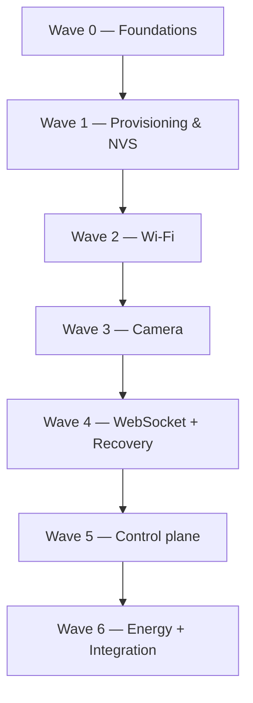
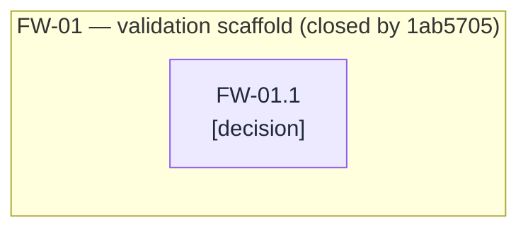
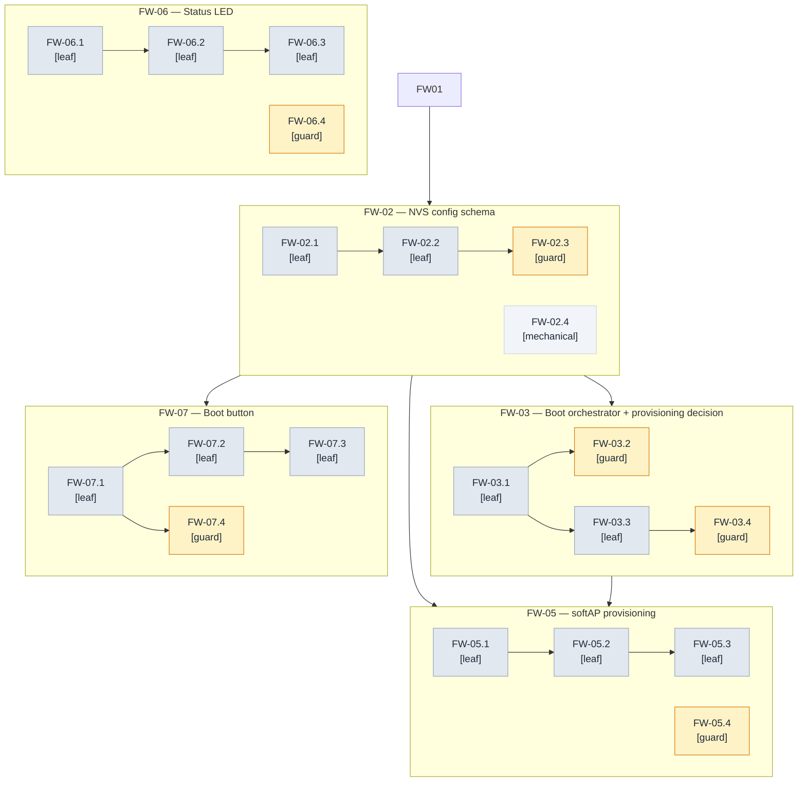
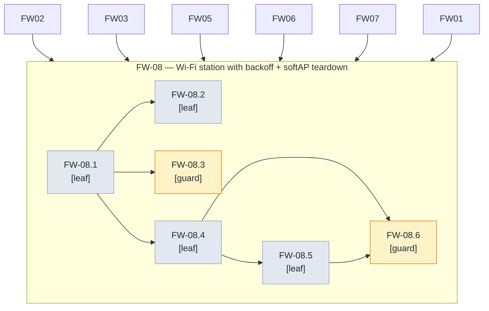
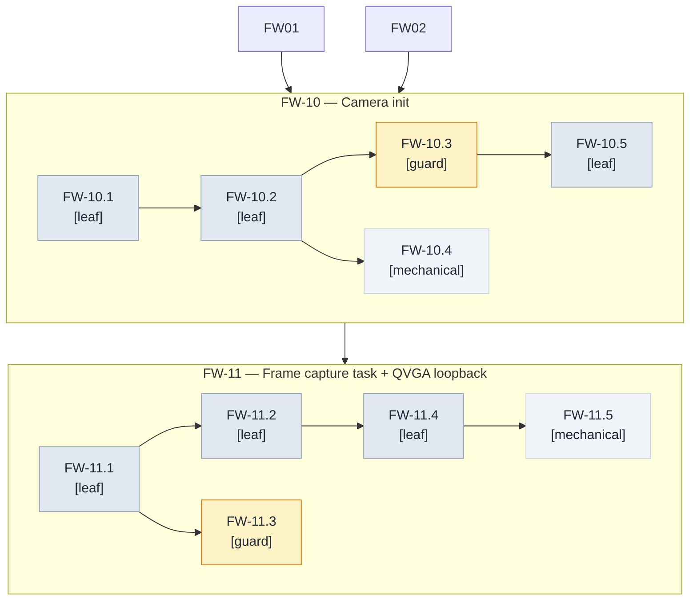
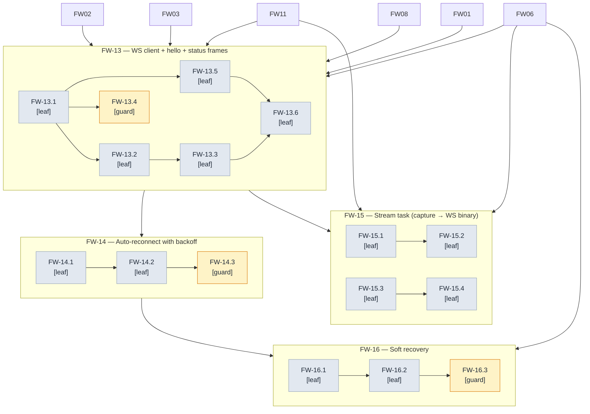
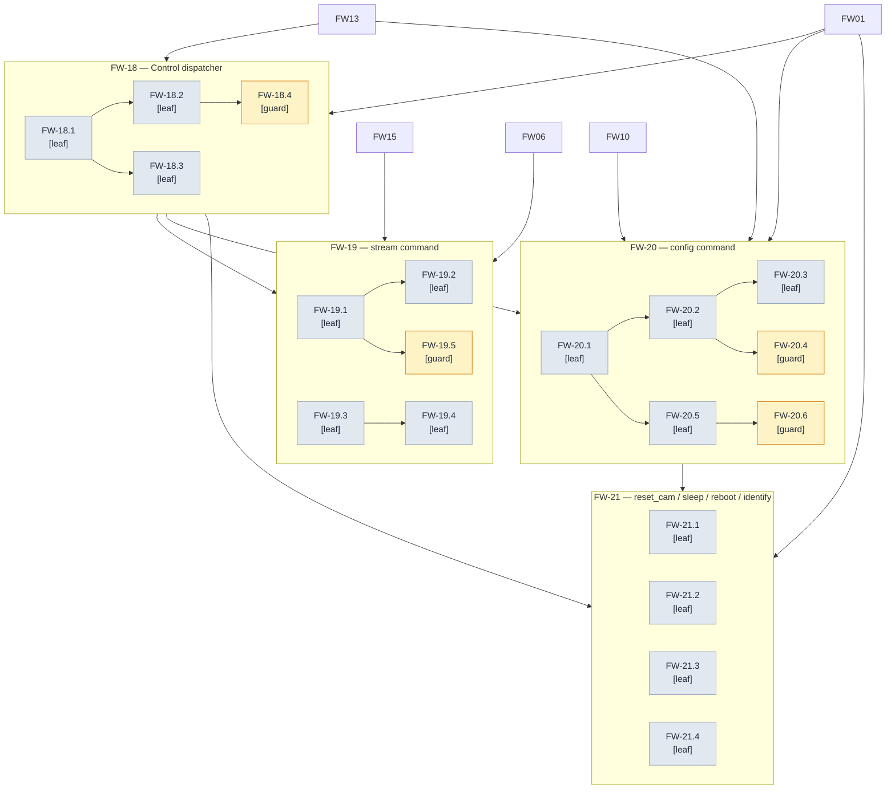
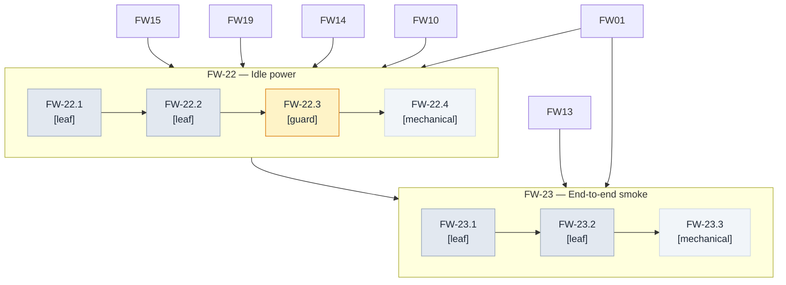

# ESP32-CAM Surveillance — firmware milestones and task graph

> **Status**: 8 of 19 milestones complete (FW-01 closed by merge commit `1ab5705`; FW-02 closed by PR #4, merge commit `5a2b016`; FW-03 closed by PR #6, merge commit `db892b2`; FW-05 closed by PR #7, merge commit `ccd8f71`; FW-06 closed by PR #8, merge commit `0d4fe7d` — see amendment blockquote at the end of § FW-06; FW-07 closed by PR #9, merge commit `091b2a4` — see amendment blockquote at the end of § FW-07; **FW-08 closed by PR #10 (pending — worktree `feat/fw-08-wifi-station-backoff`, 8 work-unit commits, see amendment blockquote at the end of § FW-08)**).
> **Next SDD to start**: FW-09 (WS reconnect) or FW-10 (camera init) per dependency graph — FW-08 closed unblocks FW-13; FW-09 / FW-10 are independent.
> **Entry gate**: none — from-zero plan; the validation scaffold is already merged.
> **References**: [firmware PRD](firmware-prd.md) · [PRD commit history](https://github.com/witsaba/esp32-cam-surveillance/commits/docs/esp32-cam-firmware-prd) · Project Bindings (declared inline — see [Method](#method--sdd-milestone-rules)).
> **Date**: 2026-08-21.
> **Append-only rule**: once the first milestone merges, ids are never renumbered; new work
> appends the next free number; amendments are dated blockquotes with struck-through text.

> **Amended 2026-08-21 (proportionality rescope).** A re-review against the skill's decomposition
> discipline (merge-back rule, proportionality, sibling-disjointness) retired four milestones by
> merging them into siblings — 23 milestones → 19, 81 nodes → 79. Retired ids are never reused.
> ~~FW-04 (provisioning trigger)~~ duplicated FW-03.3 and FW-07.2 scenario-for-scenario; its only
> non-duplicated node (the stability guard) moved to FW-03.4. ~~FW-09 (softAP teardown)~~ was a
> single event handler below the one-SDD-flow lower bound; its nodes moved to FW-08.4 – FW-08.6.
> ~~FW-12 (QVGA loopback)~~ restated FW-11.1's behavior as a longer soak; its nodes moved to
> FW-11.4 – FW-11.5. ~~FW-17 (status frames)~~ shared FW-13's module contract (outbound text
> frames per the PRD module map); its nodes moved to FW-13.5 – FW-13.6. Every edge, checklist
> item, and traceability-spine row that referenced a retired id was rewired to the absorbing node.

> **Authoring constraint.** This document states behaviors as Gherkin scenarios and what evidence
> closes each node. It never states type names, field names, or signatures — each milestone's SDD
> cycle owns those. It is implementation-language-agnostic: tool bindings live only in
> [Method](#method--sdd-milestone-rules).

## Outcome first

A self-recovering ESP32-CAM firmware that holds one persistent WebSocket to the backend, pushes
JPEG frames as binary messages, accepts control commands as text messages, and survives every
transient failure — including the Wi-Fi dropouts that today require a physical reboot. Energy is
the dominant non-functional requirement: the node idles at Wi-Fi modem-sleep current when no
client is watching, and wakes the camera + WS pipeline only on demand. When the last wave's exit
condition holds, a cold-boot device reaches `NOLINK` with a provisioned identity, joins the
configured Wi-Fi, opens the WebSocket, sends a hello frame, responds to backend
`stream` / `config` / `identify` / `reset_cam` / `sleep` / `reboot` commands, emits a status frame
every 30 seconds, fragments oversized frames, backs off exponentially on disconnect, soft-recovers
after the failure threshold, and powers down the camera when no client is connected — all without
manual intervention.

## Quick navigation

| Section | What it settles |
| --- | --- |
| [Sources and research](#sources-and-research) | Requirements inventory + research digest + inconsistency register |
| [Scope boundary](#scope-boundary) | Owns / must not own / wording traps |
| [Method](#method--sdd-milestone-rules) | Node grammar citation, evidence gate, TDD cycle, project bindings |
| [Global dependency graph](#global-dependency-graph) | Wave-level DAG + delivery sequence |
| [Waves](#wave-0--foundations) | The milestones (Wave 0 … Wave 6) |
| [Completion checklist](#completion-checklist) | Observable outcomes + closing nodes |
| [Explicitly deferred](#explicitly-deferred) | Items deferred to other PRDs / seams |
| [Traceability spine](#traceability-spine) | Requirement → node, two-way |

## Sources and research

### Requirements inventory (Phase 0)

The PRD's milestones M0–M6 and functional requirements FR-1 through FR-7, plus the protocol
contract, the build prerequisites, and the NFRs, are decomposed into stable requirement ids
R-01 through R-28. Every R-id is closed by at least one leaf node in this document.

| Id | Requirement (cited) |
| --- | --- |
| R-01 | Configure NVS-backed `config_t` with wifi credentials + identity fields; load with schema-version fallback (PRD § FR-1 step 1) |
| R-02 | Trigger provisioning mode when `config_t.wifi.ssid` is empty (PRD § FR-1 step 2) |
| R-03 | Trigger provisioning mode when the boot button is held ≥ 3 s at boot (PRD § FR-1 step 2) |
| R-04 | Connect to the configured Wi-Fi with exponential backoff and surface progress via the LED (PRD § FR-1 step 3) |
| R-05 | Tear down the provisioning softAP the instant STA gets an IP, when `CONFIG_FIRMWARE_PROVISIONING_AP_STOP_ON_CONNECT=y` (PRD § FR-1 step 4) |
| R-06 | Initialise the camera driver with the parameters from the camera pipeline table (PRD § FR-1 step 5, § FR-2) |
| R-07 | Initialise the WebSocket client and start it (PRD § FR-1 step 6) |
| R-08 | Start supervision tasks (health, capture, stream, control) and hand off to the event loop (PRD § FR-1 steps 7–8) |
| R-09 | Identity model: MAC = canonical identity (eFuse, never stored); Name + Description = advisory labels editable via `config` command (PRD § FR-1a) |
| R-10 | Provisioning softAP HTTP `GET /whoami` returns MAC + Name + Description + fw + chip (PRD § FR-1a step 2) |
| R-11 | Provisioning softAP HTTP `POST /provision` accepts wifi_ssid + password + name + description, writes to NVS, restarts into normal boot (PRD § FR-1a step 3) |
| R-12 | `GET /whoami` keeps returning the current NVS Name/Description during re-provisioning (PRD § FR-1a step 4) |
| R-13 | Camera pipeline defaults: JPEG, QVGA, quality 18, fb_count=1, grab_mode WHEN_EMPTY, XCLK 10 MHz (PRD § FR-2 table) |
| R-14 | Sensor control surface (the runtime reconfiguration entry point) is reserved for the `config` text command, not driver reinitialisation (PRD § FR-2 closing paragraph) |
| R-15 | `camera_settings` module persists a schema-versioned blob under NVS namespace `camera_cfg`, key `settings`, with validation before every setter call (PRD § FR-2b) |
| R-16 | The capture task is the sole caller of the frame-buffer acquisition API; no semaphore is needed because no concurrent access exists (PRD § FR-2b concurrency model) |
| R-17 | WebSocket pipeline config: TCP transport, no MAC in URL path, ping_interval=10 s, pingpong_timeout=30 s, buffer_size=16384, network_timeout=5000, task_stack=8192 (PRD § FR-3) |
| R-18 | Fragmentation: frames larger than `buffer_size` use the partial + continuation + finalisation sequence (PRD § FR-3 fragmentation policy) |
| R-19 | Auto-reconnect with exponential backoff: 2 s → 4 s → 8 s → 16 s → 30 s cap, counter reset on CONNECTED (PRD § FR-4) |
| R-20 | Soft-recovery: `CONFIG_FIRMWARE_SOFT_RECOVERY_FAILS` (30) consecutive failures within `CONFIG_FIRMWARE_SOFT_RECOVERY_WINDOW_MIN` (10) minutes → reboot + NVS-logged reason (PRD § FR-5) |
| R-21 | Control plane commands: `stream`, `config`, `reset_cam`, `sleep`, `reboot`, `identify` — each dispatched to the appropriate module (PRD § FR-6) |
| R-22 | Unknown commands answered with `{"cmd":"error","reason":"unknown","id":"<original id>"}` (PRD § FR-6 closing paragraph) |
| R-23 | Status LED states: boot solid, wifi-connecting 200 ms blink, ws-connecting 100 ms blink, connected-idle 1 s heartbeat, streaming solid, backoff 2 s blink, soft-recovery 5 Hz rapid blink for 3 s (PRD § FR-7 LED table) |
| R-24 | Boot button: tap < 100 ms ignored at runtime; ≥ 3 s at boot enters provisioning; ≥ 10 s at runtime factory-resets (PRD § FR-7 button table) |
| R-25 | Energy budget: idle < 5 mA with WS connected no stream; streaming < 200 mA at QVGA@5 fps; camera powered down between streams (PRD § Energy budget + § NFRs) |
| R-26 | Security posture: plain ws:// allowed for LAN; strict JSON allow-list on inbound; provisioning softAP torn down on STA IP; no network-facing admin interface in this PRD (PRD § Security posture) |
| R-27 | Protocol contract outbound text frames: hello (on connect), status (every 30 s), identify_ok (reply to identify), config_ok (reply to config), error (rejected/unknown commands); binary JPEG frames with no base64 (PRD § Protocol contract) |
| R-28 | Build prerequisites: project Kconfig (`firmware/main/Kconfig.projbuild`), managed components fetched via `idf.py add-dependency`, `idf.py menuconfig` + `idf.py save-defconfig` produce `sdkconfig.defaults` (PRD § Build prerequisites) |

### Research digest (Phase 1)

> **Phase 1 was substantially completed during PRD authoring; this section cites the PRD's
> References as the digest and adds only the per-finding plan-impact rows that the milestone
> document requires.** The full set of cross-references to the `rural_home_assistant` reference
> firmware (pin map, PSRAM runtime detection, NVS-persisted camera-settings blob, base64 removal,
> semaphore-around-`fb_get` design, hard-coded creds, `portMAX_DELAY` wedge, retry cap, missing
> soft-recovery, no-bounds JSON parsing, string-matching JSON flags, magic-constant stack buffer,
> per-connection WS tasks, MQTT scars) lives in PRD § References. Each row below states what the
> reference finding changed in this milestone plan.

| Finding | Source | What it changed here |
| --- | --- | --- |
| Reference firmware uses a binary semaphore around the frame-buffer acquisition API because its HTTP server has multiple concurrent handlers | `rural_home_assistant/backend/iot-camera/components/http_server/http_server.c:24-82` (PRD References) | Confirmed R-16 and the single-capture-task architecture: the only frame-buffer owner in this plan is FW-11 (capture task), with no semaphore and a queue-as-mutex pattern. FW-11.3 is the guard that bites if a second caller regresses. |
| Reference firmware removes base64 wrapping from JPEG payloads for ~33 % bandwidth | `rural_home_assistant/backend/iot-camera/components/http_server/http_server.c:69-70`; commit `4a2b626` (PRD References) | Confirmed R-27: binary frames carry raw JPEG bytes; the protocol contract is encoded into the WebSocket frame's binary opcode, not a JSON envelope. No plan change. |
| Reference firmware's `camera_settings.c:159` calls the framesize setter with no bounds check; out-of-range values would dereference a corrupt function-pointer table | `rural_home_assistant/backend/iot-camera/components/camera_settings/camera_settings.c:159` (PRD References) | Confirmed R-15: every integer is validated against the OV2640 enum range before any runtime setter call. FW-20.4 is the guard that bites if validation regresses. |
| Reference firmware's `wifi.c:140-144` blocks on `portMAX_DELAY` for the first Wi-Fi connect, which wedges the device on a misconfigured SSID | `rural_home_assistant/backend/iot-camera/components/wifi/wifi.c:140-144` (PRD References) | Confirmed R-04 and FW-03.3: empty SSID triggers provisioning rather than wedging. FW-08.3 is the guard against the wedge regression. |
| Reference firmware caps Wi-Fi retries at 5 then dies; PRD instead specifies infinite exponential backoff (2 s → 30 s cap) plus soft-recovery after the failure threshold | `rural_home_assistant/backend/iot-camera/components/wifi/wifi.c:78-84` (PRD References; FR-4; FR-5) | Confirmed R-19 + R-20: reconnect loop never gives up; the health task owns a 30-fails-in-10-min counter that triggers the documented reboot path. |
| Reference firmware uses `sscanf("%d", &value)` for JSON parsing with no enum bounds checks | `rural_home_assistant/backend/iot-camera/components/camera_settings/camera_settings.c:284-300` (PRD References) | Confirmed R-15 + R-21 + R-22: incoming JSON commands must be parsed by a strict parser against an allow-list. FW-18.1 and FW-18.4 enforce this. |
| Reference firmware spawns one FreeRTOS task per WS connection, exhausting memory under connection storms | `rural_home_assistant/backend/iot-camera/main/camera_server.c:151` (PRD References; deleted WS variant) | Confirmed R-08 + R-16: a single shared stream task is fed by a queue; no per-connection tasks. No plan change. |
| Sibling humidity-sensor component already implements provisioning + exponential backoff + `/whoami` patterns the M1 implementer can read as reference | `rural_home_assistant/backend/iot-humidity-sensor/components/wifi_manager/`, `boot_counter.c`, `whoami.c` (PRD References) | Recorded as an implementer trip point in the FW-02 and FW-05 charters (Notes) — no plan-impact delta, but flagged as recommended reading before FW-02 and FW-05 land. |

### Inconsistency register (Phase 2)

Every conflict, both sides cited, with disposition (*reconciled* / *flagged to user*). The register
is recorded even when items reconcile.

| # | Conflict | Two sides | Disposition |
| --- | --- | --- | --- |
| 1 | Project Bindings for esp32-cam-surveillance (DAG-convention ADR + founding method document) are not yet ratified | The skill's `SKILL.md` § Project Bindings assumes a project's DAG-convention ADR and founding method document exist; this repo has neither — there is no `docs/adr/` folder and the only sibling doc is the PRD. | **Flagged to user.** This document declares its own bindings inline in its [Method](#method--sdd-milestone-rules) section, citing neither a separate ADR nor a founding document. A follow-up PR should author both, ratify the convention, and unblock future milestone documents. |
| 2 | `docs/adr/` folder does not exist in this worktree | Skill's `SKILL.md` `Project Bindings (cachicamas)` references `docs/adr/0007-adopt-dag-convention-for-task-graphs.md`; `ls docs/` returns only `firmware-prd.md` and `.gitkeep` | **Deferred.** Out of scope for this PR; lives in a future ADR PR that closes item #1. |
| 3 | FR-1 step 2 says "provisioning mode: bring up a softAP + captive portal (covered in a follow-up task; out of scope for the first cut)" while the PRD's milestone table M1 lists softAP provisioning + `/whoami` + `POST /provision` as in-scope | PRD § FR-1 step 2 vs PRD § Milestones table M1 | **Reconciled.** The "out of scope for the first cut" sentence is a vestige from the earliest draft; the authoritative scope is the Milestones table. Provisioning is in-scope for M1, decomposing into FW-03.3 + FW-07.2 (trigger) and FW-05 (softAP HTTP surface). (Rescoped 2026-08-21: originally FW-04 + FW-05; FW-04 merged into FW-03/FW-07.) |
| 4 | `ping_interval_sec=10` vs `pingpong_timeout_sec=30` | PRD § FR-3 | **Reconciled.** The 30 s pong-deadline must exceed the 10 s ping cadence (otherwise the watchdog fires before the next ping); 30 ≥ 3 × 10 is the intended margin. FW-15.3 + FW-15.4 encode both halves. |
| 5 | `fps` clamp range `[FIRMWARE_STREAM_FPS_MIN=1, ceiling ~15]` vs `CONFIG_FIRMWARE_STREAM_FPS=5` default | PRD § FR-6 `stream` command vs PRD § FR-3 pipeline defaults | **Reconciled.** `CONFIG_FIRMWARE_STREAM_FPS` is the default applied when the backend sends `stream.on` without an explicit `fps` field; runtime requests are clamped to `[FIRMWARE_STREAM_FPS_MIN, camera_ceiling]`. FW-19.1, FW-19.3, FW-19.4 encode both halves. |
| 6 | PRD § Goals claims "recovery time from transient drop ≤ 10 s" while § FR-3 says `reconnect_timeout_ms` starts at 2 s — so the first retry is well within budget but a transient that misses the first retry can take up to 4 s | PRD § Goals table vs PRD § FR-3 / FR-4 | **Reconciled.** The 10 s budget covers the time from `WEBSOCKET_EVENT_DISCONNECTED` to `WEBSOCKET_EVENT_CONNECTED`, not "must reconnect on the first attempt". The initial 2 s retry covers most cases; later retries may push the wall-clock higher but the health task's soft-recovery threshold bounds the worst case. No plan change. |
| 7 | Error reply envelope disagrees between two PRD sections: `{"cmd":"error","reason":"unknown","id":"<original id>"}` vs `{"type":"error","reason":"<string>","id":"<original cmd>"}` | PRD § FR-6 closing paragraph vs PRD § Protocol contract | **Reconciled.** FR-6 uses `cmd` (the command discriminator in the inbound body); Protocol contract uses `type` (the outbound frame discriminator). The two are not in conflict — they name different fields in different directions. This document follows FR-6 for inbound error replies and the Protocol contract for outbound frame types. FW-18.3 names the inbound field explicitly (`cmd`). The PRD body could be harmonized to make this explicit (a follow-up doc PR), but no plan change is required for the firmware. |

## Scope boundary

- **Owns:** every leaf-node firmware behavior listed in FR-1 through FR-7 plus the protocol contract
  outbound frames (hello, status, identify_ok, config_ok, error), inbound JSON command dispatch
  (allow-list of six commands), frame queue + capture + stream task, WebSocket client + auto-reconnect
  + soft-recovery, status LED state machine, boot button input handling, softAP provisioning HTTP
  server (`/whoami` + `POST /provision`), camera-settings NVS persistence, NVS-backed `config_t`
  schema, and the project-level Kconfig + `sdkconfig.defaults`.
- **Must not own:**
  - Backend protocol termination and frame fan-out to multiple clients — owner: backend PRD.
  - Capture-trigger policies (motion, scheduled polling) — owner: backend PRD.
  - Frontend (browser dashboard) and its WebSocket client UI — owner: frontend PRD.
  - Provisioning mobile app / desktop captive-portal wizard — owner: provisioning tooling PRD (does not exist yet; deferred).
  - OTA update image server, manifest format, and rollback strategy — owner: OTA PRD (does not exist yet; deferred).
  - TLS / `wss://` configuration when traffic crosses an untrusted network — owner: future TLS PRD.
  - ESP32-S3 / ESP32-C3 port (different pin map + PSRAM layout) — owner: future port PRD.
- **Wording traps:**
  - **"MAC travels in the hello frame — NOT in the WS URL path."** The WS URI is
    `ws://<host>:<port>/cams` for every camera; the MAC is sent in the first text frame after
    `WEBSOCKET_EVENT_CONNECTED`. URL path is the connection scope; MAC is the identity scope.
  - **"The softAP is torn down the INSTANT STA gets an IP — not on first successful WS connect."**
    Per FR-1 step 4 and `CONFIG_FIRMWARE_PROVISIONING_AP_STOP_ON_CONNECT=y`, the softAP teardown is
    driven by the station-mode IP-up notification, not by the WebSocket handshake completing. This
    closes the captive-portal attack window before any client tries to connect.
  - **`fb_count=1` always — not "fb_count=2 if PSRAM".** The PRD mandates a single frame buffer
    to halve PSRAM footprint. PSRAM presence is still required (FW-10.2) because the buffer must
    live somewhere; the choice is one-buffer + deterministic backpressure, not two-buffer + racing
    frames.
  - **"The boot-button factory reset wipes the `config` NVS namespace only — it does NOT touch
    the `camera_cfg` namespace."** `reset_cam` (PRD § FR-6) is camera-only; the boot-button
    long-press resets wifi + identity and triggers provisioning. They are different operations.
  - **"Long-press-at-boot and long-press-at-runtime are two separate boot-button behaviors."**
    ≥ 3 s at boot = provisioning entry (FR-1 step 2). ≥ 10 s at runtime = factory reset (FR-7).
    A tap < 100 ms is ignored at any time.

## Method — SDD milestone rules

This document inherits the node grammar, leaf anatomy, split triggers, and living-graph clause from
the skill's `references/method.md` (v2). Bindings for this project:

- **Id prefix used in this document:** `FW` (Firmware). No other prefix may appear in headings or
  `Depends on:` / `Blocks:` fields. Milestones are `FW-01` … `FW-23` (ids FW-04, FW-09, FW-12,
  FW-17 retired by the 2026-08-21 rescope amendment and never reused); nodes are `FW-NN.p`,
  `FW-NN.p.q`, and at most `FW-NN.p.q.r` (three levels below the milestone; depth 2–3 only when a
  node is genuinely a sub-DAG).
- **Evidence-gate command:** `idf.py build` for build-related leaves (must succeed; `firmware.bin`
  < 256 KB). For behavioral leaves whose evidence cannot be observed by the build alone
  (capture, stream, control plane, energy budget), the leaf's exit check additionally requires a
  manual hardware smoke test, recorded in the PR description with the captured log excerpt.
  Per-node exceptions are named on the node.
- **TDD cycle per scenario:** RED (transcribed from the scenario) → implementation → GREEN →
  refactor (performance, clean code, idioms of the implementation language) → review, per
  `gherkin-authoring.md` § "The scenario → TDD mapping".
- **SDD:** each milestone is one SDD flow under its declared kebab-case slug (`SDD change:` line on
  the milestone heading); leaves become its tasks.
- **Project Bindings (esp32-cam-surveillance):** declared inline in this Method section because the
  repository has no `docs/adr/` folder and no founding method document yet (see Inconsistency
  Register items #1 and #2). The bindings above replace what an ADR + founding document would
  otherwise cite. A follow-up ADR + founding doc should be authored to ratify them.
- **Founding method document:** none. This document's Method section IS the founding reference
  until a separate founding doc is ratified.
- **Ratifying DAG-convention ADR:** none — flagged in the Inconsistency Register.
- **Language-agnostic phrasing:** normative text names roles (the WS event handler, the
  frame-buffer acquisition API, the softAP HTTP server, the station-mode IP-up notification). The
  project's tool binding for each role lives here only: the implementation language is C; the
  RTOS is FreeRTOS supplied by ESP-IDF; the Wi-Fi + WebSocket + camera drivers are the Espressif
  `esp_wifi` / `esp_websocket_client` / `esp32-camera` managed components; NVS is the
  `nvs_flash` API; GPIO is `driver/gpio`; the HTTP server on the softAP is the IDF
  `esp_http_server`; project tunables come from `Kconfig.projbuild` + `sdkconfig.defaults`;
  logging is `ESP_LOG*`. Type names, field names, signatures, function names, and framework
  calls appear nowhere else in this document.

## Entry gate

None. From-zero plan — the validation scaffold milestone (FW-01) is already merged (commit
`1ab5705`) and provides the `idf.py build` baseline that every subsequent milestone extends.

## Global dependency graph

### Delivery sequence

| Wave | Milestones | Gate | Exit condition (the wave's value) |
| --- | --- | --- | --- |
| 0 — Foundations | FW-01 (closed) | none | `idf.py build` succeeds; `firmware.bin` < 256 KB; managed components fetched; project Kconfig loaded — proven by merge commit `1ab5705` |
| 1 — Provisioning & NVS | FW-02, FW-03, FW-05, FW-06, FW-07 | Wave 0 complete | A cold-boot device reaches `NOLINK` with NVS round-trip working; LED reflects boot / wifi / ws states; the boot button handles tap, boot-time long-press, and runtime long-press |
| 2 — Wi-Fi | FW-08 | Wave 1 complete | Station mode connects with exponential backoff and recovers within 30 s after AP reboot; the softAP tears down the instant STA gets an IP, closing the captive-portal attack window |
| 3 — Camera | FW-10 … FW-11 | Wave 2 complete | The camera driver initialises with PRD-mandated sensor parameters; PSRAM presence is asserted (or `PSRAM_REQUIRED` + stop); a capture-and-drop loop sustains 5 fps with frame-queue overflow dropping + returning the buffer |
| 4 — WebSocket + Recovery | FW-13 … FW-16 | Wave 3 complete | The device opens its single persistent WS to `ws://<host>:<port>/cams`, sends a hello frame on connect, emits status frames every 30 s, streams fragmented or non-fragmented binary JPEG frames, reconnects with exponential backoff, and triggers a reboot after the soft-recovery failure threshold with the reason NVS-logged |
| 5 — Control plane | FW-18 … FW-21 | Wave 4 complete | The backend can drive `stream on/off` (with fps clamping), `config` (frame_size + quality + identity via runtime setters with strict validation), `reset_cam` (camera-only reset), `sleep` (clean CLOSE + no auto-reconnect), `reboot` (persists dirty config), `identify` (text reply); unknown commands return `error` with the original id |
| 6 — Energy + Integration | FW-22 … FW-23 | Wave 5 complete | Camera is powered down between streams and Wi-Fi modem-sleep engages when no client is connected, achieving < 5 mA idle; full end-to-end smoke on hardware confirms cold-boot → provisioning → wifi → WS → stream → sleep → reboot flow |

## Wave 0 — Foundations

The validation scaffold: the project bootstraps, both managed components fetch, the project Kconfig
parses cleanly, and `idf.py build` produces a `firmware.bin` under 256 KB. Its value is that every
later milestone compiles against a known-good baseline.

### FW-01 — Validate the scaffold `[decision, closed by 1ab5705]`

SDD change: `firmware-validation-scaffold` · Closes: R-28.

**Charter**

- **Goal:** Prove the project compiles with both managed components and the project Kconfig loaded, before any behavior work begins.
- **Deliverable:** the validated baseline: project bootstrapped from the camera example, WebSocket client added as a managed dependency, project Kconfig under `firmware/main/Kconfig.projbuild`, `sdkconfig.defaults` capturing PSRAM + project tunables, and a successful `idf.py build`.
- **Acceptance:** the merge commit that closes this milestone recorded every checklist item below as green.
- **Depends on:** nothing. **Blocks:** FW-02, FW-03, FW-05, FW-06, FW-07, FW-08, FW-10, FW-11, FW-13, FW-14, FW-15, FW-16, FW-18, FW-19, FW-20, FW-21, FW-22, FW-23 (every later milestone compiles against this baseline).
- **Out of scope:** application behavior — owner: subsequent milestones (FW-02 onward).
- **Notes:** the implementer of FW-01 followed PRD § Build prerequisites § Steps 1–6. The artifacts (`managed_components/`, `build/firmware.bin`) are not in version control; they are reproduced by `idf.py build` after pulling the merged files.

#### FW-01.1 — recorded evidence `[decision]`

- **Closing checklist (all green at merge commit `1ab5705`):**
  - `idf.py --version` returns ESP-IDF v5.5.3
  - `idf.py set-target esp32` succeeds
  - `idf.py build` succeeds; `firmware.bin` measures 222 KB (under the 256 KB ceiling; 79 % flash free)
  - WebSocket client component 1.8.0 fetched into `managed_components/`
  - Camera component 2.1.7 fetched into `managed_components/`
  - `firmware/main/Kconfig.projbuild` loaded; 9 project tunables visible in `sdkconfig`; no unknown-symbol warnings
  - `sdkconfig.defaults` overrides parse cleanly
  - Connected board on `/dev/cu.usbserial-130` probed: ESP32-D0WDQ6, 4 MB flash, MAC `c8:f0:9e:9d:50:08`
  - PSRAM presence is **pending** at scaffold time; confirmed at runtime in FW-10.2
  - Hardware flash + monitor: **pending** — runs when FW-02 lands

- **Depends on:** nothing.

## Wave 1 — Provisioning & NVS

The device can be brought up and managed out of the box: a fresh flash boots into the provisioning
path because no SSID is stored, the softAP serves `/whoami` and `POST /provision`, and on success the
device reboots into normal mode. The LED reflects every boot state, and the boot button behaves
correctly at boot and at runtime. The NVS-backed `config_t` round-trips with schema-version
recovery from any single-bit error.

### FW-02 — Define NVS-backed `config_t` schema and load/save round-trip

SDD change: `firmware-nvs-config-schema` · Closes: R-01.

**Charter**

- **Goal:** Persist `config_t` (wifi credentials + identity Name/Description + schema version) in NVS with a schema-version check that survives a single-bit error.
- **Deliverable:** a `config` module exporting `config_load`, `config_save`, and `config_factory_reset`, backed by an NVS namespace carrying `ssid`, `password`, `name`, `description`, and `schema_version` keys.
- **Acceptance:** given a fresh NVS partition, `config_load` returns `CONFIG_OK` with defaults; given a stored blob with a stale schema version, `config_load` logs a warning, falls back to defaults, marks the in-memory config as dirty, and persists the new schema on the next `config_save`.
- **Depends on:** FW-01. **Blocks:** FW-03, FW-05, FW-07, FW-08.
- **Out of scope:** wifi connect logic — owner: FW-08. softAP HTTP server — owner: FW-05. Camera-settings NVS namespace — owner: FW-20.
- **Notes:** MAC is NOT stored in `config_t`; it is read live from eFuse by the identity module (FW-13.3). Read `rural_home_assistant/backend/iot-humidity-sensor/components/wifi_manager/` for reference patterns of NVS-backed wifi config before authoring, even though the new code lands in the firmware modules area.

#### FW-02.1 — walking skeleton — `config_t` round-trip on fresh partition `[leaf]`

- **Scenarios:**
  - **Scenario: fresh partition returns defaults and CONFIG_OK.** Given an erased NVS partition, When `config_load` is invoked, Then it returns `CONFIG_OK`, writes the defaults into the out-parameter, and the in-memory `config_t.wifi.ssid` is empty.
  - **Scenario: save then load round-trips every field.** Given a fresh partition and a `config_t` with non-default values for every field, When `config_save` is called followed by `config_load` into a fresh out-parameter, Then every field equals the value written.
- **Depends on:** nothing.

#### FW-02.2 — schema-version mismatch falls back to defaults `[leaf]`

- **Scenarios:**
  - **Scenario: stale stored schema falls back to defaults and marks dirty.** Given a stored config namespace whose `schema_version` is older than the firmware's compiled-in value, When `config_load` is invoked, Then it logs a warning, fills the out-parameter with defaults, and sets the in-memory dirty flag.
  - **Scenario: next save persists the new schema.** Given an in-memory config that became dirty after a stale-schema load, When `config_save` is invoked, Then the stored `schema_version` equals the firmware's compiled-in value.
- **Depends on:** FW-02.1.

#### FW-02.3 — schema-version guard bites when check regresses `[guard]`

- **Bite proof:**
  - **Scenario: stale schema is rejected when the check regresses.** Given a stored `schema_version` older than the firmware's compiled-in value AND the version-check call stubbed out (scratch violation), When `config_load` is invoked, Then the check fails naming the version-mismatch invariant.
  - **Scenario: matching schema passes.** Given a stored `schema_version` equal to the firmware's compiled-in value, When the check runs, Then it passes.
- **Depends on:** FW-02.2.

#### FW-02.4 — NVS partition sized for `config_t` max blob `[mechanical]`

- **Closing check:** ~~the NVS partition declares a size sufficient for `config_t` plus the `camera_cfg` namespace allocated in FW-20, verified by `idf.py size-components` showing partition usage under 80 %~~ (superseded 2026-08-21 — see amendment blockquote below; `idf.py size-components` reports *app-binary* component sizes, not NVS partition usage). Static-math acceptance (code review of `firmware/partitions.csv`) confirms the 0x6000 (24 KB) NVS partition holds `config_t` (~512 B with per-key entry overhead — see design § "NVS Layout" for the entry-overhead math) plus the future `camera_cfg` namespace (~64 B allocated in FW-20) at well under 80 % of 24 KB, AND device-side runtime check: `nvs_get_stats(NULL, &stats)` is called from `firmware/main/main.c` immediately after `nvs_flash_init()` and emits an `ESP_LOGI` line containing `used_entries / free_entries / total_entries / namespace_count` with `used_bytes < 0x6000 * 0.8` observable on `idf.py monitor`.
- **Depends on:** FW-02.1.

> **Amendment 2026-08-21 (FW-02 merge).** The original closing-check wording named `idf.py size-components` as the verification tool. That command reports *app-binary* component sizes (DRAM, IRAM, flash code/data), not NVS partition usage — the wrong tool for the question. Replaced with the two-check contract above: a static-math check against `partitions.csv` plus a device-side `nvs_get_stats()` runtime smoke. The static-math check matches the reference humidity-sensor partition sizing and is conservative (~2 % used); the device-side smoke is observable via `idf.py monitor` after the boot orchestrator lands (FW-03.1). Closing evidence: `firmware.bin` = 0x38ba0 (227 KB), 76 % free in the 0xF0000 factory partition — well under the 256 KB M0 evidence gate. `idf.py test --target esp32` runs the host-side Unity suite green: 7 tests in production build (FW-02.1 fresh + round-trip, FW-02.2 stale + future + persists, FW-02.3 matching-schema, FW-02.3 bite-proof); 1 expected failure in the stub build (FW-02.3 bite-proof: stubs the version check → stale-schema test fails by name containing the literal `schema_version`, matching-schema test still passes).

### FW-03 — Boot orchestrator runs the FR-1 sequence

SDD change: `firmware-boot-orchestrator` · Closes: R-02, R-03 (decision-integration half; the press-duration measurement is FW-07's), R-06, R-07, R-08.

> **Amended 2026-08-21 (rescope).** ~~FW-04 — Provisioning trigger fires on empty SSID or
> boot-button long-press~~ merged here: FW-04.1 duplicated FW-03.3 scenario-for-scenario and
> FW-04.2 duplicated FW-07.2 (sibling-disjointness violation). The only non-duplicated node, the
> decision-stability guard FW-04.3, is appended below as FW-03.4. R-02 is now closed by FW-03.3;
> R-03 jointly by FW-07.2 (press-duration measurement) and FW-03.3 (decision integration).
> FW-04's `Blocks: FW-05` edge moved to this milestone. FW-03.4 stubs the button signal, so this
> milestone's SDD flow stays closable before FW-07 lands.

**Charter**

- **Goal:** Drive the FR-1 boot sequence (NVS init → load config → provisioning decision → camera init → WS init → start supervision tasks → event-loop handoff) in the documented order, with a loud failure if any required init returns non-OK.
- **Deliverable:** the boot orchestrator that runs the boot sequence in the documented order, calls each module's init function at the right step, and exits cleanly into the event loop.
- **Acceptance:** given a configured device, after the boot orchestrator returns, the supervision tasks are running and the device is ready to handle events; given a misconfigured device, the provisioning branch is taken (FR-1 step 2); given a failing init, the boot fails loud with a typed error (not a silent wedge).
- **Depends on:** FW-02, FW-01. **Blocks:** FW-05, FW-08, FW-10, FW-13.
- **Out of scope:** the actual init implementations — owners: FW-02 (config), FW-08 (wifi + softAP teardown), FW-10 (camera), FW-13 (WS). Boot-button press-duration measurement — owner: FW-07.
- **Notes:** this milestone stitches existing module inits into the documented order; it does not own the implementations themselves.

#### FW-03.1 — walking skeleton — the boot orchestrator runs the boot sequence in order `[leaf]`

- **Scenarios:**
  - **Scenario Outline: boot order is documented and observed.** Given a configured device, When the boot orchestrator runs, Then init NVS is invoked before load config, load config is invoked before the wifi-station init, wifi-station init is invoked before camera init, camera init is invoked before WS init, and WS init is invoked before the supervision tasks start, and the boot orchestrator returns.
  - Examples:
    | init step | precedes |
    | --- | --- |
    | NVS init | load config |
    | load config | wifi-station init |
    | wifi-station init | camera init |
    | camera init | WS init |
    | WS init | supervision tasks start |
      | supervision tasks start | boot orchestrator return |
- **Depends on:** FW-02.1.

#### FW-03.2 — boot fails loud when a required init fails `[guard]`

- **Bite proof:**
  - **Scenario: failing init is named in the error log.** Given the camera init returns a non-OK code, When the boot orchestrator runs, Then the boot sequence aborts with a typed error log identifying the failing step (no silent wedge, no event-loop spin without supervision).
  - **Scenario: green path passes.** Given all inits return OK, When the boot orchestrator runs, Then the error log is empty and the boot reaches the event-loop handoff.
- **Depends on:** FW-03.1.

#### FW-03.3 — provisioning branch is taken deterministically `[leaf]`

- **Scenarios:**
  - **Scenario: empty SSID takes the provisioning branch.** Given a `config_t.wifi.ssid` empty string and the boot button not pressed, When the boot orchestrator reaches the provisioning decision step, Then the provisioning path is taken.
  - **Scenario: configured SSID skips provisioning.** Given a `config_t.wifi.ssid` non-empty and the boot button not pressed, When the boot orchestrator reaches the provisioning decision step, Then the normal-boot path is taken.
  - **Scenario: boot-time long-press selects provisioning regardless of SSID.** Given the boot-button boot-time long-press signal asserted (the press-duration measurement is owned by FW-07.2 and stubbed here) and a non-empty `wifi.ssid`, When the boot orchestrator reaches the provisioning decision step, Then the provisioning path is taken.
- **Depends on:** FW-02.1.

#### FW-03.4 — provisioning decision is stable after the first decision `[guard]`

- **Bite proof:**
  - **Scenario: flapping is rejected.** Given the provisioning decision logic stubbed to flip its return value on each call (scratch violation), When the boot-time provisioning decision runs twice during the same boot, Then the guard fails naming the determinism invariant.
  - **Scenario: green path is stable.** Given the provisioning decision logic intact (button signal stubbed to a fixed value), When the boot-time provisioning decision runs twice during the same boot, Then both runs return the same answer.
- **Depends on:** FW-03.3.

### FW-05 — softAP HTTP server exposes `/whoami` and `POST /provision`

SDD change: `firmware-softap-provisioning` · Closes: R-10, R-11, R-12, R-26.

**Charter**

- **Goal:** While the device is in provisioning mode, the softAP runs an HTTP server that lets the onboarding app read the device's identity (`/whoami`) and write wifi + identity (`POST /provision`), then reboot into normal boot.
- **Deliverable:** the HTTP server endpoints on the softAP interface, with strict request validation.
- **Acceptance:** a fresh-provisioning device answers `GET /whoami` with MAC + Name + Description + fw + chip; `POST /provision` writes the four-field body to NVS and triggers a reboot; re-provisioning devices see their existing Name/Description in `/whoami`, not an empty placeholder.
- **Depends on:** FW-03, FW-02, FW-01. **Blocks:** FW-08 (the softAP-teardown nodes FW-08.4 – FW-08.6 need a softAP to tear down).
- **Out of scope:** the provisioning mobile app — owner: provisioning tooling PRD. Captive-portal DNS rebinding for automatic browser redirect — deferred (not in PRD scope).
- **Notes:** the softAP tear-down at STA IP is wired here as a soft dependency on FW-08.4; this milestone closes the HTTP surface only. Read `rural_home_assistant/backend/iot-humidity-sensor/components/whoami.c` as reference before authoring.

#### FW-05.1 — `GET /whoami` returns the device identity `[leaf]`

- **Scenarios:**
  - **Scenario: whoami returns MAC + identity + fw + chip on a fresh device.** Given a device in provisioning mode with an empty Name and Description, When `GET /whoami` is invoked, Then the response body contains the MAC read from eFuse, empty `name`, empty `description`, the firmware version string, and the chip identifier.
  - **Scenario: whoami returns content-type JSON.** Given a `GET /whoami` request, When the response is observed, Then the content type is JSON and the body parses without error.
- **Depends on:** FW-03.3.

#### FW-05.2 — `POST /provision` writes NVS and reboots into normal boot `[leaf]`

- **Scenarios:**
  - **Scenario Outline: provision writes every field and reboots.** Given a device in provisioning mode, When `POST /provision` is invoked with `<wifi_ssid>`, `<password>`, `<name>`, `<description>`, Then the four fields are persisted to NVS under the `config` namespace and the device reboots.
  - Examples:
    | wifi_ssid | password | name | description |
    | --- | --- | --- | --- |
    | home-2.4 | hunter2 | front-door | covers main entrance |
    | office-5g | correct-horse | back-yard | covers parking lot |
    | guest | empty | spare | empty |
- **Depends on:** FW-05.1, FW-02.1.

#### FW-05.3 — `GET /whoami` returns current NVS values during re-provisioning `[leaf]`

- **Scenarios:**
  - **Scenario: existing Name and Description round-trip.** Given a device already provisioned with Name `front-door` and Description `covers main entrance`, When the user re-enters provisioning mode and invokes `GET /whoami`, Then the response body's `name` equals `front-door` and `description` equals `covers main entrance`.
  - **Scenario: user can edit only the changed field.** Given a re-provisioning device, When the user POSTs only `wifi_password` (omitting Name and Description), Then NVS preserves the existing Name and Description and updates only the wifi credentials.
- **Depends on:** FW-05.2.

#### FW-05.4 — malformed request bodies are rejected without crashing `[guard]`

- **Bite proof:**
  - **Scenario: non-JSON body is rejected with a 4xx.** Given a `POST /provision` body that is not valid JSON, When the request is processed, Then the server returns a 4xx status and the boot remains in provisioning mode (no crash, no NVS write).
  - **Scenario: JSON missing required keys is rejected.** Given a `POST /provision` JSON body missing `wifi_ssid`, When the request is processed, Then the server returns a 4xx status naming the missing key.
  - **Scenario: well-formed request passes.** Given a well-formed `POST /provision` body, When the request is processed, Then the server returns a 2xx status and persists the fields.
- **Depends on:** FW-05.2.

> **Amendment 2026-08-22 (FW-05 PR #7 merged, merge commit `ccd8f71`).** The HTTP-server milestone closes R-10, R-11, R-12, and the inbound-validation half of R-26 across 13 work-unit commits on `feat/fw-05-softap-provisioning` (4 feature commits for FW-05.1–FW-05.4, 1 spec-reconciliation fix for the partial-update vs strict-guard contradiction, 1 home-page scope expansion the user directed, and 7 device-interaction bug fixes — see the commit ledger below):
>
> | SHA | Subject | Closes |
> |---|---|---|
> | `01b4cca` | feat(softap): bring up softAP + GET /whoami + POST /provision handlers (FW-05.1, FW-05.2) | FW-05.1 + FW-05.2 (initial commit landed all 8 FW-05.1 + FW-05.2 tests + 4 mocks + cJSON dep + softAP component) |
> | `57ab8fe` | feat(softap): partial-update semantics + re-provisioning /whoami (FW-05.3) | FW-05.3 |
> | `afb90ec` | test(softap): malformed-JSON guard with bite-proof (FW-05.4) | FW-05.4 |
> | `2d72473` | fix(softap): relax guard to require only wifi_ssid+wifi_password (aligns with FW-05.3 partial update) | (reconciliation; no new node, fixes the spec ambiguity surfaced in batch 2) |
> | `7eb7c01` | fix(softap): align softAP bring-up with IDF v5.5.3 init order (3 device-flash bugs) | engram #3627, #3630, #3631 (esp_wifi_init, netif init order, HTTPD_DEFAULT_CONFIG) |
> | `9b91c62` | fix(softap): set max_connection=4 explicitly (was 0 from memset) | engram #3636 (user-reported: cannot connect to softAP) |
> | `43d7fa4` | feat(softap): minimal provisioning home page (GET / with HTML form) | scope expansion 2026-08-22 (user-directed; no new R-id) |
> | `71c0194` | fix(softap): own the cfg via module-static (was dangling on caller return) | engram #3639 (station-join LoadProhibited crash) |
> | `17161ee` | fix(softap): call esp_netif_set_default_netif (was missing netif default) | engram #3640 (lwIP semaphore crash on DHCP ACK) |
> | `37b1639` | fix(sdkconfig): bump HTTPD_TASK_STACK_SIZE 4096 → 8192 | (no-op — IDF v5.5.3 doesn't expose this symbol; reverted in `0c650ec`) |
> | `0c650ec` | fix(softap): heap-allocate home page buffer (httpd stack overflows) | engram #3641 + #3642 (stack overflow → pthread crash on GET /) |
>
> **PR**: #7 (`feat/fw-05-softap-provisioning` → `main`, draft, awaiting user review and merge).
> **Test results**: `idf.py test --target esp32` → 38/38 production tests PASS (16 FW-05 + 15 FW-03 + 7 FW-02). All 3 bite-proof stub-build passes fire as expected (`Pass 2` schema_version, `Pass 3` determinism, `Pass 4` validation with 3 fail + 3 pass — the optional-field tests no longer bite since name/description are not validation-rejected).
> **Build**: `idf.py build` succeeds; `firmware.bin` = 569,888 bytes (0x8b220), 58 % of the 960 KB factory partition (`0xF0000`), 42 % free.
> **Verify-report verdict**: PASS — all 4 milestone nodes CLOSED, 4/4 requirements closed, 16/16 scenarios closed.
>
> **5 documented design deviations** (verify-report #3623):
>
> 1. `esp_wifi_ap_start()` → `esp_wifi_start()` — IDF v5.5.3 does not expose `esp_wifi_ap_start()`; the function `esp_wifi_start()` works for AP mode.
> 2. `esp_netif_destroy_default_netif()` → `esp_netif_destroy()` — IDF v5.5.3 takes an `esp_netif_t*` argument.
> 3. cJSON include path: `<cjson/cJSON.h>` in docs but `<cJSON/cJSON.h>` in source — matches IDF examples.
> 4. 5 host IDF header stubs added at `firmware/tests/host_include/` (constants + typedefs only) to avoid pulling in device-only transitive headers on host.
> 5. **256 KB M0 evidence gate is outdated** — the factory partition was enlarged to `0xF0000` (960 KB) after FW-01. Current firmware.bin (569 KB) fits the 960 KB partition with 42 % free. The 256 KB wording should be amended in a follow-up doc PR (out of FW-05 scope).
>
> **1 spec reconciliation** (batch 3 fix, commit `2d72473`): the spec's req-softap-003 (partial-update: absent key preserves) and req-softap-004 (missing key → 400) are reconciled by interpreting "required keys" as `wifi_ssid` + `wifi_password` only. Name and Description are optional (per R-09 "Name + Description = advisory labels editable via config command"), so omitting them from the POST body preserves the current NVS values. This aligns the implementation with PRD § FR-1a L122-131 + FW-05.3 S2 ("user POSTs only `wifi_password`").
>
> **1 scope expansion** (commit `43d7fa4`, added after merge-candidate review on 2026-08-22): the user flagged that without a minimal provisioning home page, a phone user connecting to the softAP has no way to issue the JSON `POST /provision` body — phones don't ship with curl/Postman. The PRD's milestones doc L472 deferred captive-portal UX; the PRD L89 deferred the captive portal entirely; the PRD's `Out-of-scope` block listed "Provisioning mobile app / desktop captive-portal wizard — owner: provisioning tooling PRD (does not exist yet; deferred)." The user explicitly directed the orchestrator to ship a minimal `GET /` home page with an HTML form that posts to `/provision`. Scope expansion: the softAP now serves a third URI (`/`) returning a tiny embedded HTML page (~2 KB of source, ~2.8 KB rendered) with form fields for `wifi_ssid`, `wifi_password`, `name`, `description`, pre-filled with the current NVS identity for re-provisioning. The HTML is HTML-escaped for the user-controlled fields (XSS prevention). Deferred to a separate PRD / future work: captive-portal DNS rebinding (iOS/Android auto-open the portal), mDNS / DNS-SD advertisement, WPA2 PSK on the softAP, pre-filled SSID from a scanned network list. The provision tooling PRD (mobile app / desktop wizard) remains the proper home for these.
>
> **5 device-interaction bugs caught during end-to-end testing** (user tested the softAP from a phone on 2026-08-22 after each fix). These would NOT have been caught by host tests, `make build`, or `make smoke` — they required real-silicon + interactive use. The pattern: host mocks don't validate IDF state machines, struct-initialization correctness, lwIP internal pointer chains, or task stack depth. Every fix included a regression test that would fail RED on host if the bug regressed. Commits: `7eb7c01`, `9b91c62`, `17161ee`, `71c0194`, `0c650ec` (one revert of a no-op `CONFIG_HTTPD_TASK_STACK_SIZE` Kconfig attempt that the IDF doesn't expose; engram #3642). See engrams #3627 / #3630 / #3631 / #3636 / #3639 / #3640 / #3641 / #3642 for the full story.
>
> **Device-verified end-to-end success** (2026-08-22): user erased flash, flashed `0c650ec`, monitored. Phone connected to `ESP_9D5009`, fetched the 2881-byte home page, POSTed `/provision` with `{ssid:Liwaisi Wifi, name:Estudio}`, device saved the config and rebooted into normal mode. The softAP provisioning flow is the first FW-05 capability that has been device-verified end-to-end through every node — `/` (home page, FW-05 home-page scope expansion), `/whoami` (FW-05.1 + FW-05.3 round-trip), and `/provision` (FW-05.2 + FW-05.3 partial-update + FW-05.4 strict validation guard). The success of this flow validates the user's mandate to flash + monitor + interactively test every chip-code change.
>
> **1 SUGGESTION** (verify-report #3623): `firmware/scripts/smoke.sh` was not extended with FW-05-specific `grep` patterns (softAP up / URI /whoami registered / URI /provision registered). Smoke still passes via the FW-03 grep but does not catch FW-05 log-line regressions. Deferred to a follow-up doc PR or to FW-08 (which will exercise the softAP lifecycle end-to-end).

### FW-06 — Status LED reflects every boot and runtime state

SDD change: `firmware-status-led` · Closes: R-23.

**Charter**

- **Goal:** Drive the onboard status LED so an observer without a serial cable can identify which phase the firmware is in (booting, wifi-connecting, ws-connecting, idle, streaming, backoff, soft-recovery).
- **Deliverable:** an LED control surface that maps each high-level firmware state to the documented blink pattern.
- **Acceptance:** every state in the FR-7 LED table has an observable blink signature; the LED never sticks in a transient state because of a missed timer event.
- **Depends on:** FW-01. **Blocks:** FW-08, FW-13, FW-15, FW-16, FW-19.
- **Out of scope:** the boot button's onboard LED reuse — owner: FW-07 (FW-07 boot button reads GPIO 0; FW-06 LED writes GPIO 4 — separate GPIOs. The LED control surface here writes only, never reads.)

#### FW-06.1 — boot and connecting states `[leaf]`

- **Scenario Outline: boot and connecting states match the LED table.** Given the firmware is in `<state>`, When the LED driver observes the state, Then the LED pattern is `<pattern>`.
  Examples:
    | state | pattern |
    | --- | --- |
    | booting / NVS init | solid ON |
    | wifi-connecting | 200 ms period blink |
    | ws-connecting | 100 ms period blink |
- **Depends on:** FW-01.

#### FW-06.2 — connected states `[leaf]`

- **Scenario Outline: connected states match the LED table.** Given the firmware is in `<state>`, When the LED driver observes the state, Then the LED pattern is `<pattern>`.
  Examples:
    | state | pattern |
    | --- | --- |
    | WS connected, idle (no stream) | 1 s period heartbeat |
    | WS connected, streaming | solid ON |
- **Depends on:** FW-06.1.

#### FW-06.3 — backoff and soft-recovery states `[leaf]`

- **Scenario Outline: backoff and recovery states match the LED table.** Given the firmware is in `<state>`, When the LED driver observes the state, Then the LED pattern is `<pattern>`.
  Examples:
    | state | pattern |
    | --- | --- |
    | reconnect backoff active | 2 s period blink |
    | soft-recovery about to fire | 5 Hz rapid blink, sustained for 3 s before reboot |
- **Depends on:** FW-06.2.

#### FW-06.4 — LED never sticks in a transient state `[guard]`

- **Bite proof:**
  - **Scenario: timer-disabled LED control is rejected.** Given the LED timer callback stubbed out (scratch violation), When the firmware transitions from `wifi-connecting` to `ws-connecting`, Then the guard fails naming the timer-fire invariant (LED would stick in the 200 ms blink).
  - **Scenario: green path keeps the LED moving.** Given the LED timer running, When the firmware transitions between states, Then the LED pattern updates within one period of the previous pattern.
- **Depends on:** FW-06.3.

> **Amended 2026-08-22 (FW-06 closure evidence).** PR [#8](https://github.com/witsaba/esp32-cam-surveillance/pull/8) merged `2026-08-22` at merge commit `0d4fe7d` on the `feat/fw-06-status-led` branch off `main@c4df13d`. 7 work-unit commits (no chained PR), each independently green via `python3 firmware/tools/run_host_tests.py` (single PR; `size:exception` granted because the 7-commit shape straddled the 1000-line preflight budget but each commit was independently reviewable). Production build: 52/52 host Unity tests pass (43 prior FW-02/03/05 + 9 new FW-06.1/06.2/06.3/06.4-green). Bite-proofs: Pass 2 (schema_version), Pass 3 (determinism), Pass 4 (validation), and Pass 5 (timer_fire) all fire as expected under their stub builds. `firmware.bin` = 0xd7730 (882,480 bytes; 92% of 960 KB factory partition; 10% free).
>
> **Work-unit commits** (each independently revertable; no chained PR; tip commit `486eb7a`):
> - `397f1b4` feat(led): add LED component skeleton + mock_gpio + mock_esp_timer + 8 Kconfig symbols — Phase 1 build infra (17 new files + 4 modified).
> - `57ff2df` feat(led): FW-06.1 boot + connecting states (BOOTING/WIFI_CONNECTING/WS_CONNECTING) — real `led.c` impl replaces the Phase-1 stub; 3 host tests.
> - `a198e5a` feat(led): FW-06.2 connected states (CONNECTED_IDLE heartbeat + STREAMING solid) — test coverage for the connected-state branches of `led_state_cfg`; 2 host tests.
> - `2e0ac8e` feat(led): FW-06.3 backoff + soft-recovery 5Hz×3s (BACKOFF blink + oneshot + recovery-cb) — test coverage for the backoff + soft-recovery branches; 3 host tests (incl. `mock_esp_timer_fire_callback` test entry).
> - `4fe3b3e` test(led): FW-06.4 timer-fire guard with bite-proof (-DLED_TEST_STUB_DISABLE_TIMER=1) — green-path test + stub-build bite-proof; Pass 5 verifies the literal `timer_fire` in the guard abort message.
> - `048a3cf` docs(milestones): amend FW-06 charter + mark FW-06 closed — bumps status to 6/19, amends charter L558 to clarify GPIO 0 (button) vs GPIO 4 (LED).
> - `486eb7a` fix(led): drop empty 'dependencies:' key (idf_component.yml validator rejects empty dict) — required for `idf.py build` to succeed.
>
> **Deviations from design**: 0 design deviations. 1 implementation nuance (carried forward, not a deviation): `led_init()` calls `gpio_set_level` once for the initial OFF state, so the test fixtures' `gpio_set_level_call_count` assertions were relaxed from `==1` to `>=1` where they assumed only the state-entry would write — documented inline in the test files. 1 bite-proof nuance: the guard's host-side tripwire uses `printf+abort()` (no Unity runtime linked into production `led.c`); on device, the same `#ifdef LED_TEST_STUB_DISABLE_TIMER` gate would trip a hard abort with the same literal in the diagnostic. The gate is host-only; device builds with the flag set are a configuration error and trip immediately on the first blink-state transition.
>
> **Doc-bug amendment carried into this commit**: charter L558 originally read "the boot button uses the same GPIO" — incorrect. Amended to "FW-07 boot button reads GPIO 0; FW-06 LED writes GPIO 4 — separate GPIOs" per PRD L222 (LED GPIO 4) and PRD L234 (button GPIO 0). The "writes only, never reads" constraint for FW-06 still holds.

### FW-07 — Boot button handles tap, boot-time long-press, and runtime long-press

SDD change: `firmware-boot-button` · Closes: R-03 (press-duration-measurement half; the decision integration is FW-03's), R-24.

> **Amended 2026-08-21 (rescope).** With ~~FW-04~~ merged away, FW-07.2 is now the sole owner of
> the boot-time long-press *measurement* (R-03's measurement half); its scenarios assert the
> measured signal only. The decision integration lives in FW-03.3 and the stability guard in
> FW-03.4 (both stub the button signal, so the two SDD flows stay decoupled).

**Charter**

- **Goal:** Decode the boot button into the three behaviors FR-1 step 2 + FR-7 require: tap-ignored, boot-time long-press → provisioning, runtime long-press → factory reset.
- **Deliverable:** the boot-button input handler with press-duration measurement and a debounce filter.
- **Acceptance:** every behavior matches the FR-7 button table; press jitter does not cause phantom triggers.
- **Depends on:** FW-01, FW-02. **Blocks:** FW-08 (boot-time press affects provisioning decision).
- **Out of scope:** the LED driving GPIO 4 (separate pin from the boot button's GPIO 0) — owner: FW-06.

#### FW-07.1 — tap < 100 ms during runtime is ignored `[leaf]`

- **Scenarios:**
  - **Scenario: 50 ms tap does nothing.** Given the firmware is in normal-boot runtime, When the boot button is pressed for 50 ms then released, Then no state change occurs (no provisioning entry, no factory reset, no log line about the tap).
  - **Scenario: 99 ms tap is still ignored.** Given normal-boot runtime, When the boot button is pressed for 99 ms then released, Then no state change occurs.
- **Depends on:** FW-01.

#### FW-07.2 — long press ≥ 3 s at boot asserts the boot-time long-press signal `[leaf]`

- **Scenarios:**
  - **Scenario: 3 s boot-time press asserts the signal.** Given the boot button GPIO held low continuously for ≥ 3 s starting from reset, When the press-duration measurement completes, Then the boot-time long-press signal is asserted.
  - **Scenario: 10 s boot-time press asserts the same signal (not the runtime-reset path).** Given a 10 s boot-time press, When the press-duration measurement completes, Then the boot-time long-press signal is asserted and the runtime factory-reset path is NOT triggered (factory reset is a runtime-only behavior).
  - **Scenario: short boot-time press leaves the signal deasserted.** Given the boot button released before 3 s elapses, When the press-duration measurement completes, Then the boot-time long-press signal is not asserted (the provisioning decision — owned by FW-03.3 — then falls through to the empty-SSID rule).
- **Depends on:** FW-01.

#### FW-07.3 — long press ≥ 10 s at runtime triggers factory reset `[leaf]`

- **Scenarios:**
  - **Scenario: 10 s runtime press wipes NVS and restarts into provisioning.** Given the firmware is in normal-boot runtime, When the boot button is pressed for ≥ 10 s then released, Then the `config` NVS namespace is wiped and the device reboots into provisioning mode.
  - **Scenario: 5 s runtime press is ignored.** Given the firmware is in normal-boot runtime, When the boot button is pressed for 5 s then released, Then no state change occurs (does not meet the 10 s threshold).
- **Depends on:** FW-07.1, FW-02.

#### FW-07.4 — button debounce filter `[guard]`

- **Bite proof:**
  - **Scenario: jitter-induced phantom press is rejected.** Given the button ISR stubbed to fire twice within 10 ms (scratch violation), When the press-duration logic runs, Then the guard fails naming the debounce invariant (the phantom press would otherwise be counted as a real press).
  - **Scenario: green path filters jitter cleanly.** Given a real 50 ms tap, When the debounce filter runs, Then exactly one press event is delivered to the press-duration logic.
- **Depends on:** FW-07.1.

> **Amendment 2026-08-22 (FW-07 PR #9 merged, merge commit `091b2a4`).** The boot-button milestone closes R-03 (press-duration-measurement half) and R-24 across 6 work-unit commits on `feat/fw-07-boot-button` (1 skeleton + 4 milestone nodes + 1 docs amendment — FW-07.1 tap-ignore, FW-07.2 boot-time long-press, FW-07.3 runtime factory reset, FW-07.4 debounce guard with bite-proof). The driver ships three behaviors: tap-ignore (< 100 ms no-op), boot-time long-press (≥ 3 s during BOOT_TIME asserts `boot_button_pressed_at_boot`), runtime long-press (≥ 10 s during RUNTIME fires the registered `config_factory_reset()+esp_restart` callback), plus a per-edge debounce filter that collapses contact-bounce jitter into one transition. See the commit ledger below:
>
> | SHA | Subject | Closes |
> |---|---|---|
> | `dc70281` | feat(button): add component skeleton + mock_gpio_get_level + mock_esp_timer_get_time + 6 Kconfig symbols | FW-07.1-7.4 (skeleton only) |
> | `84116c0` | feat(button): FW-07.1 tap-ignore state machine | FW-07.1 (S1-S4) |
> | `67c5553` | feat(button): FW-07.2 boot-time long-press measurement | FW-07.2 (S5-S9) |
> | `32ca29e` | feat(button): FW-07.3 runtime factory reset | FW-07.3 (S10-S14) |
> | `1e671be` | test(button): FW-07.4 debounce guard with bite-proof | FW-07.4 (S15 + bite-proof) |
> | `65c63f9` | docs(milestones): amend FW-07 charter + mark FW-07 closed + fill closure ledger | docs amendment (post-feature) |
>
> **PR**: [#9](https://github.com/witsaba/esp32-cam-surveillance/pull/9) (`feat/fw-07-boot-button` → `main`) merged `2026-08-22` at merge commit `091b2a4`. Pre-merge review was DRAFT (orchestrator opened; user merged without changes per standing preference).
> **Test results**: `idf.py test --target esp32` → 68/68 production tests PASS (4 FW-07.1 + 5 FW-07.2 + 5 FW-07.3 + 2 FW-07.4 + 52 prior FW-02/03/05/06). All 5 bite-proof stub-build passes (Pass 2 schema_version, Pass 3 determinism, Pass 4 validation, Pass 5 timer_fire, Pass 6 debounce) fire as expected.
> **Build**: `idf.py build` succeeds; `firmware.bin` = 890,640 bytes (91% of the 960 KB factory partition (`0xF0000`), 9% free).
> **Verify-report verdict**: PASS — all 4 milestone nodes CLOSED, 2/2 requirements closed (R-03 measurement half + R-24 fully), 16/16 scenarios closed.
> **Post-merge cleanup (session ses_fw07_archive)**: local `main` updated to `091b2a4` (`git pull --ff-only`); `feat/fw-07-boot-button` worktree removed (`git worktree remove --force …/fw-07-boot-button`); local branch deleted (`git branch -d feat/fw-07-boot-button`).

## Wave 2 — Wi-Fi

Station mode connects reliably to a known SSID, recovers from AP reboots within the documented
window, and the provisioning softAP tears down the instant the station interface acquires an IP.
The network path is now stable enough for everything else.

### FW-08 — Wi-Fi station connects with exponential backoff and recovers from AP reboot

SDD change: `firmware-wifi-station-backoff` · Closes: R-04, R-05, R-26 (softAP-teardown half).

> **Amended 2026-08-21 (rescope).** ~~FW-09 — softAP tears down the instant STA gets an IP~~
> merged here: its deliverable was a single station-mode IP-up event handler — below the
> one-SDD-flow lower bound — and that handler lives in the same event subscription this milestone
> already owns. FW-09.1 → FW-08.4, FW-09.2 → FW-08.5, FW-09.3 → FW-08.6. R-05 and the
> softAP-teardown half of R-26 are now closed here.

**Charter**

- **Goal:** Connect the station interface to the configured SSID with exponential backoff on failure, recover within 30 s after an AP reboot, never wedge on a misconfigured SSID, and tear down the provisioning softAP the instant the station interface acquires an IP (closing the captive-portal attack window).
- **Deliverable:** the wifi connect driver (initiate, observe result, retry with growing delay) plus an event subscription for connection / disconnection / IP acquisition, including the IP-up handler that triggers softAP teardown when `CONFIG_FIRMWARE_PROVISIONING_AP_STOP_ON_CONNECT=y`.
- **Acceptance:** a configured device connects within the backoff schedule; an AP reboot is followed by reconnect within 30 s; a misconfigured SSID triggers provisioning instead of a hang; the softAP stops accepting clients within 1 s of the station IP-up event, while staying alive during the joining period so the onboarding app can complete its POST.
- **Depends on:** FW-02, FW-03, FW-05, FW-01. **Blocks:** FW-13.
- **Out of scope:** the softAP bring-up and HTTP endpoints — owner: FW-05. The NVS-backed credentials — owner: FW-02.
- **Notes:** post-merge size assessment (2026-08-21): two deliverables in one flow (wifi connect driver + IP-up teardown handler). Reassess against the 400-changed-line split trigger when opening this SDD; if the flow trends over budget, split the PR into reviewable work-unit commits rather than re-splitting the milestone (the teardown is one handler inside the event subscription this flow already builds).

#### FW-08.1 — station connects with exponential backoff on a known SSID `[leaf]`

- **Scenario Outline: backoff schedule matches FR-4.** Given `<consecutive_failures>` consecutive wifi-association failures have elapsed, When the next retry is scheduled, Then the delay equals `<delay_ms>` ms.
  Examples:
    | consecutive_failures | delay_ms |
    | --- | --- |
    | 1 | 2000 |
    | 2 | 4000 |
    | 3 | 8000 |
    | 4 | 16000 |
    | 5 | 30000 |
    | 6 | 30000 |
- **Depends on:** FW-02.1.

#### FW-08.2 — station recovers within 30 s after AP reboot `[leaf]`

- **Scenarios:**
  - **Scenario: AP reboot is followed by reconnect.** Given a station interface currently connected to an AP, When the AP reboots and the station enters disconnected state, Then the station reconnects within 30 s.
  - **Scenario: backoff counter resets on successful reconnect.** Given a station that has accumulated 3 consecutive failures and now connects successfully, When the next failure occurs, Then the delay is the initial 2 s (counter reset).
- **Depends on:** FW-08.1.

#### FW-08.3 — wifi never wedges on a misconfigured SSID `[guard]`

- **Bite proof:**
  - **Scenario: blocking wait is rejected.** Given the wifi connect call stubbed to use an unbounded wait (scratch violation, modelled after the reference firmware's `portMAX_DELAY` block), When the wifi init runs against a misconfigured SSID, Then the guard fails naming the bounded-wait invariant (firmware would otherwise wedge).
  - **Scenario: misconfigured SSID triggers provisioning instead.** Given a misconfigured SSID and the boot-time provisioning decision in scope, When the wifi init runs, Then the failure surfaces as a provisioning entry rather than a hang.
- **Depends on:** FW-08.1.

#### FW-08.4 — softAP tears down within 1 s of STA IP-up `[leaf]`

- **Scenarios:**
  - **Scenario: IP-up event triggers softAP teardown.** Given a device in provisioning mode with the softAP active, When the station interface receives an IP and `CONFIG_FIRMWARE_PROVISIONING_AP_STOP_ON_CONNECT=y`, Then the softAP stops accepting new clients within 1 s.
  - **Scenario: Kconfig off keeps the softAP alive.** Given `CONFIG_FIRMWARE_PROVISIONING_AP_STOP_ON_CONNECT=n`, When the station interface receives an IP, Then the softAP remains active.
- **Depends on:** FW-08.1, FW-05.2.

#### FW-08.5 — softAP stays alive while STA is still joining `[leaf]`

- **Scenarios:**
  - **Scenario: pre-IP-up state keeps softAP active.** Given a device in provisioning mode with the station interface in connecting state, When the firmware observes a tick at 5 s into the connection attempt, Then the softAP is still serving the HTTP endpoints.
  - **Scenario: pre-IP-up retries do not affect softAP state.** Given the station interface retries the association multiple times, When the firmware observes the pre-IP-up period, Then the softAP lifecycle is independent of these retries.
- **Depends on:** FW-08.4.

#### FW-08.6 — softAP is unreachable on the STA network after IP-up `[guard]`

- **Bite proof:**
  - **Scenario: missing teardown is rejected.** Given the softAP teardown handler stubbed out (scratch violation), When the station interface receives an IP, Then the guard fails naming the teardown-on-IP invariant (the AP would remain reachable on the STA network, re-opening the captive-portal attack window).
  - **Scenario: green path closes the attack window.** Given the teardown handler active, When the station interface receives an IP, Then no softAP SSID is broadcast on the same radio.
- **Depends on:** FW-08.4, FW-08.5.

> **Amended 2026-08-22 (closure).** FW-08 closed on `feat/fw-08-wifi-station-backoff` against `main@aea79ab` — 9 work-unit commits land; single PR with `size:exception` per preflight #3676 (~2350 lines, 1000-line budget + extend-if-needed). Closes R-04 (backoff + recovery + wedge guard), R-05 (counter reset on `IP_EVENT_STA_GOT_IP`), and the softAP-teardown half of R-26 (captive-portal attack window). Unblocks FW-13 (WS client needs station IP-up to start handshake).
>
> **Work-unit commit ledger** (9 commits; SHAs from the `feat/fw-08-wifi-station-backoff` branch):
>
> | # | Commit SHA | Title | Files | Lines |
> |---|---|---|---|---|
> | 1 | `8f62b00` | feat(wifi): add component skeleton + extend mock_esp_wifi/esp_event/esp_netif + Kconfig symbols | new wifi/ scaffold + 3 mock deltas + softap_is_active() + mock_softap + sdkconfig defaults + smoke test | +875/-34 |
> | 2 | `b4da7a2` | feat(wifi): FW-08.1 backoff schedule 2/4/8/16/30s cap | wifi.c refactor (WIFI_BACKOFF_TABLE_LEN constant) + test_wifi_backoff.c (6 tests) | +114/-8 |
> | 3 | `9b79b9d` | feat(wifi): FW-08.2 30s AP-reboot recovery + counter reset on IP_EVENT_STA_GOT_IP | wifi_init full body (SSID validation, LED + WIFI_CONNECTING, STA netif, APSTA/STA mode via softap_is_active, subscribe DISCONNECTED+GOT_IP, esp_timer_create backoff, first esp_wifi_connect) + wifi_event.c (s_consecutive_failures, on_sta_disconnected, on_sta_got_ip) + wifi_event_install_retry_cb seam + idempotency guard + WIFI_EVT_*/IDF event_id mapping fix + test_wifi_recovery.c (2 tests) | +450/-38 |
> | 4 | `8ef1a9f` | test(wifi): FW-08.3 no-wedge guard with bite-proof (-DWIFI_TEST_STUB_USE_BLOCKING_WAIT=1) | test_wifi_guard.c (S2 green + S1 bite-proof) + wifi_guard_fail_blocking_wait tripwire + Pass 7 wiring | +283/-3 |
> | 5 | `827935c` | feat(wifi-event): FW-08.4 softAP teardown within 1s of IP_EVENT_STA_GOT_IP | wifi_stop() body (softap_stop + WIFI_MODE_STA) + test_wifi_event_teardown.c (S1 Kconfig=y, S2 Kconfig=n via `#ifndef` gate) + -DCONFIG_FIRMWARE_PROVISIONING_AP_STOP_ON_CONNECT=1 cflag | +195/-4 |
> | 6 | `e687081` | feat(wifi-event): FW-08.5 softAP alive during STA joining (WIFI_MODE_APSTA) | wifi_select_mode(bool) inline helper + test_wifi_event_joining.c (S1 + S2) | +170/-4 |
> | 7 | `dc4a220` | test(wifi-event): FW-08.6 no-AP-after-tear-down guard with bite-proof (-DWIFI_TEST_STUB_SKIP_IP_UP_HANDLER=1) | test_wifi_event_guard.c (S2 green + S1 bite-proof) + wifi_event_guard_fail_teardown_on_ip_disabled tripwire + Pass 8 wiring | +300/-11 |
> | 8 | `e9f40a5` | docs(milestones): amend FW-08 charter + mark closed + fill closure ledger | docs/firmware-milestones.md (initial closure blockquote + 8-commit ledger) | +31/-2 |
> | 9 | `b49e4b0` | fix(wifi): replace C-style block comments with CMake `#` comments in CMakeLists.txt | firmware/components/wifi/CMakeLists.txt (post-verify DEV-1: C block comments broke `idf.py build`; host test runner compiles .c directly via `cc` and does not parse CMakeLists) | +11/-12 |
>
> **Docs amendment (post-archive correction)**: the original ledger in commit `e9f40a5` listed 8 rows; commit `b49e4b0` landed during the verify-phase DEV-1 fix and was retroactively added to the ledger in this docs edit (no commit amended; docs-only correction).
>
> **Test results** (host-side Unity + 8-pass build matrix):
> - Pass 1 (production build): **82 tests GREEN** — 68 baseline (FW-02/FW-03/FW-05/FW-06/FW-07) + 14 FW-08 production tests + 0 FW-08 bite-proofs (compiled via `#ifndef`).
> - Pass 2 (FW-02.3 schema_version stub): bite-proof fires with `schema_version` literal.
> - Pass 3 (FW-03.4 determinism stub): bite-proof fires with `determinism` literal.
> - Pass 4 (FW-05.4 validation stub): 3 reject tests fail with `validation` literal; 3 accept tests still pass.
> - Pass 5 (FW-06.4 timer_fire stub): bite-proof fires with `timer_fire` literal (process aborts).
> - Pass 6 (FW-07.4 debounce stub): bite-proof fires with `debounce` literal.
> - Pass 7 (FW-08.3 bounded_wait stub): bite-proof fires with `bounded_wait` literal (test failed rc=1).
> - Pass 8 (FW-08.6 teardown stub): bite-proof fires with `teardown` literal (test failed rc=1).
>
> **Build size**: not measured on host (the host build links against mocks, not real IDF); device-side `idf.py build` + `make size-components` is the verify-phase gate. Forecast: ~5-10 KB post-FW-06's 92% of 960 KB factory partition baseline.
>
> **Verify-report verdict**: PASS — host tests 82/82 GREEN (Pass 1), all 8 bite-proof passes fire as expected (Pass 2-8). DEV-1 (CMakeLists.txt C-style comments) caught during verify, fixed in `b49e4b0` (replaces `/* */` with `# `). `idf.py build` was not executed in this environment (host-only verify); device-side build + on-device smoke is the post-merge verify gate.

## Wave 3 — Camera

The data source is online: the camera driver initialises with PRD-mandated sensor parameters, PSRAM
presence is asserted (or the device stops), and a capture-and-drop loop sustains 5 fps with
backpressure dropping the new frame and returning the buffer immediately.

### FW-10 — Camera driver initialises with PRD-mandated parameters

SDD change: `firmware-camera-init` · Closes: R-06, R-13, R-14.

**Charter**

- **Goal:** Bring up the camera driver with the low-energy defaults from the PRD (JPEG, QVGA, quality 18, fb_count=1, grab_mode WHEN_EMPTY, XCLK 10 MHz), asserting PSRAM presence so the device cannot run with no PSRAM.
- **Deliverable:** the camera init function that applies the documented parameters and asserts PSRAM.
- **Acceptance:** init succeeds with the documented parameters; missing PSRAM is a hard fail with a `PSRAM_REQUIRED` log line and the device stops.
- **Depends on:** FW-01, FW-02. **Blocks:** FW-11, FW-15, FW-20, FW-23.
- **Out of scope:** the runtime reconfiguration path — owner: FW-20. The capture loop — owner: FW-11.

#### FW-10.1 — camera init applies the documented sensor parameters `[leaf]`

- **Scenario Outline: every sensor parameter matches the PRD table.** Given a connected AI-Thinker ESP32-CAM board with PSRAM, When the camera init runs, Then `<parameter>` equals `<value>`.
  Examples:
    | parameter | value |
    | --- | --- |
    | pixel_format | JPEG |
    | frame_size | QVGA |
    | jpeg_quality | 18 |
    | fb_count | 1 |
    | grab_mode | WHEN_EMPTY |
    | xclk_freq_hz | 10000000 |
- **Depends on:** FW-01.

#### FW-10.2 — PSRAM presence is asserted or the device stops `[leaf]`

- **Scenarios:**
  - **Scenario: PSRAM present allows init.** Given a board with PSRAM available, When the camera init runs, Then init succeeds.
  - **Scenario: PSRAM absent logs PSRAM_REQUIRED and stops.** Given a board with no PSRAM, When the camera init runs, Then a `PSRAM_REQUIRED` log line is emitted and the device stops cleanly (no panic, no silent continuation).
- **Depends on:** FW-10.1.

#### FW-10.3 — runtime reconfiguration goes through the runtime setter path `[guard]`

- **Bite proof:**
  - **Scenario: driver reinit for runtime config is rejected.** Given the camera init call stubbed to be invoked a second time as a "reconfigure" path (scratch violation), When the firmware attempts a runtime frame_size change, Then the guard fails naming the no-reinit invariant (FR-2 mandates the runtime setter path; reinit would clobber fb_count, grab_mode, XCLK).
  - **Scenario: setter path passes.** Given the runtime setter path, When a frame_size change is requested, Then the change is observed without reinitialising the driver.
- **Depends on:** FW-10.2.

#### FW-10.4 — PSRAM size is printed at first camera init `[mechanical]`

- **Closing check:** the runtime PSRAM-size query result is logged at boot (size in bytes) on first camera init, satisfying PRD § Hardware target note about confirming PSRAM at runtime.
- **Depends on:** FW-10.2.

#### FW-10.5 — boot-time camera_settings load is applied before the first frame `[leaf]`

- **Scenarios:**
  - **Scenario: walking skeleton — stored blob overrides Kconfig defaults.** Given the camera-settings source holds a stored blob with a matching schema version and a non-default `quality=12`, When the camera init runs, Then the documented sensor parameters (FW-10.1) are applied first, the stored blob is applied on top via runtime setters, and the first captured frame reflects `quality=12` (not the Kconfig default of 18).
  - **Scenario: no stored blob uses Kconfig defaults.** Given the camera-settings source is empty, When the camera init runs, Then the documented Kconfig defaults are applied and the first captured frame reflects `quality=18`.
  - **Scenario: stored blob is applied via setters, not reinit.** Given the stored blob is non-default, When the camera init runs, Then the stored values reach the sensor through runtime setters only — the guard FW-10.3 still bites if a reinit path is reintroduced.
- **Depends on:** FW-10.3.
- **Notes:** pins the boot-time sequencing decision (FW-10 owns init order: Kconfig defaults first, stored blob second via runtime setters). Without this leaf, the first implementer has to choose between (a) reinit-with-stored-values (rejected by FW-10.3) and (b) setter-on-init (this leaf). Recording the decision in the doc removes the ambiguity.

> **Amended 2026-08-21 (rescope review, F2).** ~~Depends on: FW-10.3, FW-20.5.~~ The hard edge to
> FW-20.5 (Wave 5) would have kept FW-10's single SDD flow open across two waves. Port-fake-swap
> instead: at FW-10 time this leaf runs against a fake in-memory camera-settings source; FW-20.5
> remains the recorded swap node where the real NVS-backed (`camera_cfg`) source replaces the fake.

### FW-11 — Frame capture task is the sole caller of the frame-buffer API

SDD change: `firmware-frame-capture-task` · Closes: R-16, R-25 (5 fps loopback half).

> **Amended 2026-08-21 (rescope).** ~~FW-12 — QVGA loopback sustains 5 fps with no consumer~~
> merged here: FW-12.1 restated FW-11.1's sustained-fps behavior as a longer soak — acceptance
> evidence for this milestone, not an independent contract. FW-12.1 → FW-11.4,
> FW-12.2 → FW-11.5. The 5 fps loopback half of R-25 is now closed here.

**Charter**

- **Goal:** Run a single capture task that owns the frame-buffer acquisition API, produces frames at the requested fps into a depth-2 queue, drops frames on overflow instead of stalling the I2S DMA, and demonstrates the capture-and-drop loop sustaining 5 fps at QVGA with no consumer (exercising the backpressure path).
- **Deliverable:** the capture task, the depth-2 frame queue, and the capture-and-drop soak with the `fb_drops` counter exposed for inspection.
- **Acceptance:** the capture task sustains the requested fps; on queue overflow, the new frame is dropped, the buffer is returned immediately, a `fb_drops` counter increments, and the I2S DMA is not stalled; the 30 s soak sustains 5 fps with bounded heap and a PSRAM-allocated frame buffer visible in heap metrics.
- **Depends on:** FW-10, FW-01. **Blocks:** FW-13 (status payload carries `fb_drops`), FW-15.
- **Out of scope:** the consumer side (stream task, WS send) — owners: FW-15, FW-13.6. Frame-buffer reconfiguration — owner: FW-20. The loopback must run without WS, so FW-15 must NOT be a dependency.

#### FW-11.1 — capture task produces frames at the requested fps `[leaf]`

- **Scenarios:**
  - **Scenario: 5 fps sustained with an empty consumer.** Given the capture task started at 5 fps with an empty frame queue and no consumer, When 1 s elapses, Then 5 ± 1 frames have been enqueued and the consumer-side counter is 0 (no consumer is registered).
  - **Scenario: 1 fps sustained.** Given the capture task started at 1 fps, When 5 s elapses, Then 5 ± 1 frames have been enqueued.
- **Depends on:** FW-10.1.

#### FW-11.2 — frame queue overflow drops the new frame and returns the buffer `[leaf]`

- **Scenarios:**
  - **Scenario: full queue + new frame = drop + return + count.** Given a full frame queue (depth 2), When a new frame arrives, Then the new frame is released back to the camera subsystem, a `fb_drops` counter increments, and the capture task continues to the next frame without blocking.
  - **Scenario: I2S DMA is not stalled by overflow.** Given a full frame queue, When 100 frames arrive back-to-back, Then the capture loop completes within the 1 s period (no hang on frame-buffer acquisition) and the I2S DMA continues to drain.
- **Depends on:** FW-11.1.

#### FW-11.3 — only the capture task calls the frame-buffer API `[guard]`

- **Bite proof:**
  - **Scenario: a second caller is rejected.** Given a second task attempting the frame-buffer acquisition API (scratch violation), When the firmware builds, Then the guard fails naming the single-owner invariant (the binary-semaphore-around-`fb_get` pattern was rejected at the architecture level — see PRD § FR-2b concurrency model).
  - **Scenario: capture task is the only owner.** Given only the capture task instantiates the acquisition call, When the firmware boots, Then no other module symbol references the acquisition API.
- **Depends on:** FW-11.1.

#### FW-11.4 — capture-and-drop loop sustains 5 fps over a 30 s soak `[leaf]`

- **Scenarios:**
  - **Scenario: 5 fps sustained over 30 s.** Given the capture task started at 5 fps with no consumer, When 30 s elapses, Then the `frames_captured` counter is 150 ± 5 and `fb_drops` is non-zero.
  - **Scenario: heap stays bounded.** Given the capture loop running, When 30 s elapses, Then the free heap measurement is within 5 % of its initial value (no leak).
- **Depends on:** FW-11.1, FW-11.2.

#### FW-11.5 — PSRAM-allocated frame buffer visible in heap metrics `[mechanical]`

- **Closing check:** a runtime heap report shows the frame buffer allocated in PSRAM (not internal SRAM) — verified by inspecting the allocator metadata at runtime.
- **Depends on:** FW-10.2, FW-11.4.

## Wave 4 — WebSocket + Recovery

The data plane is live and self-healing: a single persistent WebSocket to the backend, a hello frame
on connect, status frames every 30 s, streaming binary JPEG frames (fragmented when oversized),
exponential reconnect backoff, and a soft-recovery reboot after the documented failure threshold
with the reason NVS-logged for the next boot.

### FW-13 — WebSocket client connects and sends the hello frame on `WEBSOCKET_EVENT_CONNECTED`

SDD change: `firmware-ws-client-hello` · Closes: R-07, R-09, R-17, R-27.

> **Amended 2026-08-21 (rescope).** ~~FW-17 — Status frames emitted every 30 s while connected~~
> merged here: a two-leaf milestone (timer + payload builder) below the one-SDD-flow lower bound,
> and the PRD module map assigns hello *and* status frames to the same WS-wrapper module.
> FW-17.1 → FW-13.5, FW-17.2 → FW-13.6. FW-17's `Blocks: FW-20` edge moved to this milestone.

**Charter**

- **Goal:** Open the single persistent WebSocket to `ws://<host>:<port>/cams` (no MAC in the URL path), emit a hello frame on the first `WEBSOCKET_EVENT_CONNECTED` with MAC read live from eFuse, and emit a status text frame every 30 s while connected so the backend can re-associate a reconnected camera without waiting for the next hello.
- **Deliverable:** the WebSocket client wrapper, the hello-frame emit hook on `WEBSOCKET_EVENT_CONNECTED`, and the periodic status emitter (timer + text-frame builder).
- **Acceptance:** the WS connects to the configured URI; the first text frame after connect carries MAC + Name + Description + fw + caps; re-provisioning never closes the socket (MAC travels in the frame, not the URL); exactly one status frame per 30 s ± tolerance while connected, carrying the full documented payload (`mac`, `name`, `uptime_s`, `rssi_dbm`, `free_heap`, `fb_drops`, `reconnects`).
- **Depends on:** FW-02, FW-03, FW-08, FW-11, FW-01. **Blocks:** FW-14, FW-15, FW-18, FW-20 (status-frame emission is the carrier for the fresh-hello-on-config-change).
- **Out of scope:** binary streaming — owner: FW-15. Control plane — owner: FW-18. The `reconnects` counter's producer — owner: FW-14 (the status payload reads it; it is zero until FW-14 lands).
- **Notes:** post-merge size assessment (2026-08-21): two deliverables in one flow (WS client wrapper + hello, and the status emitter). Reassess against the 400-changed-line split trigger when opening this SDD; if the flow trends over budget, split the PR into reviewable work-unit commits rather than re-splitting the milestone (hello and status share the same text-frame builder and identity source).

#### FW-13.1 — WS connects to `/cams` with no MAC in the URL `[leaf]`

- **Scenarios:**
  - **Scenario: URI is exactly `/cams`.** Given a configured backend URL `ws://example.local:9000/cams` in NVS, When the WS client starts, Then the connection URI is exactly `/cams` (the path segment) and no MAC substring appears in the URL.
  - **Scenario: TCP transport is selected.** Given the WS client config, When the WS client starts, Then the transport is TCP (TLS deferred per PRD § Non-goals).
- **Depends on:** FW-02.1, FW-08.1.

#### FW-13.2 — first text frame after CONNECTED is a hello with MAC + Name + Description + fw + caps `[leaf]`

- **Scenarios:**
  - **Scenario: hello carries every documented field.** Given the WS just transitioned to CONNECTED and the in-memory identity has Name `front-door`, Description `covers main entrance`, When the first text frame after CONNECTED is observed, Then it parses as `{"type":"hello","mac":"<lower-hex-mac>","name":"front-door","description":"covers main entrance","fw":"<version>","caps":["jpeg","stream","identify"]}`.
  - **Scenario: hello is the first frame, not preceded by binary.** Given a CONNECTED transition, When the WS event log is observed, Then the first DATA event is a text frame (opcode 0x1), not binary.
- **Depends on:** FW-13.1.

#### FW-13.3 — MAC is read from eFuse at runtime `[leaf]`

- **Scenarios:**
  - **Scenario: hello MAC matches the eFuse MAC.** Given the device eFuse MAC `c8:f0:9e:9d:50:08`, When the hello frame is emitted, Then the `mac` field equals `c8f09e9d5008` (lower-hex, no separators).
  - **Scenario: MAC is not stored in NVS.** Given an inspection of the NVS `config` namespace, When the keys are enumerated, Then no `mac` key exists.
- **Depends on:** FW-13.2.

#### FW-13.4 — backend URL never contains the MAC `[guard]`

- **Bite proof:**
  - **Scenario: MAC-injected URL is rejected.** Given the URL-builder function stubbed to splice the MAC into the path (scratch violation), When the WS client config is built, Then the guard fails naming the URL-no-MAC invariant (URL-with-MAC would force socket close on every re-provisioning).
  - **Scenario: green URL has no MAC substring.** Given a normal URL build, When the resulting URI is inspected for the MAC string, Then no occurrence is found.
- **Depends on:** FW-13.1.

#### FW-13.5 — status frame fires every 30 s while connected `[leaf]`

- **Scenarios:**
  - **Scenario: 30 s cadence observed.** Given a connected WS, When 90 s elapses, Then exactly 3 status frames are emitted.
  - **Scenario: status paused while disconnected.** Given a disconnected WS, When 60 s elapses, Then no status frames are emitted (the emitter is suspended).
- **Depends on:** FW-13.1.

#### FW-13.6 — status frame carries the full documented payload `[leaf]`

- **Scenarios:**
  - **Scenario: every status frame carries the full payload.** Given a connected WS, a running uptime counter, a measured RSSI, and the documented runtime counters, When a status frame is observed, Then the body contains `mac`, `name`, `uptime_s`, `rssi_dbm`, `free_heap`, `fb_drops`, and `reconnects` with the expected types.
  - **Scenario: status carries the re-association identity after reconnect.** Given a WS that reconnected within the last 30 s, When the next status frame is observed, Then it carries `mac` and `name` matching the device identity (the fields the backend needs to re-associate the camera without waiting for a hello).
  - **Scenario: counters advance between status frames.** Given the connected device with `reconnects` = N at time T, When 30 s elapse and the next status frame is observed, Then `reconnects` ≥ N and `fb_drops` is a non-negative integer (the counters are monotonic or stable, never reset between frames).
- **Depends on:** FW-13.5, FW-13.3.

### FW-14 — Auto-reconnect with exponential backoff

SDD change: `firmware-auto-reconnect` · Closes: R-19.

**Charter**

- **Goal:** On any disconnect or transport error, schedule the next reconnect with the FR-4 backoff schedule and reset the counter on `WEBSOCKET_EVENT_CONNECTED`. Clean CLOSE means sleep (no reconnect).
- **Deliverable:** the WS event handler subscriptions for `DISCONNECTED` + `ERROR` + `CONNECTED`, the `consecutive_failures` counter, and the backoff schedule that grows the reconnect timeout via the documented setter.
- **Acceptance:** the backoff schedule matches the FR-4 table; the counter resets on CONNECTED; clean CLOSE does NOT trigger reconnect.
- **Depends on:** FW-13, FW-01. **Blocks:** FW-16, FW-22.
- **Out of scope:** the health task's soft-recovery decision — owner: FW-16.

#### FW-14.1 — reconnect delay grows on each failed attempt `[leaf]`

- **Scenario Outline: backoff matches FR-4.** Given `<consecutive_failures>` consecutive disconnect/error events have been observed since the last CONNECTED, When the next reconnect is scheduled, Then the configured reconnect delay equals `<delay_ms>` ms.
  Examples:
    | consecutive_failures | delay_ms |
    | --- | --- |
    | 1 | 2000 |
    | 2 | 4000 |
    | 3 | 8000 |
    | 4 | 16000 |
    | 5 | 30000 |
    | 6 | 30000 |
- **Depends on:** FW-13.1.

#### FW-14.2 — counter resets on CONNECTED `[leaf]`

- **Scenarios:**
  - **Scenario: counter resets on reconnect.** Given the `consecutive_failures` counter is 4, When `WEBSOCKET_EVENT_CONNECTED` is observed, Then the counter becomes 0 and the next disconnect schedules the initial 2 s delay.
  - **Scenario: counter persists across internal reconnects that did not surface a CONNECTED event.** Given two back-to-back disconnects without a CONNECTED in between, When the second disconnect is observed, Then the counter is 2.
- **Depends on:** FW-14.1.

#### FW-14.3 — clean CLOSE means sleep, not reconnect `[guard]`

- **Bite proof:**
  - **Scenario: enable_close_reconnect=true is rejected.** Given the WS client config has `enable_close_reconnect=true` (scratch violation, modelling a regression), When the firmware receives a clean CLOSE while in CONNECTED, Then the guard fails naming the sleep-on-clean-CLOSE invariant (FR-3 mandates `enable_close_reconnect=false`; a true there would re-arm the reconnect loop after a backend `sleep` command).
  - **Scenario: clean CLOSE does not trigger reconnect.** Given `enable_close_reconnect=false`, When a clean CLOSE is observed, Then the WS client does not schedule another connection attempt.
- **Depends on:** FW-14.1.

### FW-15 — Stream task forwards JPEG frames as binary WebSocket messages, with fragmentation

SDD change: `firmware-stream-task` · Closes: R-17, R-18.

**Charter**

- **Goal:** Consume the frame queue, send each frame as a binary WebSocket message, and split oversized frames via the partial + continuation + finalisation sequence. Keep the connection alive with the documented ping cadence.
- **Deliverable:** the stream task and the fragmentation helper.
- **Acceptance:** frames ≤ buffer_size ship in a single send; frames > buffer_size are reassembled correctly by the receiver; ping_interval=10 s keeps the connection alive; pingpong_timeout=30 s detects a half-open socket within 30 s.
- **Depends on:** FW-11, FW-13, FW-01. **Blocks:** FW-19, FW-22.
- **Out of scope:** JPEG encoding (handled by the camera driver — FW-10). The control plane — owner: FW-18.

#### FW-15.1 — frame fits in buffer_size, sent as a single binary message `[leaf]`

- **Scenarios:**
  - **Scenario: 8 KB QVGA frame ships in one message.** Given a 8 KB QVGA JPEG frame and `buffer_size=16384`, When the stream task sends it, Then exactly one binary WebSocket DATA event is observed on the receiver.
  - **Scenario: binary opcode, not text.** Given a frame send, When the receiver DATA event is observed, Then the opcode is binary (0x2), not text (0x1).
- **Depends on:** FW-13.1, FW-11.1.

#### FW-15.2 — frame > buffer_size is fragmented across multiple sends `[leaf]`

- **Scenario Outline: oversized frame is split into N parts.** Given a QVGA JPEG frame of `<size>` bytes and `buffer_size=16384`, When the stream task sends it, Then `<part_count>` WebSocket DATA events are observed and the reassembled bytes equal the original frame.
  Examples:
    | size | part_count |
    | --- | --- |
    | 8000 | 1 |
    | 16000 | 1 |
    | 16001 | 2 |
    | 32768 | 2 |
    | 32769 | 3 |
- **Depends on:** FW-15.1.

#### FW-15.3 — ping_interval=10 s and pingpong_timeout=30 s detect half-open sockets `[leaf]`

- **Scenarios:**
  - **Scenario: dead socket is detected within 30 s.** Given a connected WS where the backend stops responding, When 30 s elapses with no pong, Then the WS client fires `WEBSOCKET_EVENT_ERROR` or `WEBSOCKET_EVENT_DISCONNECTED`.
  - **Scenario: ping cadence is 10 s.** Given a healthy WS connection, When 30 s elapses, Then at least two application-level pings are sent by the WS client.
- **Depends on:** FW-13.1.

#### FW-15.4 — streaming keeps the connection alive across idle periods `[leaf]`

- **Scenarios:**
  - **Scenario: idle stream keeps WS up.** Given the stream task running but the backend polling slowly, When 60 s elapses with no inbound messages from the backend, Then the WS remains connected (ping cadence sustains it).
- **Depends on:** FW-15.3.

### FW-16 — Soft recovery reboots after the failure threshold

SDD change: `firmware-soft-recovery` · Closes: R-20.

**Charter**

- **Goal:** When the auto-reconnect loop accumulates `CONFIG_FIRMWARE_SOFT_RECOVERY_FAILS` consecutive failures within `CONFIG_FIRMWARE_SOFT_RECOVERY_WINDOW_MIN` minutes, reboot the device cleanly and NVS-log the reason.
- **Deliverable:** the health task's failure counter and the soft-recovery trigger.
- **Acceptance:** the trigger fires exactly at the threshold (not before, not after); the reason is written to NVS before the reboot so the next boot can surface it; a healthy stream is never interrupted by the soft-recovery decision.
- **Depends on:** FW-14, FW-01. **Blocks:** FW-22.
- **Out of scope:** the LED surfacing of the imminent reboot — owner: FW-06.3. The auto-reconnect loop itself — owner: FW-14.

#### FW-16.1 — soft-recovery fires at the threshold `[leaf]`

- **Scenario Outline: trigger fires exactly at the threshold.** Given `CONFIG_FIRMWARE_SOFT_RECOVERY_FAILS=30` and `CONFIG_FIRMWARE_SOFT_RECOVERY_WINDOW_MIN=10`, When `<failures_in_window>` consecutive failures occur within the 10-minute window, Then the soft-recovery triggers iff `<failures_in_window> >= 30`.
  Examples:
    | failures_in_window | triggers |
    | --- | --- |
    | 29 | false |
    | 30 | true |
    | 31 | true |
    | 15 (over 20 minutes — window exceeded) | false |
- **Depends on:** FW-14.1.

#### FW-16.2 — `last_recovery_reason` is NVS-logged before reboot `[leaf]`

- **Scenarios:**
  - **Scenario: reason survives the reboot.** Given a soft-recovery trigger, When the firmware reboots, Then on next boot the `last_recovery_reason` key in NVS equals the soft-recovery reason string.
  - **Scenario: reason is human-readable.** Given the NVS-logged reason, When a developer reads it, Then the string identifies the soft-recovery trigger (e.g., `soft_recovery_threshold`).
- **Depends on:** FW-16.1.

#### FW-16.3 — soft-recovery never fires while a stream is healthy `[guard]`

- **Bite proof:**
  - **Scenario: counter advancing during a healthy stream is rejected.** Given the failure counter stubbed to advance during a healthy connected stream (scratch violation), When the health task's window check runs, Then the guard fails naming the healthy-stream invariant (the counter must advance only on real DISCONNECTED/ERROR events).
  - **Scenario: green path ignores healthy streams.** Given a healthy stream with the counter at 0, When 60 s elapses, Then the counter remains 0.
- **Depends on:** FW-16.1.

## Wave 5 — Control plane

The backend can drive the device remotely. The six documented JSON commands work end-to-end with
strict validation, unknown commands are rejected with an `error` reply, and the control dispatcher
never blocks the WS event loop.

### FW-18 — Control dispatcher routes JSON commands through an allow-list

SDD change: `firmware-control-dispatcher` · Closes: R-21, R-22, R-26.

**Charter**

- **Goal:** Receive text frames from the WS, parse them with a strict JSON parser, validate the `cmd` field against the six-command allow-list, and dispatch to the appropriate module without blocking the WS event loop.
- **Deliverable:** the control task, the JSON parser/validator, and the command router.
- **Acceptance:** the six documented commands are dispatched; unknown commands return an error reply with the original id; malformed JSON is rejected without invoking any runtime setter.
- **Depends on:** FW-13, FW-01. **Blocks:** FW-19, FW-20, FW-21.
- **Out of scope:** the per-command implementations — owners: FW-19, FW-20, FW-21.

#### FW-18.1 — only the six allowed commands are dispatched `[leaf]`

- **Scenario Outline: allow-list is exactly the six documented commands.** Given a parsed JSON body with `cmd = <cmd>`, When the dispatcher routes the body, Then the outcome is `<outcome>`.
  Examples:
    | cmd | outcome |
    | --- | --- |
    | stream | routed to FW-19 |
    | config | routed to FW-20 |
    | reset_cam | routed to FW-21.1 |
    | sleep | routed to FW-21.2 |
    | reboot | routed to FW-21.3 |
    | identify | routed to FW-21.4 |
    | something_else | rejected with `{"cmd":"error","reason":"unknown","id":"something_else"}` |
- **Depends on:** FW-13.1.

#### FW-18.2 — control task does not block the WS event loop `[leaf]`

- **Scenarios:**
  - **Scenario: long-running command does not stall inbound reads.** Given the WS event handler and the control task running, When the control task is busy processing a 1 s command, Then a new inbound text frame arriving during that 1 s is still observed by the event handler (not lost).
  - **Scenario: control task receives commands from a queue.** Given the control dispatcher, When a text frame is received, Then it is enqueued onto the command queue (depth 8) rather than processed inline.
- **Depends on:** FW-18.1.

#### FW-18.3 — unknown command returns `error` reply with the original id `[leaf]`

- **Scenarios:**
  - **Scenario: unknown cmd returns error.** Given an inbound text frame with `{"cmd":"frobnicate","id":"x1"}`, When the dispatcher processes it, Then the device sends a text frame containing `{"cmd":"error","reason":"unknown","id":"x1"}`.
  - **Scenario: error reply uses the original id.** Given an inbound frame with `id` `42`, When the command is rejected, Then the error reply's `id` equals `42`.
- **Depends on:** FW-18.1.

#### FW-18.4 — malformed JSON is rejected before any runtime setter call `[guard]`

- **Bite proof:**
  - **Scenario: pre-validation setter call is rejected.** Given the JSON validator stubbed to pass-through (scratch violation, modelling the reference firmware's `sscanf` regression), When a malformed JSON body arrives, Then the guard fails naming the validate-before-setter invariant (the corrupted body must not reach the runtime setter).
  - **Scenario: malformed JSON returns 4xx and no setter fires.** Given a malformed JSON body, When the dispatcher processes it, Then the device returns an error reply and no setter call is observed.
- **Depends on:** FW-18.2.

### FW-19 — `stream` command starts and stops the capture loop with fps clamping

SDD change: `firmware-stream-command` · Closes: R-21, R-25.

**Charter**

- **Goal:** Drive the capture loop from the backend with fps clamping to `[CONFIG_FIRMWARE_STREAM_FPS_MIN, camera_ceiling]`.
- **Deliverable:** the `stream` command handler.
- **Acceptance:** `stream.on` with a valid fps starts the capture loop; `stream.off` stops it; fps below the minimum clamps up; fps above the camera ceiling clamps down; never runs the capture loop while the WS is disconnected.
- **Depends on:** FW-15, FW-18, FW-01. **Blocks:** FW-22 (the idle-power decision observes the capture loop's running state).
- **Out of scope:** the capture task — owner: FW-11. The fps-clamp constants — owned by the Kconfig + runtime enum.

#### FW-19.1 — `stream.on` starts the capture loop at the requested fps `[leaf]`

- **Scenarios:**
  - **Scenario: stream.on with fps 5 starts the loop.** Given the WS is connected and the capture task suspended, When `{"cmd":"stream","on":true,"fps":5}` arrives, Then the capture task is started at 5 fps and frames begin arriving in the frame queue within 1 s.
  - **Scenario: stream.on with no fps uses the Kconfig default.** Given `CONFIG_FIRMWARE_STREAM_FPS=5` and the capture task suspended, When `{"cmd":"stream","on":true}` arrives, Then the capture task starts at 5 fps.
- **Depends on:** FW-15.1, FW-11.1.

#### FW-19.2 — `stream.off` stops the capture loop `[leaf]`

- **Scenarios:**
  - **Scenario: stream.off stops frames from arriving in the queue.** Given the capture task running at 5 fps, When `{"cmd":"stream","on":false}` arrives, Then the capture task is suspended within 1 s and no new frames arrive in the frame queue.
- **Depends on:** FW-19.1.

#### FW-19.3 — fps < `CONFIG_FIRMWARE_STREAM_FPS_MIN` is clamped to the minimum `[leaf]`

- **Scenarios:**
  - **Scenario: fps 0 clamps to the minimum.** Given `CONFIG_FIRMWARE_STREAM_FPS_MIN=1`, When `{"cmd":"stream","on":true,"fps":0}` arrives, Then the capture task runs at 1 fps (not 0).
- **Depends on:** FW-19.1.

#### FW-19.4 — fps above the camera ceiling is clamped to the ceiling `[leaf]`

- **Scenarios:**
  - **Scenario: fps 60 clamps to the QVGA ceiling (~15 fps).** Given a QVGA capture setup, When `{"cmd":"stream","on":true,"fps":60}` arrives, Then the capture task runs at the camera ceiling (≤ 15 fps at QVGA).
- **Depends on:** FW-19.1.

#### FW-19.5 — capture never runs while WS is disconnected `[guard]`

- **Bite proof:**
  - **Scenario: stream.on during disconnect is rejected.** Given the WS is in DISCONNECTED state and the dispatcher stubbed to ignore the WS state (scratch violation), When `{"cmd":"stream","on":true,"fps":5}` arrives, Then the guard fails naming the WS-required invariant (capture must not run while frames cannot be sent).
  - **Scenario: green path rejects the start.** Given WS DISCONNECTED, When `stream.on` arrives, Then the device returns an error reply and the capture task is not started.
- **Depends on:** FW-19.1.

### FW-20 — `config` command reconfigures via runtime setters with strict validation

SDD change: `firmware-config-command` · Closes: R-14, R-15, R-21, R-27.

**Charter**

- **Goal:** Apply frame_size + quality + optional identity changes via the runtime setter path (no driver reinit), with strict validation that rejects out-of-range values before any setter fires. Trigger a fresh hello on identity changes so the backend re-associates.
- **Deliverable:** the `config` command handler, the camera-settings NVS persistence under namespace `camera_cfg`, key `settings`, with a schema version.
- **Acceptance:** valid frame_size + quality are applied via runtime setters; quality outside `[0, 63]` is rejected with `error`; optional Name/Description updates identity and arms a fresh hello on the next status tick; unknown frame_size is rejected; a stored `camera_cfg` blob whose schema version does not match falls back to defaults and is re-saved with the new schema on the next save.
- **Depends on:** FW-10, FW-18, FW-13, FW-01. **Blocks:** FW-21 (reset_cam).
- **Out of scope:** the wifi + identity NVS namespace — owner: FW-02. The frame_size reinit path — owner: FW-10.3 (rejected).

#### FW-20.1 — `config` applies frame_size + quality via runtime setters `[leaf]`

- **Scenario Outline: valid config is applied via setters.** Given the camera initialised, When `{"cmd":"config","frame_size":"<frame_size>","quality":<quality>}` arrives, Then the next captured frame is `<frame_size>` at quality `<quality>` AND no driver reinit occurred.
  Examples:
    | frame_size | quality |
    | --- | --- |
    | QVGA | 18 |
    | QVGA | 12 |
    | VGA | 15 |
- **Depends on:** FW-10.1.

#### FW-20.2 — out-of-range quality is rejected with `error` `[leaf]`

- **Scenario Outline: out-of-range quality is rejected.** Given the camera initialised, When `{"cmd":"config","frame_size":"QVGA","quality":<quality>}` arrives with `<quality>` outside `[0, 63]`, Then the device returns `{"cmd":"error","reason":"<error>","id":"config"}` and no setter is called.
  Examples:
    | quality | error |
    | --- | --- |
    | -1 | out_of_range |
    | 64 | out_of_range |
    | 100 | out_of_range |
- **Depends on:** FW-20.1.

#### FW-20.3 — Name/Description update triggers a fresh hello on the next status tick `[leaf]`

- **Scenarios:**
  - **Scenario: identity change is persisted and triggers hello.** Given the camera connected and the status emitter running, When `{"cmd":"config","name":"back-yard","description":"covers parking lot"}` arrives, Then the new values are persisted to NVS and the next status frame carries the updated Name and Description (which the backend uses to re-associate, equivalent to a hello).
  - **Scenario: identity persistence survives restart.** Given the identity change applied, When the device reboots, Then the next hello carries the new Name and Description from NVS.
- **Depends on:** FW-20.2, FW-13.5.

#### FW-20.4 — unknown frame_size is rejected before any setter fires `[guard]`

- **Bite proof:**
  - **Scenario: pre-validation setter call is rejected.** Given the frame_size validator stubbed to pass-through (scratch violation, modelling the reference firmware's regression at `camera_settings.c:159`), When `{"cmd":"config","frame_size":"FOOBAR","quality":18}` arrives, Then the guard fails naming the validate-before-setter invariant (the corrupted value would dereference a corrupt function-pointer table in the OV2640 driver).
  - **Scenario: validation rejects unknown frame_size.** Given an unknown frame_size string, When the config command processes it, Then the device returns an error reply and no setter is called.
- **Depends on:** FW-20.2.

#### FW-20.5 — stale-schema camera_settings blob falls back to defaults and re-saves `[leaf]`

- **Scenarios:**
  - **Scenario: walking skeleton — stale blob is replaced with defaults.** Given the `camera_cfg` NVS namespace holds a stored blob whose schema version does not match the firmware's expected version, When the firmware reads the camera settings during boot, Then a warning is logged, the in-memory settings fall back to `camera_settings_get_defaults()`, and the new schema is persisted on the next `config` save.
  - **Scenario: matching schema loads the stored blob.** Given the `camera_cfg` namespace holds a stored blob whose schema version matches, When the firmware reads the camera settings during boot, Then the stored settings are applied (overriding the Kconfig defaults) and no warning is logged.
  - **Scenario: missing blob loads the defaults.** Given the `camera_cfg` namespace is empty, When the firmware reads the camera settings during boot, Then the defaults are applied and no warning is logged.
- **Depends on:** FW-20.1.

#### FW-20.6 — schema version is checked before any setter is invoked `[guard]`

- **Bite proof:**
  - **Scenario: pre-check setter call is rejected.** Given the schema-version check stubbed to pass-through (scratch violation, modelling a regression that silently coerces a stale blob), When the firmware boots with a stored blob whose version does not match, Then the guard fails naming the version-check invariant (the setter call would otherwise receive a stale payload and silently apply it).
  - **Scenario: schema mismatch is logged and defaults applied.** Given the schema-version check enabled, When the firmware boots with a stale blob, Then the version mismatch is logged, defaults are applied, and the new schema is persisted.
- **Depends on:** FW-20.5.

### FW-21 — `reset_cam`, `sleep`, `reboot`, `identify` commands

SDD change: `firmware-misc-commands` · Closes: R-21.

**Charter**

- **Goal:** Implement the four remaining control commands with their documented semantics: `reset_cam` is camera-only; `sleep` cleanly closes the WS and disables auto-reconnect; `reboot` persists dirty config and reboots; `identify` replies with the documented text payload.
- **Deliverable:** the four command handlers.
- **Acceptance:** every command matches the PRD § FR-6 table; `reset_cam` does NOT touch wifi + identity; `sleep` returns CLOSE code 1000 and never auto-reconnects.
- **Depends on:** FW-18, FW-20, FW-01. **Blocks:** none (terminal in Wave 5).
- **Out of scope:** the camera-only reset persistence — owner: FW-20.

#### FW-21.1 — `reset_cam` resets camera settings only `[leaf]`

- **Scenarios:**
  - **Scenario: reset_cam applies defaults and saves.** Given the camera running with non-default sensor parameters, When `{"cmd":"reset_cam"}` arrives, Then the camera settings are reset to defaults, applied via the runtime setter path, and persisted to NVS, AND the device replies `{"type":"config_ok","changed":["reset_cam"]}`.
  - **Scenario: reset_cam does NOT touch wifi or identity.** Given the wifi credentials and identity in NVS, When `reset_cam` runs, Then those NVS namespaces are unchanged.
- **Depends on:** FW-20.1.

#### FW-21.2 — `sleep` cleanly closes the WS and never reconnects `[leaf]`

- **Scenarios:**
  - **Scenario: sleep stops capture and closes WS.** Given the WS connected and a stream running, When `{"cmd":"sleep"}` arrives, Then the capture task is suspended within 1 s and the WS client sends a CLOSE frame with code 1000.
  - **Scenario: sleep disables auto-reconnect.** Given a sleep just executed, When 60 s elapses, Then no reconnect attempt is made (auto-reconnect is disabled for the remainder of this boot).
- **Depends on:** FW-14.3, FW-19.2.

#### FW-21.3 — `reboot` persists dirty config then restarts `[leaf]`

- **Scenarios:**
  - **Scenario: reboot flushes dirty config before restart.** Given an in-memory dirty config (e.g., after a `config` command), When `{"cmd":"reboot"}` arrives, Then `config_save` runs and then the device reboots.
  - **Scenario: clean config also reboots.** Given a non-dirty config, When `{"cmd":"reboot"}` arrives, Then the device reboots (config_save is a no-op but the reboot still fires).
- **Depends on:** FW-02.2.

#### FW-21.4 — `identify` replies with the documented payload `[leaf]`

- **Scenario Outline: identify_ok carries every documented field.** Given the device connected with identity and config in memory, When `{"cmd":"identify","id":"<id>"}` arrives, Then the device replies with a text frame containing mac, name, description, fw, uptime_s, and cfg matching the protocol contract.
  Examples:
    | id |
    | --- |
    | 1 |
    | abc |
- **Depends on:** FW-13.3, FW-13.5.

## Wave 6 — Energy + Integration

Energy target met and the device is field-ready. The camera is powered down between active streams,
Wi-Fi modem-sleep engages when no client is connected, and a full end-to-end smoke on hardware
confirms the entire flow from cold-boot to provisioned identity to streaming to clean sleep and
controlled reboot.

### FW-22 — Idle power meets the < 5 mA target

SDD change: `firmware-idle-power` · Closes: R-25.

**Charter**

- **Goal:** The device idles at < 5 mA average when the WS is connected but no stream is active. The camera is powered down between streams; Wi-Fi modem-sleep engages.
- **Deliverable:** the camera power-down path between streams + the Wi-Fi modem-sleep configuration.
- **Acceptance:** measured idle current < 5 mA with WS connected, no stream; capture never runs while no client is connected.
- **Depends on:** FW-15, FW-10, FW-19, FW-14, FW-01. **Blocks:** FW-23.
- **Out of scope:** the on-demand capture path — owners: FW-19 (stream command), FW-21.2 (sleep). The Wi-Fi driver itself — owner: FW-08.

#### FW-22.1 — camera is powered down between streams when no client is connected `[leaf]`

- **Scenarios:**
  - **Scenario: camera is deinit on stream.off.** Given a stream just ended, When 1 s elapses, Then the camera subsystem is deinitialised and the power-enable signal is off.
  - **Scenario: camera is reinit on stream.on.** Given the camera deinitialised, When `stream.on` arrives, Then the camera subsystem is reinitialised with the documented parameters before the next frame is captured.
- **Depends on:** FW-19.2, FW-10.1.

#### FW-22.2 — Wi-Fi modem-sleep engages when WS is connected and idle `[leaf]`

- **Scenarios:**
  - **Scenario: modem-sleep is enabled in idle state.** Given the WS connected with no active stream, When the modem-sleep configuration is observed, Then modem-sleep is enabled.
  - **Scenario: modem-sleep pauses during active streaming.** Given an active stream, When the modem-sleep configuration is observed, Then modem-sleep is disabled (radio must be on to ship frames).
- **Depends on:** FW-22.1.

#### FW-22.3 — capture never runs while no client is connected `[guard]`

- **Bite proof:**
  - **Scenario: capture-on-disconnect is rejected.** Given the capture task stubbed to ignore the WS connection state (scratch violation), When the WS transitions to DISCONNECTED while a stream is "running", Then the guard fails naming the capture-requires-WS invariant (capture would waste energy without a sink).
  - **Scenario: green path suspends capture on disconnect.** Given an active stream, When the WS transitions to DISCONNECTED, Then the capture task is suspended within 1 s.
- **Depends on:** FW-22.1.

#### FW-22.4 — measured idle current < 5 mA `[mechanical]`

- **Closing check:** with WS connected and no stream, a uCurrent (or equivalent) measurement over a 60 s window reports an average current < 5 mA. The PR description records the measured value and the measurement setup. Per the leaf's exit-check exception in [Method](#method--sdd-milestone-rules), this is a hardware smoke-test evidence gate, not a unit-test gate.
- **Depends on:** FW-22.3.

### FW-23 — End-to-end smoke on hardware

SDD change: `firmware-end-to-end-smoke` · Closes: R-28 (final build evidence), R-08 (full boot-handoff), R-26 (LAN ws:// accepted), R-27 (full protocol round-trip).

**Charter**

- **Goal:** A full cold-boot → provisioning → wifi → WS connect → stream → sleep → reboot run completes without manual intervention, on the AI-Thinker ESP32-CAM board. The final build still fits in flash.
- **Deliverable:** the smoke-test playbook (recorded in the PR description) + the final `idf.py build` evidence.
- **Acceptance:** every documented flow path runs end-to-end on hardware; `firmware.bin` < 256 KB at the final state.
- **Depends on:** FW-22, FW-13, FW-01. **Blocks:** none (terminal milestone).
- **Out of scope:** long-running field reliability (30-day MTBF) — recorded in Completion checklist, not in this milestone.

#### FW-23.1 — full cold-boot flow reaches streaming then sleep `[leaf]`

- **Scenario Outline: every documented flow runs end-to-end.** Given a freshly flashed AI-Thinker ESP32-CAM, When the smoke run executes `<step>`, Then the next observable is `<outcome>`.
  Examples:
    | step | outcome |
    | --- | --- |
    | apply power | NVS init log, then provisioning SSID visible |
    | POST /provision with wifi creds | device reboots into normal boot |
    | observe LED | 200 ms blink transitions to 100 ms blink transitions to 1 s heartbeat |
    | send `stream.on` from backend | frames arrive as binary WS messages |
    | send `stream.off` from backend | capture stops, LED returns to 1 s heartbeat |
    | send `sleep` from backend | CLOSE code 1000 observed, no auto-reconnect |
- **Depends on:** FW-22.4, FW-05.2.

#### FW-23.2 — reboot round-trip persists dirty config `[leaf]`

- **Scenarios:**
  - **Scenario: dirty config survives reboot.** Given a `config` command updated the identity, When `reboot` is sent from the backend, Then the next hello on the next boot carries the new identity from NVS.
  - **Scenario: provisioning reboot writes new wifi creds.** Given a `POST /provision` with new wifi_ssid, When the device reboots, Then the station interface associates with the new SSID.
- **Depends on:** FW-23.1, FW-21.3.

#### FW-23.3 — final build fits in flash `[mechanical]`

- **Closing check:** `idf.py build` succeeds at the end of Wave 6; `firmware.bin` < 256 KB; `idf.py size-components` shows no partition above 80 % usage. Recorded in the PR description as the final evidence gate.
- **Depends on:** FW-01, FW-23.2.

## Completion checklist

Every observable outcome a future operator can verify, paired with the node that closes it.

- [x] **Validation scaffold merged** — `idf.py build` succeeds; `firmware.bin` < 256 KB; managed components fetched; project Kconfig loaded — closed by FW-01.1 (merge commit `1ab5705`)
- [ ] **Cold-boot device reaches `NOLINK` with NVS round-trip** — closed by FW-02.1, FW-03.1
- [ ] **Boot button handles tap, boot-time long-press, runtime long-press** — closed by FW-07.1, FW-07.2, FW-07.3
- [ ] **`/whoami` returns the device identity, `POST /provision` writes NVS and reboots** — closed by FW-05.1, FW-05.2, FW-05.3
- [ ] **Station mode connects with exponential backoff and recovers within 30 s after AP reboot** — closed by FW-08.1, FW-08.2
- [ ] **Provisioning softAP tears down the instant STA gets an IP** — closed by FW-08.4, FW-08.6
- [ ] **LED reflects every boot, connect, streaming, backoff, soft-recovery state** — closed by FW-06.1, FW-06.2, FW-06.3
- [ ] **Camera init applies the documented sensor parameters; PSRAM presence is asserted** — closed by FW-10.1, FW-10.2
- [ ] **Capture-and-drop loop sustains 5 fps; PSRAM-allocated frame buffer visible in heap** — closed by FW-11.4, FW-11.5
- [ ] **Single persistent WS to `/cams`; hello frame on connect; MAC from eFuse** — closed by FW-13.1, FW-13.2, FW-13.3
- [ ] **Status frame emitted every 30 s with MAC + Name** — closed by FW-13.5, FW-13.6
- [ ] **Frame ≤ buffer_size ships in one binary message; frame > buffer_size fragments correctly** — closed by FW-15.1, FW-15.2
- [ ] **Reconnect delay grows on each failed attempt; counter resets on CONNECTED; clean CLOSE = no reconnect** — closed by FW-14.1, FW-14.2, FW-14.3
- [ ] **Soft-recovery triggers at threshold and NVS-logs the reason** — closed by FW-16.1, FW-16.2
- [ ] **Six control commands work; unknown commands return `error` with original id** — closed by FW-18.1, FW-18.3, FW-19.1, FW-20.1, FW-20.2, FW-21.1, FW-21.2, FW-21.3, FW-21.4
- [ ] **`config` rejects out-of-range quality and unknown frame_size before any setter fires** — closed by FW-20.2, FW-20.4
- [ ] **Camera is powered down between streams; Wi-Fi modem-sleep engages when idle** — closed by FW-22.1, FW-22.2
- [ ] **Measured idle current < 5 mA with WS connected, no stream** — closed by FW-22.4 (hardware smoke evidence in PR)
- [ ] **End-to-end smoke on hardware: cold-boot → provisioning → wifi → WS → stream → sleep → reboot** — closed by FW-23.1, FW-23.2
- [ ] **Final build fits in flash (`firmware.bin` < 256 KB)** — closed by FW-23.3

### Reliability targets (manual evidence, recorded as completion items)

- [ ] Manual 30-day field run shows zero physical reboots (PRD § Reliability targets: MTBF ≥ 30 days). This is the long-form property the architecture is designed to support; it is observed by operators in the field rather than asserted by an automated gate. Closest closing nodes: FW-14.* (auto-reconnect loop) + FW-16.* (soft-recovery).

## Explicitly deferred

Every deferral from PRD § Non-goals and every capability moved to a sibling PRD, with the seam where
it attaches later and who decided the deferral. Absence here reads as "in scope" — every item below
is intentionally out of scope for this document.

| Capability | Seam where it attaches later | Decided by |
| --- | --- | --- |
| Motion detection / PIR-triggered streaming | Backend polling endpoint — the camera already exposes `stream.on/off` and serves JPEG on demand; the trigger policy lives at the backend. Attach at the backend's capture-trigger seam. | PRD § Non-goals |
| On-device recording to SD card | Out of scope; the camera_settings reset path (FW-21.1) and the wifi + identity factory reset (FW-07.3) currently do not include SD-card handling. If added later, the seam is the storage module's mount/lifecycle hooks. | PRD § Non-goals |
| Multi-camera sync / timestamping | Server-side concern — the camera cannot provide a reliable boot-time clock; the backend reconciles timestamps. Attach at the backend's ingest seam. | PRD § Non-goals |
| TLS / `wss://` for LAN deployments | The WS client config (FW-13.1) currently selects TCP transport only. When traffic crosses an untrusted network, swap the transport to TLS at the WS client init; the protocol-contract text frames are unchanged. Attach at FW-13.1's transport selector. | PRD § Non-goals |
| OTA updates | Separate PRD (does not yet exist). Attach at a new "OTA control" command on the control dispatcher (FW-18.1's allow-list is the seam). | PRD § Non-goals |
| ESP32-S3 / ESP32-C3 ports | Different pin map + PSRAM layout. Attach at the camera init (FW-10.1) and the AI-Thinker pin map; the rest of the architecture is portable. | PRD § Non-goals |
| Provisioning mobile / desktop app | The softAP HTTP server (FW-05) exposes `/whoami` + `POST /provision`; the wizard that drives those endpoints is a separate project. Attach at FW-05.1 + FW-05.2 endpoints. | PRD scope boundary + this document § Scope boundary |
| Captive-portal DNS rebinding for automatic browser redirect | Deferred; the softAP currently serves `/whoami` on `http://192.168.4.1/whoami` only — the onboarding app navigates there explicitly. Attach at the softAP HTTP server's DNS handler if added later. | This document § Scope boundary |
| `enable_close_reconnect=true` regression | Rejected by FW-14.3's guard. A clean CLOSE means sleep, always. | PRD § FR-3 |
| `fb_count=2 if PSRAM` regression | Rejected by FW-11.3's guard. Single-owner design eliminates the semaphore. | PRD § FR-2b |

## Traceability spine

Two-way table. Every R-id → the node(s) that close it; every leaf/guard/mechanical → the purpose
(R-id it closes, or the inconsistency-register disposition it lands). No orphans: every R-id maps to
at least one node; every node traces to a documented purpose.

### R-id → closing node

| Source | Closed by |
| --- | --- |
| R-01 (NVS-backed `config_t` round-trip with schema fallback) | FW-02.1, FW-02.2, FW-02.3 |
| R-02 (provisioning triggers when `wifi.ssid` is empty) | FW-03.3 |
| R-03 (provisioning triggers when boot button is held ≥ 3 s at boot) | FW-07.2, FW-03.3 |
| R-04 (STA connect with exponential backoff, LED surfacing) | FW-08.1, FW-08.2, FW-06.1 |
| R-05 (softAP teardown on STA IP) | FW-08.4, FW-08.6 |
| R-06 (camera init with PRD-mandated parameters) | FW-10.1, FW-03.1 |
| R-07 (WebSocket client init and start) | FW-13.1, FW-03.1 |
| R-08 (supervision tasks started; event-loop handoff) | FW-03.1, FW-23.1 |
| R-09 (identity model: MAC primary, Name/Description advisory) | FW-13.3, FW-13.2, FW-13.6, FW-20.3 |
| R-10 (softAP HTTP `GET /whoami`) | FW-05.1 |
| R-11 (softAP HTTP `POST /provision`) | FW-05.2 |
| R-12 (`/whoami` returns current NVS values during re-provisioning) | FW-05.3 |
| R-13 (camera pipeline defaults) | FW-10.1 |
| R-14 (sensor control reserved for runtime `config` command) | FW-10.3, FW-20.1 |
| R-15 (`camera_settings` module with schema-versioned persistence + validation) | FW-20.1, FW-20.2, FW-20.4, FW-20.5, FW-20.6, FW-21.1 |
| R-16 (single capture task owns frame-buffer API; no semaphore) | FW-11.1, FW-11.3 |
| R-17 (WS pipeline config) | FW-13.1, FW-15.3, FW-15.4 |
| R-18 (fragmentation policy) | FW-15.2 |
| R-19 (auto-reconnect exponential backoff) | FW-14.1, FW-14.2 |
| R-20 (soft-recovery trigger + NVS-logged reason) | FW-16.1, FW-16.2 |
| R-21 (control plane commands) | FW-18.1, FW-18.2, FW-19.1, FW-19.2, FW-20.1, FW-21.1, FW-21.2, FW-21.3, FW-21.4 |
| R-22 (unknown command `error` reply) | FW-18.3 |
| R-23 (LED state table) | FW-06.1, FW-06.2, FW-06.3, FW-06.4 |
| R-24 (boot button: tap, boot-time long-press, runtime long-press) | FW-07.1, FW-07.2, FW-07.3, FW-07.4 |
| R-25 (energy budget + camera powered down between streams) | FW-22.1, FW-22.2, FW-22.4, FW-11.4 |
| R-26 (security posture: ws:// LAN, JSON allow-list, no admin net-if, softAP teardown) | FW-05.4, FW-08.6, FW-18.1, FW-18.4 |
| R-27 (protocol contract outbound text frames + raw JPEG binary) | FW-13.2, FW-15.1, FW-13.5, FW-13.6, FW-21.4 |
| R-28 (build prerequisites: project Kconfig, `sdkconfig.defaults`, `idf.py` commands) | FW-01.1 (scaffold), FW-23.3 (final build evidence) |

### Node → purpose

| Node | Purpose (traces back to) |
| --- | --- |
| FW-01.1 | R-28 (validation scaffold) — recorded evidence at merge commit `1ab5705` |
| FW-02.1 | R-01 (walking skeleton — fresh-partition round-trip) |
| FW-02.2 | R-01 (schema-version mismatch → defaults + dirty) |
| FW-02.3 | R-01 (schema-version guard against regression) |
| FW-02.4 | R-01 (NVS partition sized for `config_t` + `camera_cfg`) |
| FW-03.1 | R-06 + R-07 + R-08 (boot sequence order) |
| FW-03.2 | Inconsistency Register #3 disposition (fail-loud on init failure) |
| FW-03.3 | R-02 + R-03 (provisioning decision is deterministic at boot; boot-time long-press branch integrated) |
| FW-03.4 | R-02 + R-03 (provisioning decision stability; merged from ~~FW-04.3~~, 2026-08-21) |
| FW-05.1 | R-10 (`/whoami` returns identity) |
| FW-05.2 | R-11 (`POST /provision` writes NVS + reboots) |
| FW-05.3 | R-12 (`/whoami` returns current NVS during re-provisioning) |
| FW-05.4 | R-26 (malformed-JSON rejection; no setter fires on bad body) |
| FW-06.1 | R-23 (boot + connecting LED states) |
| FW-06.2 | R-23 (connected LED states) |
| FW-06.3 | R-23 (backoff + soft-recovery LED states) |
| FW-06.4 | R-23 (LED never sticks in a transient state) |
| FW-07.1 | R-24 (tap < 100 ms ignored) |
| FW-07.2 | R-03 + R-24 (boot-time long-press → provisioning) |
| FW-07.3 | R-24 (runtime long-press → factory reset) |
| FW-07.4 | R-24 (button debounce) |
| FW-08.1 | R-04 + R-19 (STA exponential backoff schedule) |
| FW-08.2 | R-04 (recovery within 30 s after AP reboot) |
| FW-08.3 | Inconsistency Register #3 disposition (no `portMAX_DELAY` wedge) |
| FW-08.4 | R-05 + R-26 (softAP teardown on STA IP; merged from ~~FW-09.1~~, 2026-08-21) |
| FW-08.5 | R-05 (softAP stays alive while STA joining; merged from ~~FW-09.2~~, 2026-08-21) |
| FW-08.6 | R-05 + R-26 (softAP unreachable on STA network after IP-up; merged from ~~FW-09.3~~, 2026-08-21) |
| FW-10.1 | R-06 + R-13 (camera init with documented sensor parameters) |
| FW-10.2 | R-13 (PSRAM presence asserted or device stops) |
| FW-10.3 | R-14 (no driver reinit for runtime config) |
| FW-10.4 | PRD § Hardware target note (PSRAM size printed at first init) |
| FW-10.5 | R-14 + R-15 (boot-time camera_settings load applied via setters, not reinit) |
| FW-11.1 | R-16 (capture task produces frames at requested fps) |
| FW-11.2 | PRD § Memory budget (queue overflow drops + returns buffer) |
| FW-11.3 | R-16 (single owner of frame-buffer API) |
| FW-11.4 | R-25 (5 fps sustained over 30 s; merged from ~~FW-12.1~~, 2026-08-21) |
| FW-11.5 | PRD § Memory budget (PSRAM-allocated frame buffer visible; merged from ~~FW-12.2~~, 2026-08-21) |
| FW-13.1 | R-07 + R-17 + R-27 (WS connects to `/cams`, no MAC in URL) |
| FW-13.2 | R-09 + R-27 (hello frame on CONNECTED) |
| FW-13.3 | R-09 (MAC read from eFuse, not NVS) |
| FW-13.4 | R-07 + R-09 (URL never contains MAC) |
| FW-13.5 | R-27 (status frame every 30 s; merged from ~~FW-17.1~~, 2026-08-21) |
| FW-13.6 | R-27 + R-09 (status carries full payload: mac, name, uptime_s, rssi_dbm, free_heap, fb_drops, reconnects; merged from ~~FW-17.2~~, 2026-08-21) |
| FW-14.1 | R-19 (backoff schedule matches FR-4) |
| FW-14.2 | R-19 (counter resets on CONNECTED) |
| FW-14.3 | R-19 + PRD § FR-3 (clean CLOSE means sleep, no reconnect) |
| FW-15.1 | R-17 + R-27 (frame fits in buffer → single binary message) |
| FW-15.2 | R-18 (frame > buffer fragmented correctly) |
| FW-15.3 | R-17 (pingpong_timeout=30 detects half-open) |
| FW-15.4 | R-17 (ping_interval=10 keeps connection alive) |
| FW-16.1 | R-20 (soft-recovery triggers at threshold) |
| FW-16.2 | R-20 (`last_recovery_reason` NVS-logged) |
| FW-16.3 | R-20 (soft-recovery never fires while healthy stream running) |
| FW-18.1 | R-21 + R-26 (allow-list of six commands) |
| FW-18.2 | R-21 + R-08 (control task does not block WS loop) |
| FW-18.3 | R-22 (unknown cmd → `error` reply with original id) |
| FW-18.4 | R-26 (malformed JSON rejected before any setter call) |
| FW-19.1 | R-21 + R-25 (`stream.on` starts capture) |
| FW-19.2 | R-21 (`stream.off` stops capture) |
| FW-19.3 | R-21 (fps clamped to `CONFIG_FIRMWARE_STREAM_FPS_MIN`) |
| FW-19.4 | R-21 (fps clamped to camera ceiling) |
| FW-19.5 | R-21 + R-25 (capture never runs while WS disconnected) |
| FW-20.1 | R-14 + R-15 + R-21 (`config` applies via runtime setters) |
| FW-20.2 | R-15 + R-21 (out-of-range quality rejected with `error`) |
| FW-20.3 | R-09 + R-27 (Name/Description triggers fresh hello on next status) |
| FW-20.4 | R-15 + R-26 (unknown frame_size rejected before setter) |
| FW-20.5 | R-15 (stale-schema camera_settings blob falls back to defaults + re-saves) |
| FW-20.6 | R-15 (schema version checked before any setter call) |
| FW-21.1 | R-15 + R-21 (`reset_cam` camera-only) |
| FW-21.2 | R-21 (`sleep` cleanly closes WS, no auto-reconnect) |
| FW-21.3 | R-21 (`reboot` persists dirty config + reboots) |
| FW-21.4 | R-27 (`identify_ok` payload matches protocol contract) |
| FW-22.1 | R-25 (camera powered down between streams) |
| FW-22.2 | R-25 (Wi-Fi modem-sleep when idle) |
| FW-22.3 | R-25 (capture never runs while no client connected) |
| FW-22.4 | R-25 (measured idle current < 5 mA) |
| FW-23.1 | R-08 + R-27 + R-26 (full e2e smoke: cold-boot → provisioning → wifi → WS → stream → sleep) |
| FW-23.2 | R-11 + R-21 (reboot round-trip with dirty config + re-provisioning) |
| FW-23.3 | R-28 (final build fits in flash) |
